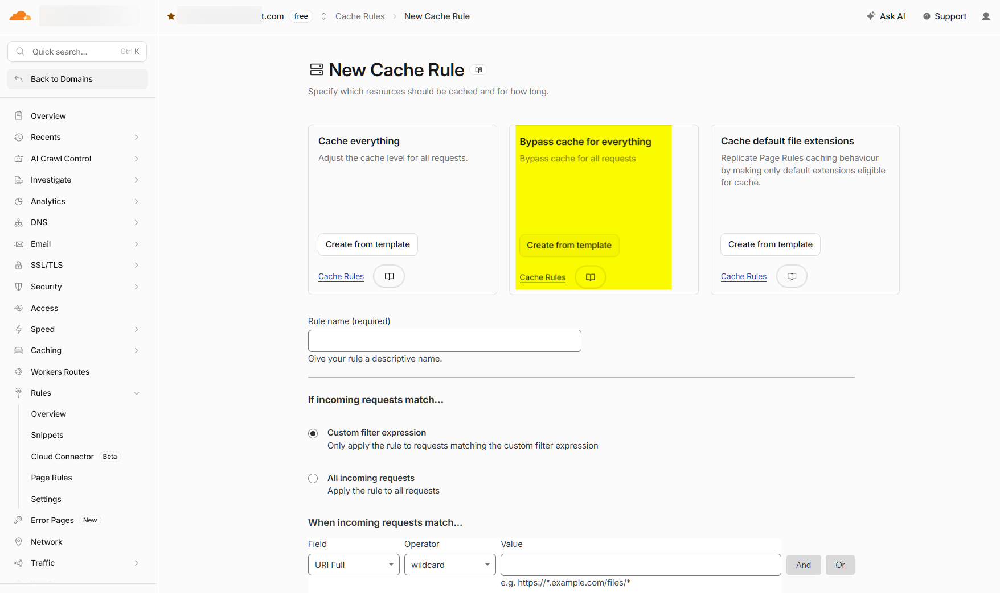
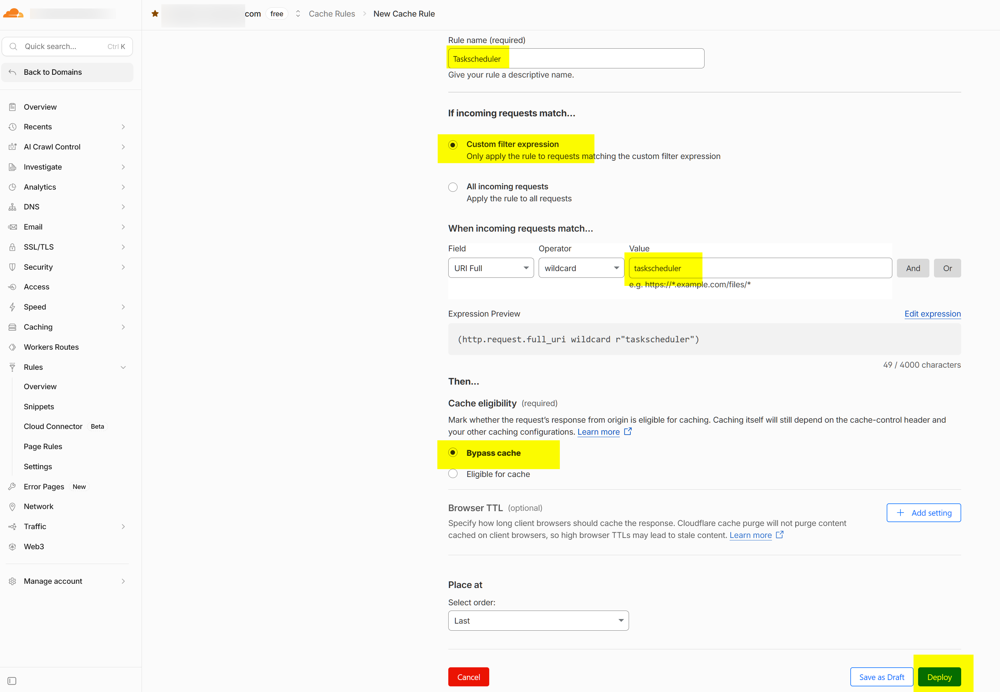

# Cloudflare

Cloudflare can be used as a reverse proxy in front of Smartstore and offers protection against bots and DDoS attacks, as well as additional performance optimizations. To ensure optimal interaction between Smartstore and Cloudflare, some configuration steps are required. This page describes the recommended settings.

## Advantages

Using Cloudflare offers the following advantages, among others:

* Protection against bot and DDoS attacks
* Filtering of harmful requests
* Improved performance through the global Cloudflare network
* SSL/TLS termination and additional security features

## Configure cache rules

When using Cloudflare, the caching should be configured accordingly to avoid display problems.

Cloudflare can cache CSS files and other static content by default. After making changes to the shop, outdated style sheets may be served, so design changes are not immediately visible.

Therefore, create a cache rule that prevents the caching of the corresponding content.

1. Open Cloudflare's **Rules &rarr; Cache Rules**.
2. Create a new rule.
3. Select **Bypass Cache for everything**.
4. Save the rule.



This ensures that the latest files are always loaded from the web server, while the other Cloudflare functions remain available.

## Allow Task Scheduler

Cloudflare must not block Smartstore's automated tasks.

Make sure the following URLs are forwarded to the shop without modification:

- `https://www.myshop.com/taskscheduler`
- `https://www.myshop.com/taskscheduler/poll`


Replace https://www.myshop.com with the URL of your shop.


The following examples show the required configuration in Cloudflare.




## Use the real client IP

After activating Cloudflare, the shop no longer displays the visitor's IP address. Instead, the IP address of a Cloudflare server appears.

### Cause

Smartstore's standard configuration is designed for general reverse proxy scenarios. This configuration works particularly well when the reverse proxy is local or has already been classified as trustworthy.

Since Cloudflare is operated as a public reverse proxy in front of the shop, Smartstore only uses the client IP address from the forwarded headers if the Cloudflare IP networks are explicitly configured as trusted. If these entries are missing under `ReverseProxy:KnownNetworks`, the Cloudflare IP address is still used as the remote address.

Cloudflare supports the header `X-Forwarded-For`, but recommends using `CF-Connecting-IP` as `ForwardedForHeaderName`, as this header uniquely contains the original visitor IP.

### Configuration

Create a subfolder called `Config` in the web folder (if it does not already exist) and create the file `usersettings.json` in it.

```json
{
  "Smartstore": {
    "ReverseProxy": {
      "Enabled": true,

      "ForwardForHeader": true,
      "ForwardProtoHeader": true,
      "ForwardHostHeader": true,
      "ForwardPrefixHeader": false,

      "ForwardedForHeaderName": "CF-Connecting-IP",
      "ForwardedProtoHeaderName": "X-Forwarded-Proto",
      "ForwardedHostHeaderName": "X-Forwarded-Host",
      "ForwardedPrefixHeaderName": null,

      "KnownProxies": null,
      "KnownNetworks": [
        "103.21.244.0/22",
        "103.22.200.0/22",
        "103.31.4.0/22",
        "104.16.0.0/13",
        "104.24.0.0/14",
        "108.162.192.0/18",
        "131.0.72.0/22",
        "141.101.64.0/18",
        "162.158.0.0/15",
        "172.64.0.0/13",
        "173.245.48.0/20",
        "188.114.96.0/20",
        "190.93.240.0/20",
        "197.234.240.0/22",
        "198.41.128.0/17",
        "2400:cb00::/32",
        "2606:4700::/32",
        "2803:f800::/32",
        "2405:b500::/32",
        "2405:8100::/32",
        "2a06:98c0::/29",
        "2c0f:f248::/32"
      ],

      "AllowedHosts": [
        "www.myshop.com",
        "myshop.com"
      ],

      "ForwardLimit": null,
      "RequireHeaderSymmetry": false
    }
  }
}
```


Enter the hostnames of your shop under `AllowedHosts`. For multishop installations, all used hostnames must be listed.



For a constantly updated list of Cloudflare's `KnownNetworks`, visit [https://www.cloudflare.com/ips-v4](https://www.cloudflare.com/ips-v4) or [https://www.cloudflare.com/ips-v6](https://www.cloudflare.com/ips-v6).


After creating the configuration and restarting the application, Smartstore will use the actual visitor IP address from the `CF-Connecting-IP` header, provided the request comes from a Cloudflare IP network that has been configured as trustworthy.