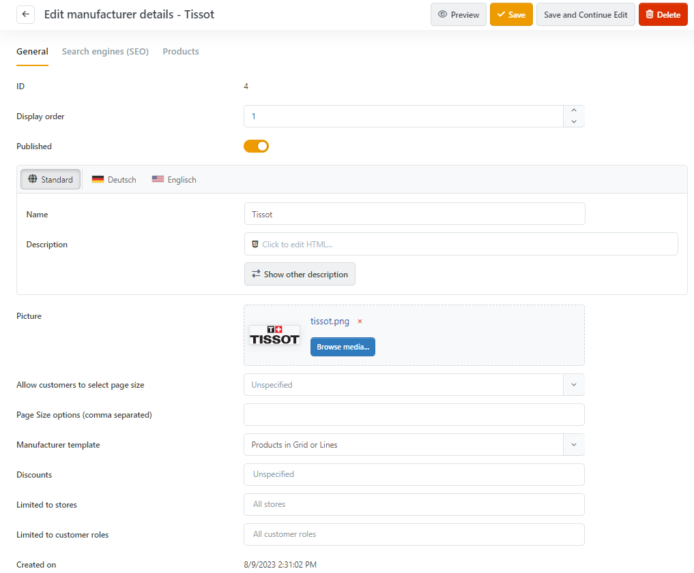

# Managing Manufacturers

You can assign manufacturers to products and display them in the product details view. Each created manufacturer will also be displayed on its own page, where the description of the manufacturer will be shown along with all the products that have been assigned to this manufacturer. On the home page of your shop, there will also be a list that displays the first few manufacturers according to the display order you've determined for them. You can manage manufacturers by navigating to **Catalog > Manufacturers**. When creating a new manufacturer or clicking on **Edit** in the list, you'll be forwarded to the details view of a manufacturer as shown below. 

### Manufacturer Info

| **Input Field** | **Description** |
| --- | --- |
| Discounts | Defines discounts to be applied to the object. |
| Limited to Stores | Determines whether the entry is only available for certain stores. |
| Manufacturer Template | Choose a manufacturer template. This template defines how this manufacturer (and its products) will be displayed. |
| Picture | Upload a logo for the manufacturer. |
| Display Order | Set up the manufacturer's display order. 1 represents the top of the list. |

### Search Engines (SEO) Tab

| **Input Field** | **Description** |
| --- | --- |
| Meta Keywords | Meta keywords to be added to manufacturer page header. |
| Meta Description | Meta description to be added to manufacturer page header. |
| Meta Title | Override the page title. The default is the name of the manufacturer. |
| URL Alias | Set a search engine friendly page name e.g. 'the-best-manufacturer' to make your page URL '[http://www.yourStore.com/the-best-manufacturer](http://www.yourStore.com/the-best-manufacturer)'. Leave the field empty in order to generate the URL automatically based on the name of the manufacturer. |
| Allow Customers To Select Page Size | Defines whether customers are allowed to select the page size from a predefined list of options. |
| Page Size options | Comma-separated list of page size options (e.g. 10, 5, 15, 20). The first option is the default page size if none are selected. |

### Products Tab

This tab contains a list of all products that have been assigned to this manufacturer. By clicking on **Add New Product**, you can also add new products to this list. 

### Discounts

If discounts have been set up for product groups, these can be assigned to the manufacturer. For more information on working with discounts, please read [Managing Discounts](../../user-guide/marketing-promotions/managing-discounts.md).

### Stores

In the "Limited to stores" line, you can assign the manufacturer to one or more of your stores. For more information on working with multiple stores, please read [Working with Multiple Stores](../../user-guide/common-concepts/working-with-multiple-stores.md).