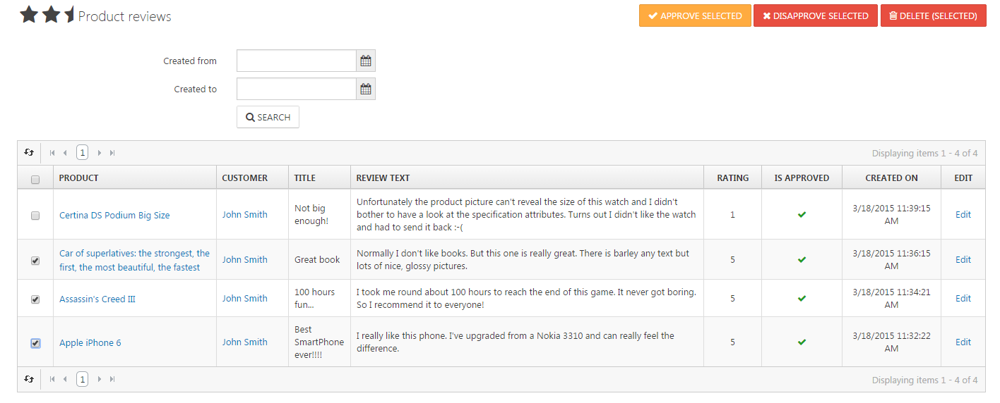

# Managing Product Reviews

Product reviews have a very strong influence on customer purchase decisions. As products can't be tested like in physical stores, many customers want to read about other customers' experiences with a product before deciding to buy it. Before customers can create product reviews, you have to enable this feature in the **Customers** tab in the [Catalog Settings](../../user-guide/configuration/general-settings-preferences/catalog-settings.md). To manage the product reviews your customers have created, navigate to **Catalog > Product Reviews**. 

## Approving Product Reviews

You can choose in the [Catalog Settings](../../user-guide/configuration/general-settings-preferences/catalog-settings.md) whether to show all reviews directly or to approve them first. To avoid spam in your product catalog, you should approve all reviews before displaying them in your product details view. You can also opt to receive notifications via e-mail when new product reviews are created.

## Display in the Frontend

While writing a review, your customers also rate the product by assigning a number of 1 to 5 stars to the review. You can opt in the [Catalog Settings](../../user-guide/configuration/general-settings-preferences/catalog-settings.md) whether to display the average rating of a product in the product box. In the details view of a product, there's a tab with the heading **Existing Reviews** where all the reviews that have been created for a product and have been approved are displayed. If there are no reviews for a product yet, there's a link where your shop visitor is invited to create the first review for this product. If there is already more than one review, an average of the ratings will be displayed right underneath the short description of the product, and your customer can create another review by clicking on the link **Add Your Review** to the right of the average rating.

