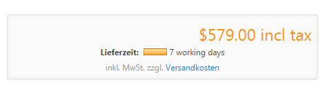
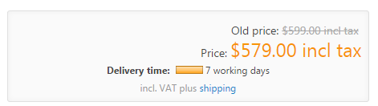
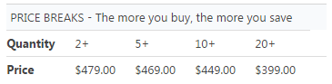

# Understanding Pricing Rules

In Smartstore, you can perform several actions that have an impact on the product price you have configured in the [product details area](../managing-products/setting-product-price.md). 

## Price

The underlying price that will be displayed in the frontend is the **Price** you have configured in the [product details area](../managing-products/setting-product-price.md) in the **Price-Tab**.

In the same area, you can define an **Old Price** which will be displayed crossed out above the actual **Price**.

## Special Price

The **Special Price** for which you can specify a certain validity period will be displayed instead of the original price.

## Additional Shipping Charge

The **Additional Shipping Charge** can be set in the [product details area](../managing-products/creating-and-editing-products.md) in the **Product Info-Tab** and will be added to the shipping rates on the shipment selection page and the order summary of the shopping cart.

         

  

  

  

  

## Product Attributes

  

The next price you can configure in the price chain is the price for a product attribute value, for which you can define a **Price Adjustment** that can be a positive or negative value and will be subtracted or added to the current price accordingly. 

  

You can also specify a fixed price for attribute combinations, which will overwrite the original price but won't be applied if a **Price Adjustment** for attribute values has been defined.  

  

## Tier Prices

  

The next element in the price chain is **Tier Prices**. With tier prices, you can motivate your customers to buy a larger quantity of your products by offering them a discount that increases with the quantity they buy. The applied tier price will overwrite the regular price. For more information on how to create tier prices, read the topic [Setting Product Price](../managing-products/setting-product-price.md).

## Discounts

Next in line are **Discounts**. Discounts will be applied on top of the current price that has been defined by the price chain explained above. For more information about discounts, read the topic [Managing Discounts](../../../user-guide/marketing-promotions/managing-discounts.md). 

## Taxes 

The next element that influence the displayed price are the settings you've determined for the handling of taxes. For more information about tax settings, read the topic [Setting up Tax Calculation](../../../user-guide/configuration/setting-up-tax-calculation.md).

## Price Indication Regulation \[PAngV\]

The base price according to Price Indication Regulation \[PAngV\] doesn't have any impact on the price calculation. Its only purpose is to inform your customers about the base price of the packaging unit in which you sell your product. For more information about the base price calculation, read the topic [Setting Product Price](../managing-products/setting-product-price.md).