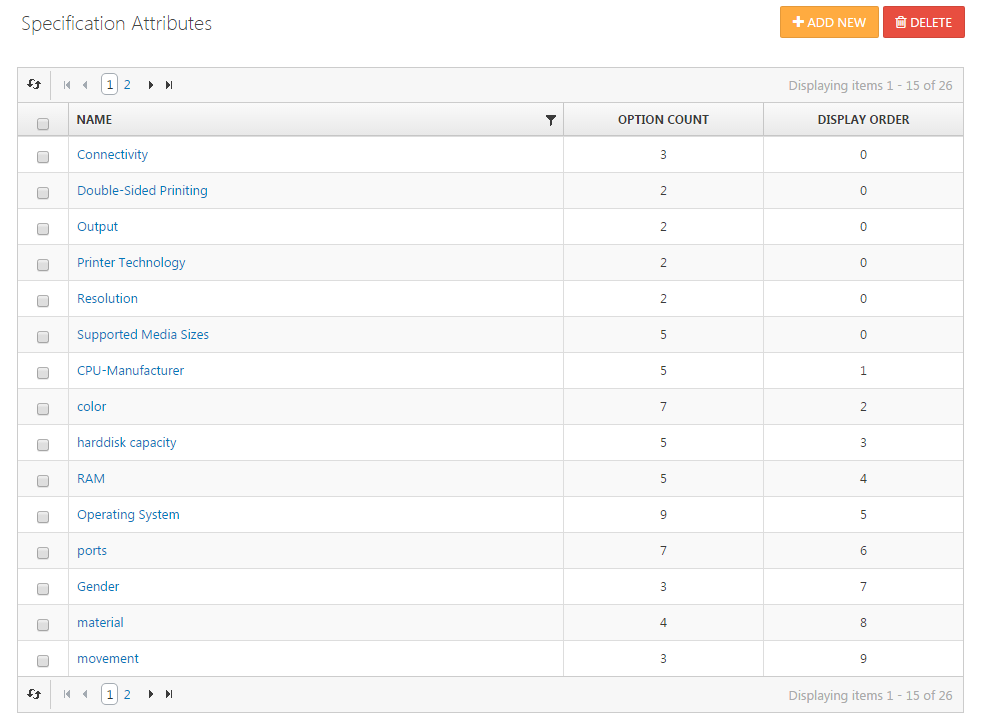

# Managing Specification Attributes

With specification attributes, you can provide more detailed information about your products and help buyers compare them more easily. You can also refine your catalog content while browsing & searching. Working with specification attributes provides the following benefits:

- Specification attributes are displayed as tabular data in a product's detail page as a sort of **data sheet**, showing your product's individual features and properties in more detail.
- When buyers **compare products** in your store, the comparison grid displays not only pictures, names and prices, but also an intersection of all specification attributes assigned to the products being compared.

## Usage scenario

Imagine you're running a shop with all kinds of printers. In this case, your buyers will most likely expect to be informed about the following printer specifications:

- **Printer Technology:** Inkjet, Laser
- **Connectivity:** Wireless, Memory Card, USB
- **Output:** B/W, Color
- **Double-Sided Printing:** Yes, No
- **Resolution:** 600 dpi, 1200 dpi, ...
- **Supported Media Sizes:** A3, A4, A5, B5, Envelope, ...

You could, of course, capture the above info in the product's long description as an HTML table, but you would lose the ability to include those features in product comparisons. Also, if you wanted to change the name or value of an attribute globally, you would still have to update all product records manually, which is a tedious and cumbersome task. It's much better to add this sort of data as global specification attributes to your store and assign them to your products later.

|     |     |
| --- | --- |
| **All Specification Attributes**   | **Assign an attribute to a product**   |
| **List of attributes on product detail page**   |     |

## Adding Specification Attributes

You can add new specification attributes by going to **Catalog > Specification Attributes**. The attributes you add here are globally available in your store and can be assigned to **any** product in the product detail configuration in the specification attributes tab. When creating specification attributes, you can specify **Display Names** for every language configured in your store, as well as a display order that specifies the order of attributes in the frontend. Once you've created a specification attribute, you can add the options to be made available when configuring the specification of a product. To do so, go to the **Options-Tab** of the attribute and click on **Add a New Option**. Here, you can also specify localized **Display Names** and a **Display Order**.

> [!INFO]
> ### Tip
> When you want to add multiple values in one step, enter each of them separated by a semicolon, and check the box **Enter multiple names separated by semicolon** (;). When saving your options, an option will be created for each of the semicolon-divided values.

## Assigning Specification Attributes to Products

After you have set up your specification attributes, you're ready to assign them to your products. Assignment takes place in the **Specification Attributes** tab of the **Edit Product Details** screen.

### Fields Reference

| **Fields** | **Description** |
| --- | --- |
| **Attribute** | Choose the specification attribute you wish to assign to the product, e.g. *Printer Technology.* |
| **Attribute option** | Choose one of the options you have specified for the current attribute, e.g. *Inkjet.* |
| **Allow filtering** | Check this box if you want to allow filtering by this product attribute (only takes effect with an active *filter sidebar widget*). |
| **Show on product page** | Check this box to display the product attribute in the public product detail page. |
| **Display order** | Display order of the specification attribute. 1 represents the top of the list. |

Click **Add Attribute** to save the assignment to the database. To proceed to another assignment, just change the field's values and click the button again.

### How to Batch-Edit Assignment Values

When managing a specification attribute (Catalog > Specification Attributes > *Attribute* *), t*here's a button (**Bundled**) in the upper right corner which allows you to batch-edit this attribute. With this button, you can change the values of all assignments referring to the current attribute in one go, instead of opening, changing and saving each and every product one by one. 

| **Bundled Function** | **Description** |
| --- | --- |
| Allow Filtering | Allows the attribute to be filtered when searching products. |
| Disallow Filtering | Disallows the attribute to be filtered when searching products. |
| Show On Product Page | Set the attribute to be displayed on the product details page. |
| Don't Show On Product Page | Set the attribute to be excluded from the display on the product details page. |