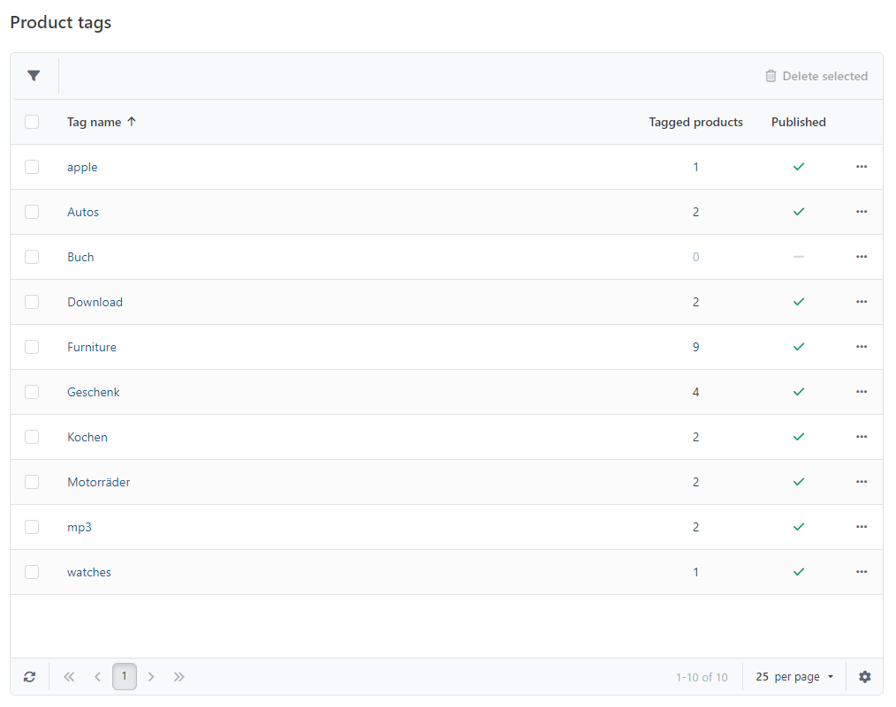
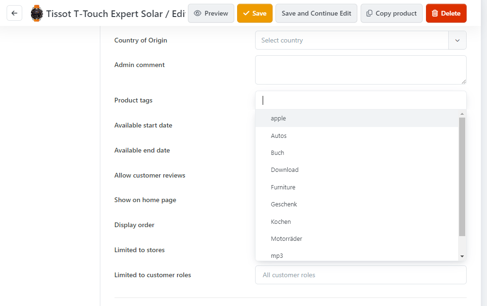

# Managing Tags

Product tags can be edited and deleted by navigating to **Catalog > Product Tags** within the administration area. Products tags are a great way to group products independent of categories. Tags are also included in the search results.

## Usage Scenario

Imagine you run an online shop where you sell clothing for motorcycle drivers. There are promoted articles associated with certain racing drivers, spanning across multiple categories such as jackets, helmets or caps. To group them together, you wouldn't want to create new categories, but to use tags instead. Tags you assign to products are shown right beneath the product details. When customers are interested in one of the assigned tags (in our scenario it would be the name of the racing driver), they can click on the tag and see a list with all the products assigned under the tag.

## Creating a Product Tag

To create a product tag, you just type the tag to be assigned to a product in the product detail tab **Product Info**. When you start to type, you'll be presented with a list of all the existing product tags in your shop that match the characters you've already typed.

The most frequently assigned tags will be displayed in a tag cloud on the start page of your shop, where the most frequently used tags will be displayed in a bolder and bigger font than the less frequently used ones.

