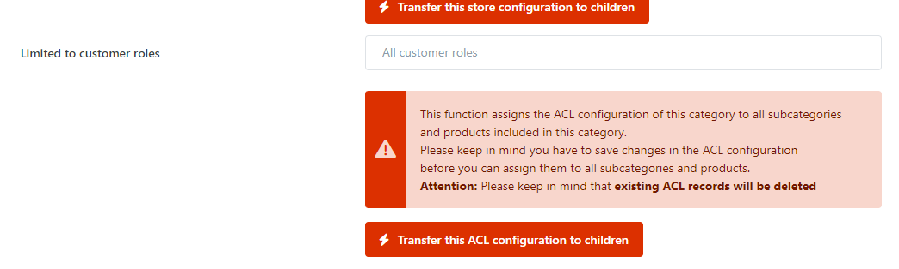

# Access Control Lists (ACL)

**Smartstore** provides **Access Control Lists (ACL)** that can be defined to restrict system access to authorized users based on their designated roles. Access Control Lists can be configured for categories and products. The Access Control Lists for products and categories define which content will be displayed to your registered customers in the frontend of your shop.

## Usage Scenario

Imagine you run a business where you sell age-restricted products and your customers have to confirm they are over 18 by sending you a copy of their identification card. After receiving their ID,  you would assign them to a customer role which is configured to have access to the categories with age-restricted products. This way you can ensure that shop visitors cannot access these items until they have confirmed to be over 18.

## How to configure ACL

You can add categories and products to ACL and define which specific roles can access those categories and products in the front end of your shop. This feature can be individually set to each category and product. The procedure to add or subject a category or product to ACL is the same. Just navigate to the tab ACL of the category or product you want to subject to ACL and add the roles that are allowed to view it.

> [!INFO]
> ### Transfer ACL configuration to children of a category
> 
> With this function you can assign the ACL configuration of a category to all subcategories and products included in the category.
> Please keep in mind you have to save changes in the ACL configuration  before you can assign them to all subcategories and products.
> **Attention:**  Please keep in mind that  **existing ACL records will be deleted.**