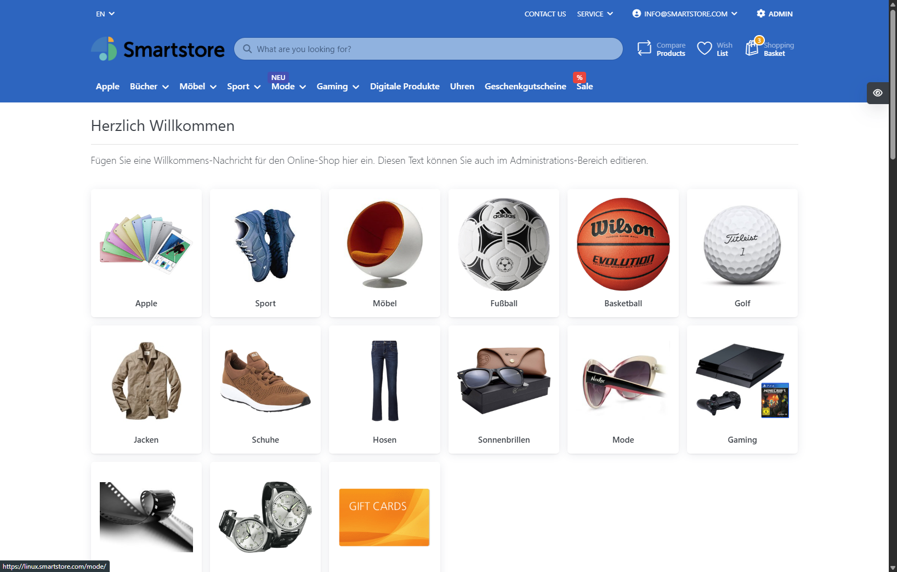
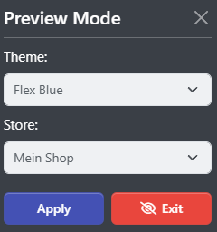

# Previewing Themes & Stores

If you decide to alter your design, you may want to preview the new theme to see what your store would look like. To do so, navigate to **Admin > Configuration > Themes** and click on the **Preview** button of the desired theme. 

The front end of your store will now be shown in preview mode. When you are in preview mode, there is a little symbol displayed on the left side of the browser window. By clicking on it, you can switch the themes and stores of your shop within preview mode.

