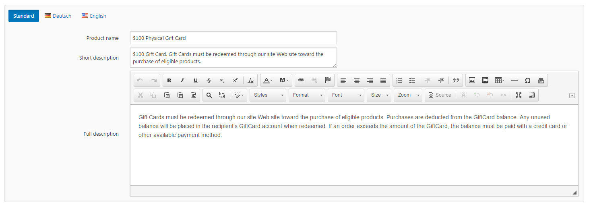
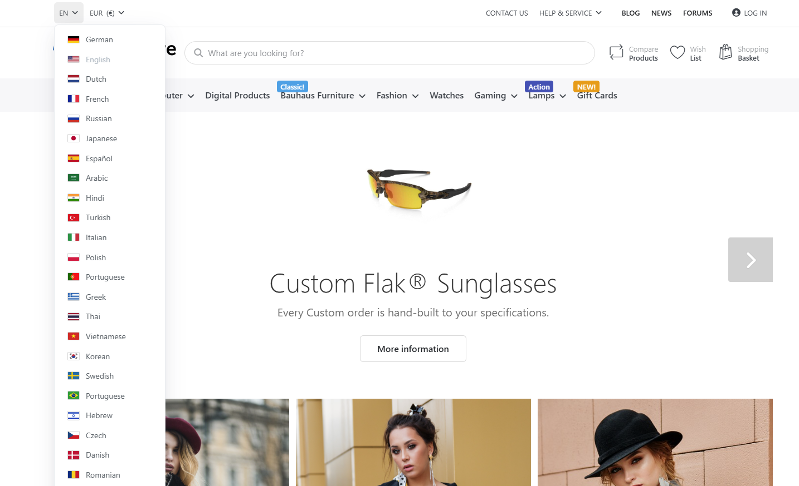

# Working with Multiple Languages

Smartstore already comes with two languages in the box (English and German), but you can add an unlimited number of further languages. The default language is the one you've chosen during the installation process.

## How to Add a Language

To add another language, navigate to **Configuration > Regional Settings > Languages** and click on **New**.

| **Input Field** | **Description** |
| --- | --- |
| Name | The name of the language. This name will be displayed when a user hovers over the flag in the frontend, where he can choose his preferred language. |
| Language culture | The language-specific culture. The culture information includes the names for the culture, the writing system, the calendar used and formatting for dates and sort strings. |
| Unique SEO code | The unique two-letter SEO code. It's used to generate URLs such as '[http://www.yourStore.com/en/](http://www.yourStore.com/en/)' when you have more than one published language. 'SEO friendly URLs with multiple languages' option should also be enabled. |
| Flag image file name | The flag image file name. You can choose an image from the flags that are shown when you click on the link **Show**. If you want to use another image, it should be saved into the /*images/flags/* directory. |
| Right-to-left | Select this option to enable right-to-left support for this language. The active theme should support RTL (i.e. it should have the appropriate CSS style file). This affects only the front end of your store. |

After you've created the desired language, you need to add the resources for this language by clicking on **Import Resources,** where you can choose an XML-file to import. You can find the resource xml file for English and German in the directory /*App\_Data/Localization/App.*

> [!INFO]
> ### For More Languages Visit Our Marketplace
> If you want to offer a product catalog in your local language and don't want to translate every textual resource yourself, take a look at the [SmartStore Community Marketplace](http://community.smartstore.com/index.php?/files/category/24-language-packs/) to check if the language is already available for download.

## How to Add or Edit a Single Resource

Sometimes it happens that you want to change a single resource. For example, you might want to change the title for the forum from Forums to Community. You can do this by going to Configuration > Regional Settings > Languages and clicking Edit Resources.

There you will see a table showing all added resources for that language. Filter the entries to find the resource you are looking for. You can filter either by value or resource name. Since you know the text you want to change, click the filter icon and type =forums in the Resource Value cell. Under the tool tip "?" you will see more search operators. You will now be shown a list of different resources that match the filter criteria. One of them has the prefix admin, which indicates that it belongs to the Administration section, this resource is not relevant for you. In this case, the resource you want to edit is called *Forum.PageTitle.Default*. You can change the desired value using the 3-dot button.   

## Localized Entities

There are numerous entities in Smartstore where you can enter data to be displayed to the user such as product names, product descriptions and several display names (e.g. delivery time display name, quantity unit display name, etc.). Whenever such a value can be entered in the backend, there will be a language management control that allows you to enter this data in all the languages configured in your store. In this control, you can enter the alternative resources for specific languages as well as a default value which will be displayed when no alternative resource for the language chosen by your customer has been specified.

## Language Chooser

When you've configured multiple languages, your users can choose one of them in the header section of your frontend. 

## Translating Resources

You can find several languages in our [Smartstore Translation Portal](https://translate.smartstore.com/). However, if the language you want isn't there, you may need to create the translation yourself. To do so, it's recommended that you export all language resources of an existing language into an XML-file, translate them all and import the file again. Textual resources for plugins should be located in the designated xml files in the respective plugins. For more information about plugin resources, read the topic [https://smartstore.atlassian.net/wiki/spaces/SMNET60/pages/2511050611](https://smartstore.atlassian.net/wiki/spaces/SMNET60/pages/2511050611).