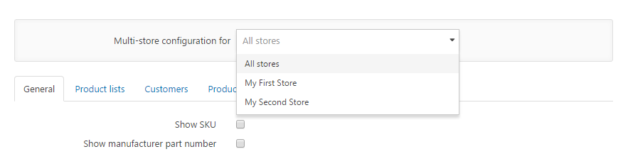

# Defining the Scope of Settings

You define the scope of settings with the **Store Selector Control**, which is always placed right above the settings. By default, you configure settings for all of your stores. If you want to configure a particular setting for just one of your stores, choose the target store and activate the override option for this setting. The control to activate the override option for a particular setting is always placed between the label and the input field for the setting. By entering a value for a particular store, you can override the global value of the setting that's defined for all configured stores.

## Multistore Configuration: Store Selector  Control

## Multistore Configuration: Override Setting  Control

