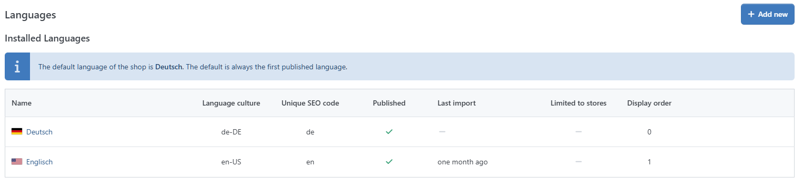
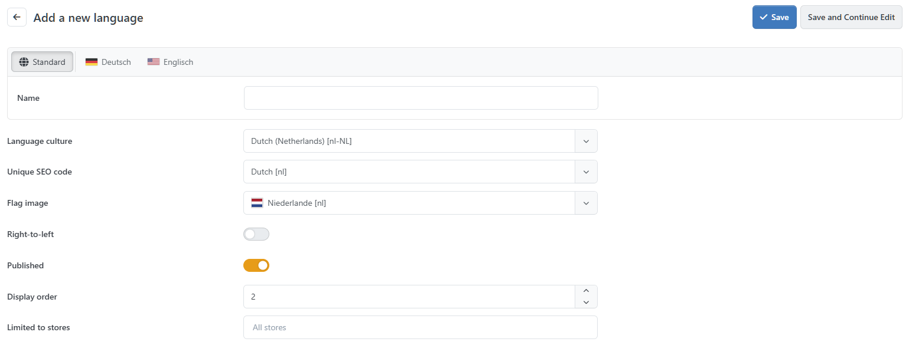
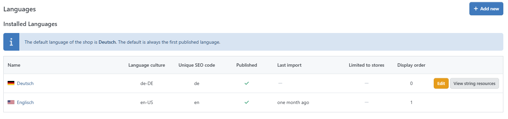
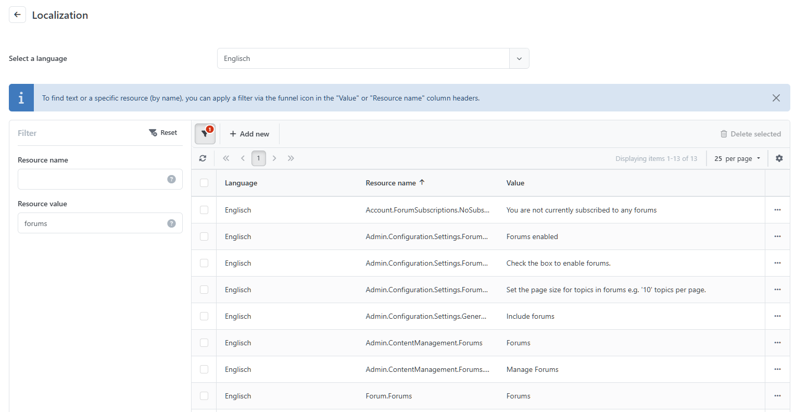

# Managing Languages

Smartstore already comes with two languages in the box (English and German), but you can add an unlimited number of further languages. The default language is the one you've chosen during the installation process. Please also read the topic [Working with Multiple Languages](https://smartstore.atlassian.net/wiki/display/SMNET/Working+with+Multiple+Languages).

## How to Add a Language

To add another language, navigate to **Configuration > Regional Settings > Languages** and click on **New**.

|     |     |
| --- | --- |
| Name | The name of the language. This name will be displayed when users hover over the flag in the frontend, where they can choose their preferred language. |
| Language culture | The language-specific culture. The culture information includes the names for the culture, the writing system, the calendar used, and formatting for dates and sort strings. |
| Unique SEO code | The unique two-letter SEO code. It's used to generate URLs such as '[http://www.yourStore.com/en/](http://www.yourstore.com/en/)' when you have more than one published language. 'SEO friendly URLs with multiple languages' option should also be enabled. |
| Flag image | Specifies the flag image. The files for the flag images must be stored in */Content/Images/flags/*. |
| Right-to-left | Select this option to enable right-to-left support for this language. The active theme should support RTL (i.e. it should have the appropriate CSS style file). This affects only the frontend of your store. |
| Published | Sets whether this language is enabled or disabled. |
| Display order | Sets the order displayed in the language selection box on the start page. |
| Limited to stores | The language can be limited to specific shops so that it is only available at these stores. |

After you've created the desired language, you need to add the resources for this language by clicking on **Import Resources,** where you can choose an XML-file to import. You can find the resource xml file for English and German in the directory /*App\_Data/Localization/App.*

> [!INFO]
> ### Smartstore translation portal with numerous additional languages
> For additional languages for the current and older Smartstore versions, please visit the Smartstore translation portal.  
> To learn how to download the languages, please refer to the article “[Working with multiple languages](https://smartstore.atlassian.net/wiki/spaces/SMNET/pages/1927774687/Working+with+Multiple+Languages).”

  

## How to Add or Edit a Single Resource

Sometimes, you may want to alter a single resource. Let's say you want to amend the link to the forum in the header menu from *Forums* to *Message Boards*. To do so, navigate to **Configuration > Regional Settings > Languages** and click on **View String Resources.** You will see a grid showing all the resources added for this language. Filter the entries to find the resource you are looking for. You can either filter by text value or by the resource name used for internal identification. Since you know the text you want to alter, click on the filter icon of the column **Value**, choose **is equal to** and enter the value *Forums.* At this point, a list of several resources matching the filter criteria will be displayed. One of them has the prefix *admin,* indicating that it belongs to the administration area, and the other contains the word *pagetitle,* indicating that it is a page title - neither of these are the resource you're looking for. The resource to be edited is the one named *forum.forums.* 

## Translating Resources

You can find several languages in our [Smartstore translation portal](https://translate.smartstore.com/). However, if the language you want isn't there, you may need to create the translation yourself. To do so, it's recommended that you export all language resources of an existing language into an XML-file, translate them all and import the file again. Textual resources for plugins should be located in the designated xml files in the respective plugins. For more information about plugin resources, read the topic [https://smartstore.atlassian.net/wiki/spaces/SMNET60/pages/2511050611](https://smartstore.atlassian.net/wiki/spaces/SMNET60/pages/2511050611).