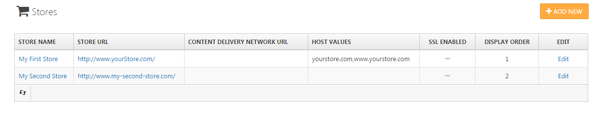

# Managing Stores

You can manage multiple stores in Smartstore by navigating to **Configuration > Stores**. For more information about working with multiple stores, read the topic [Working with Multiple Stores](../../user-guide/common-concepts/working-with-multiple-stores.md).

## The Store Details View 

|     |     |
| --- | --- |
| Store Logo | The logo of your shop. This logo will be displayed globally in the header section of your shop as well as in e-mails, pdf documents, etc. |
| Store Name | The name of your store. It will be used in several instances e.g. to create meta-titles or to be displayed as the headline of your physical shop address. |
| Store URL | The URL of your store e.g. [http://www.yourstore.com/.](http://www.yourstore.com/) |
| Content Delivery Network URL | The URL of your CDN, e.g. [https://xxx.cloudfront.net](https://xxx.cloudfront.net) or [http://xxx.cloudflare.net](http://xxx.cloudflare.net). Setting this value will allow the site to serve static content such as media through the CDN. |
| SSL enabled | Check the box if you want your store to be SSL secured. |
| HOST values | The comma-separated list of possible HTTP\_POST values (e.g. "[yourstore.com](http://yourstore.com),[www.yourstore.com](http://www.yourstore.com)"). This property is required only when you have a multi-store solution to determine the current store. |
| ID of HTML body | Allows the use of the individual CSS and javascript for a store. |
| Display order | The display order for this store. 1 represents the top of the list. |