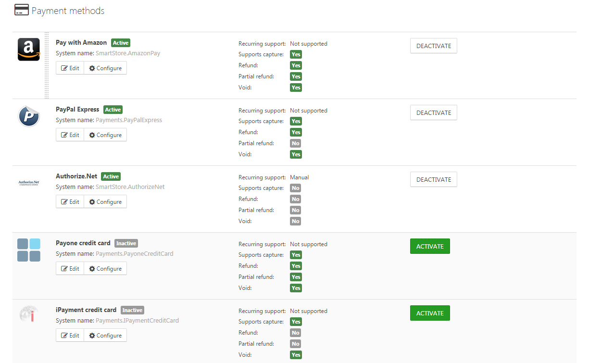
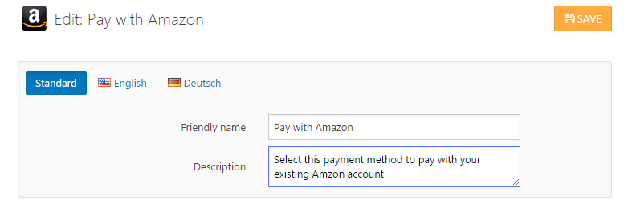

# Setting up Payment Methods

One of the most important issues when setting up an online shop is the configuration of payment methods. The choice of payment methods in an online shop will certainly have an influence on the decision to buy a product in your shop. Payment methods in Smartstore are handled by so-called payment plugins. Depending on the number of installed payment plugins, there are several payment options offered to your customers. 

## How to Configure Payment Methods 

You can configure payment methods by going to **Configuration > Payment Methods**. In this section, you can **Activate** or **Deactivate** the payment methods of your installed payment plugins by clicking the corresponding button, and you can go directly to the configuration area of each payment plugin by clicking on the button **Configure**. In this area, you can also organize the display order by using *Drag & Drop* on the selection page presented to your customers during the checkout process. To change the display order, hover over the payment method and click on the appearing grip element (you can see this element in the screenshot below for the payment method *Pay with Amazon*). Now you can drag the payment method to the desired position and drop it. 

By clicking on the **Edit** button of a payment plugin, a dialog will appear where you can alter the name and description of the payment method displayed to your customer on the payment selection page in the checkout process. You can enter different descriptions for each of the languages that are configured in your store.

## Payment Plugin Features

In the payment configuration area, an overview of the features of each payment plugin is displayed. For more information about these features, refer to the following table.

|     |     |
| --- | --- |
| Recurring Support | If a payment plugin supports recurring payments, it can handle automated payments for recurring products. For more information about recurring products, read the topic [Understanding Recurring Products](../../user-guide/catalog/managing-products/understanding-recurring-products.md). |
| Supports Capture | If a payment plugin supports the manual capturing of amounts, an additional button is displayed on the order details page (administration area) to capture the order amount manually. |
| Refund | If a payment plugin supports the refund of the whole order amount, an additional button is displayed on the order details page to refund the order amount. |
| Partial Refund | If a payment plugin supports the refund a partial order amount, an additional button is displayed on the order details page to refund the partial order amount. |
| Void | If a payment plugin supports the cancellation of a payment, an additional button is displayed on the order details page to cancel or void the payment of the order. |

> [!INFO]
> Even if a payment plugin does not support capturing, refunding or canceling, you will see non-highlighted buttons for these processes on the order details page to enable a payment status change "offline", i.e. without contacting the gateway of the payment method.

## Payment Widgets

Most plugins are displayed in the payment selection page, but some integrate their own checkout flow. The Amazon Payment plugin, for instance, incorporates a payment button directly into the mini basket of the shopbar and handles the selection of the address and the payment method, thereby skipping the usual checkout steps in which your customers enter this data. The widgets for these payment plugins have to be activated in the widget configuration area. For more information about configuring widgets, read the topic [Arranging Widgets](../../user-guide/content-management/arranging-widgets.md).

## Payment Method Restrictions

Payment methods may be restricted in many ways to prevent them from being offered at checkout. Navigate to **Configuration > Payment Methods** and click **Edit** for the desired payment method. In the restriction tab, select the criteria for which the payment method should *not* appear in checkout (the exclusion technique). You can restrict payment methods by the following criteria:

- Customer Roles
- Shipping Methods
- Countries (distinguished between billing and shipping address of the customer)
- Minimum and maximum order amount (distinguished between total and sub-total order amount)
- More criteria by installing payment filter plugins

## How to Obtain More Payment Plugins

More payment plugins can be obtained in the [Smartstore Community Marketplace](http://community.smartstore.com/index.php?/files/). The **Smartstore Community Marketplace** is the location where all the resources created for Smartstore are offered. These can either be downloaded for free or purchased. For more information on how to buy and install plugins, please read the topics [How to Buy an Extension](https://smartstore.atlassian.net/wiki/display/SMNET/How+to+Buy+an+Extension) and [How to Install an Extension](../../../smartstore-6-documentation-home/getting-started/community-marketplace/how-to-install-an-extension.md).