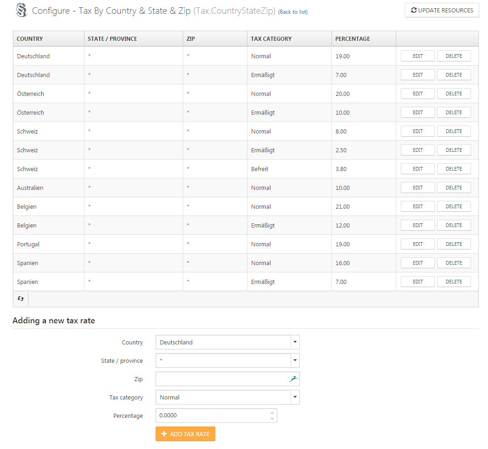

# Setting up Tax Calculation

Tax calculation is a very important topic for shop administrators. You can't afford to make any mistakes here, as you will be held responsible for the tax settings in your store. The legislation for taxes is different in every country or region. If you sell products in multiple countries, taxes are once again subject to other regulations. For example, if you're selling products within the EU, there are certain laws which need to be considered in addition to the laws that apply to a particular country within the EU. The USA has very complex rules for sales tax calculation (e.g. different tax classes for every region). In Germany, there are three different **Tax Categories** which apply to all products and services you offer. The main **Tax Category** has a rate of 19%. Another tax rate of 7% is applied to books, magazines or groceries. Under certain circumstances, you can also sell products that are exempt from taxes. With Smartstore, you can configure tax settings according to all of these regulations. If you are not sure about the tax rates that need to be applied to your products, please consult your tax accountant.

## Tax Categories 

After **Tax Categories** have been set up, they will subsequently be assigned to your products and contain the configured tax rate that will be applied to the product price. The actual tax amount will be calculated with the tax rate defined for the assigned tax category in the activated **Tax Provider**. You can configure **Tax Categories** by going to **Configuration > Regional Settings > Tax Categories** .   You assign a **Tax Category** to a product by going to the corresponding **Product Info Tab > Tax Category**, where you can choose one of your configured **Tax Categories**, thereby assigning it to the product. In Germany, you would have three different **Tax Categories**. The first is the normal category which should be assigned to nearly all of your products, the second is the one for books, magazines or groceries, and the third is the one for products exempt from taxes.

## Tax Providers

As already stated in the introduction, you have to configure different tax rates for your products depending on the legislation of your country. Tax rates are percental values that will calculate the actual tax of a price in your shop. With **Tax Providers**, you set up these tax rates for the different  **Tax Categories**  which are configured in your store. **Tax Providers** will also calculate the actual tax value to be applied to the prices in your shop. There are three different **Tax Providers** that are available out-of-the-box in Smartstore. Depending on the plugins you have installed, there may be more. You can configure **Tax Providers** by going to **Configuration > Regional Settings > Tax Providers** .

### Free Tax Rate Povider

The free **Tax Rate Provider** always applies a tax rate of zero no matter which tax category is assigned to a product. Activate this provider if you don't want your shop to calculate any taxes.

### Fixed Rate 

The **Fixed Rate** provider allows you to configure a fixed tax rate for all of the configured **Tax Categories**. The rate that has been configured for a  **Tax Category** will be applied to products assigned to this category. Since there are only three different tax rates in Germany that apply to all products, you would choose the **Fixed Rate Provider** if your shop is located in Germany. The normal category would have a rate of 19%, and the other two categories would have 7% and 0% respectively. 

### Tax By Country & State & Zip

The **Tax By Country & State & Zip** provider allows you to configure tax rates based on the **Country, State or Zip Code** of the current customer's address for all of the configured **Tax Categories**. The rate that has been configured for a  **Tax Category** will be applied to products assigned to this category. Since there are different tax classes for every state in the USA, you should activate the **Tax By Country & State & Zip** provider to configure tax rates if your shop is located in the USA. 

> [!INFO]
> When configuring **Tax Categories** for different regions, you can enter a zip code either as a specific value or a range pattern (e.g. 4000-4999). You can also define wildcard characters such as \* or ?. If the zip field is empty, this tax rate will apply to all zip codes for the given country or state/province, regardless of zip code. NOTE: Both min and max part MUST have the same amount of leading zeroes ("0100-0999" is valid, whereas "0010-0999" is invalid)

## Tax Settings 

You can configure your Tax Settings by going to **Configuration > Settings > Tax Settings**. 

|     |     |
| --- | --- |
| Prices Include Tax | A value indicating whether entered prices include tax. This setting is determined for the prices you enter in the backend of your shop when configuring prices. Activate this option if you intend to enter the product prices in the backend inclusive tax , and deactivate it if you want to enter product prices exclusive tax. |
| Tax Display Type | Tax display type. This setting determines the display and calculation of taxes in the frontend.  - **Including Tax** specifies that prices to be displayed in the frontend include tax. - **Excluding Tax** specifies that prices to be displayed in the frontend exclude tax.       > [!INFO] > If you want to sell only to business customers, there is no need to display tax values in your store under certain circumstances, thus you can set the option **Tax Display Type** to **Excluding Tax**. If you choose to display prices with a display type that differs from the setting for entering prices in the backend (e.g. **Prices Include Tax** = active & **Tax Display Type** \= **Excluding Tax** ), there may by rounding errors. In this case, it's recommended to activate the option **Configuration > Settings > Shopping Cart Settings > Round prices during calculation** . |
| Display Tax Suffix | A value indicating whether to display a tax suffix ("incl tax" / "excl tax"). |
| Display All Applied Tax Rates | A value indicating whether each tax rate's total value should be displayed on a separate line on the shopping cart summary footer. |
| Hide Zero Tax | A value indicating whether to hide zero tax in the order summary. |
| Hide Tax In Order Summary | A value indicating whether to hide tax in the order summary when prices are shown as tax-inclusive. |
| Show legal information in product list. | Activate this option to show legal information in product lists. |
| Show legal information in product detail page. | Activate this option to show legal information in product detail page. |
| Show legal information in footer. | Activate this option to show legal information in footer. |
| Tax Based On | Tax based on billing address, shipping address or default address of the current customer. This setting is applicable only if the active tax provider is **Tax By Country & State & Zip**. |
| Default Tax Address Country | This setting is applicable only if the active tax provider is **Tax By Country & State & Zip**. |
| Default Tax Address State / Province | This setting is applicable only if the active tax provider is **Tax By Country & State & Zip**. |
| Default Tax Address Zip / Postal Code | This setting is applicable only if the active tax provider is **Tax By Country & State & Zip**. |
| Taxing of Subsidiary Services | Specifies how to calculate the tax amount for subsidiary services like shipping and payment fees.  - **Specified tax category:** Uses the tax rate specified by tax setting **Shipping Tax Class**. - **Highest amount in cart:** Uses the tax rate of the product that has the highest amount (subtotal) in the cart. - **Pro rata in accordance with the main service:** Uses the tax rate of a product and the portion it has in the cart to calculate the tax amount. |
| Shipping Is Taxable | A value indicating whether shipping fees are taxable. |
| Shipping Price Includes Tax | A value indicating whether the shipping price includes tax. |
| Shipping Tax Class | Select tax class used for the shipping tax calculation. |
| Payment Method Additional Fee Is Taxable | A value indicating whether additional fees for payment methods are taxable. |
| Payment Method Additional Fee Includes Tax | A value indicating whether additional fees for payment methods include tax. |
| Payment Method Additional Fee Tax Class | Select the tax class used for calculating tax on the additional fee for a particular payment method. |
| EU VAT Enabled | Check the box to enable EU VAT (the European Union Value Added Tax). |
| Your Shop Country | Select your shop country for the corresponding VAT calculation. |
| Allow VAT Exemption | Activate this option if your store will exempt eligible VAT-registered customers from VAT. |
| Use Web Service | Activate this option if you want to use the EU web service to validate VAT numbers. WARNING: If this option is enabled, **DO NOT** disable the country form field that's available during registration in the public store. |
| Notify Admin When A New VAT Number Is Submitted | Check the box if you want to receive a notification via e-mail when a new VAT number is submitted. |

## EU-Regulations

If you're selling products within the EU, you have to calculate taxes as though you were selling the products and paying the corresponding taxes to the authorities in your own country, unless the customer has transmitted a valid VAT-ID to you. In that case, the customer himself/herself would be responsible for paying the taxes for your product in his/her own country, and you would calculate the prices without taxes. To configure this setting, you need to use the last five fields in the tax settings section. With the option  **EU VAT**  **Enabled**, you activate a set of functions which handle the regulation explained above, and you can  **Allow VAT Exemption** . If the option  **EU VAT**  **Enabled**  is activated, your customers can add their VAT number to the **Company Details** section in their customer account area.

If a customer enters a VAT number, you will be notified by e-mail (as long as you have activated the option  **Notify Admin When A New VAT Number Is Submitted** ), allowing you to check whether the VAT number is correct. If you have activated the option  **Use Web Service** , Smartstore validates the entered VAT number by sending it to a web server ([http://ec.europa.eu/taxation\_customs/vies/services/checkVatService](http://ec.europa.eu/taxation_customs/vies/services/checkVatService)). As this is only a formal check which offers no guarantee that the given VAT number is genuine, you can still manually mark the VAT number as valid or invalid by going to the customer profile in the backend and using the corresponding buttons in the **Customer Info Tab**. 

By going to **Configuration > Regional Settings > Countries**, you can specify which of the activated countries in your store are subject to the EU regulation. 

> [!INFO]
> If the location of your shop is within the EU and you're selling products to other countries in the EU, it's recommended to activate all of the last five settings in the Tax Settings configuration area.

## B2B Scenarios 

If you're selling your products to other companies, you don't need to include taxes in your price displays. Therefore, you can set the option  **Tax Display Type**  to **Excluding Tax**. If you're selling to both end users and companies, you can also configure this setting on the customer role level. To do so, go to **Admin > Customers > Customer Roles > Tax Display Type** . This setting will override the setting you've configured in **Tax Settings**. The same applies to the customer role setting **Tax Exempt**. The **Is Tax Exempt** setting can also be set on the customer level, which overrides the customer role setting. 

> [!INFO]
> If you choose to display prices with a display type that differs from the setting for entering prices in the backend (e.g. **Prices Include Tax** = active & **Tax Display Type** \= **Excluding Tax** ), rounding errors may occur. In this case, it's recommended to activate the option **Configuration > Setiings > Shopping Cart Settings > Round prices during calculation** .