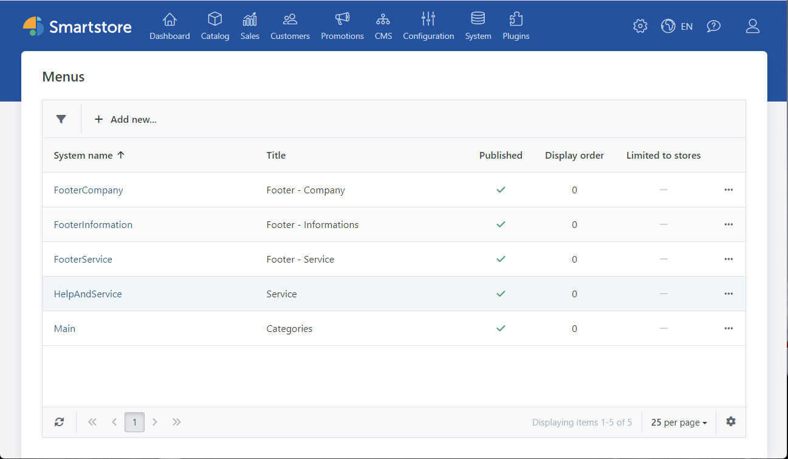
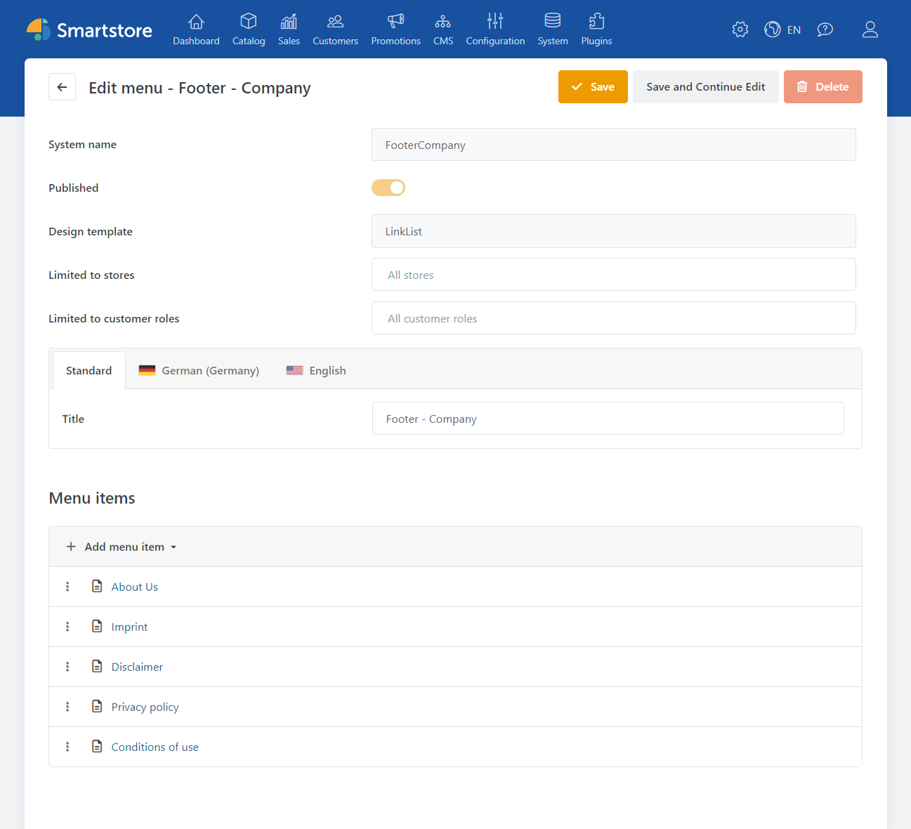

# Edit menu items

With the Menu Builder under CMS-> Menus you can create new menus or edit and extend existing menus.



## Edit / extend existing menus

To edit the footer menus, the menu bar in the header area and the merchandise group menu, click on the corresponding system name.



## Menu types

Different menu types are available.  
Internal object or URL, route and material group tree.

**Internal object or URL**

| Input field | Description |
| --- | --- |
| Destination | Specifies the destination of the link. This can be a link to a product, a merchandise group, a manufacturer page, a custom created page, a file or any URL. |
| Parent menu item | Sets the parent menu item. Leave the field empty to create a first-level menu item. |
| Published [](https://wolfgang.smartstore.com/Admin/Menu/CreateItem?providerName=entity&menuId=4&parentItemId=0) | Specifies whether the menu item is visible in the store. |
| Title [](https://wolfgang.smartstore.com/Admin/Menu/CreateItem?providerName=entity&menuId=4&parentItemId=0) | Sets the title. |
| Short description | Sets a short description. Used as the 'title' attribute for the menu item. |
| Required rights | Defines access rights required to display the menu item (at least 1 right must be granted). |
| Order [](https://wolfgang.smartstore.com/Admin/Menu/CreateItem?providerName=entity&menuId=4&parentItemId=0) | Defines the order of the menu item within a menu level. |
| Start group | Inserts a separator element in front of the link and optionally a heading (short description). |
| Icon [](https://wolfgang.smartstore.com/Admin/Menu/CreateItem?providerName=entity&menuId=4&parentItemId=0) | Specifies an optional icon. |
| nofollow [](https://wolfgang.smartstore.com/Admin/Menu/CreateItem?providerName=entity&menuId=4&parentItemId=0) | Outputs the HTML attribute rel='nofollow'. |
| Open in new browser tab | Opens the target in a new browser tab. |
| HTML ID | Sets the HTML ID attribute for the menu item. |
| CSS Class | Sets a CSS class for the menu item. |

## Route

With a route it is possible to execute an action directly by clicking on a link. Depending on the action, the controller name, action name, area name and, if necessary, parameters must be transferred via JSON.

Alternatively, e.g. news can also be linked. It should be noted that instead of controller names, etc., the SEO name is passed.

These configuration options are rather something for developers.

| Input field | Description |
| --- | --- |
| Target [](https://wolfgang.smartstore.com/Admin/Menu/CreateItem?providerName=route&menuId=4&parentItemId=0) | Sets the destination of the link. In the lower input field the route values are entered as JSON. |
| Other options | The other options are identical to the options of the **Internal object** or **URL** menu type. |

Example: DevTools

Target: SmartStore.DevTools

```
{
"Controller":"DevTools",
"action":"Test",
"area":"SmartStore.DevTools"
"parameter":"0"
}
```

Example: MenuItem

Target: NewsItem

```
{
"SeName":"die-zuse-z3"
}
```

**Category tree**

| Input field | Description |
| --- | --- |
| Target [](https://wolfgang.smartstore.com/Admin/Menu/CreateItem?providerName=catalog&menuId=4&parentItemId=0) | The category tree is dynamically integrated into the menu. |
| Other options | The other options are identical to the options of the **Internal object** or **URL** menu type. |