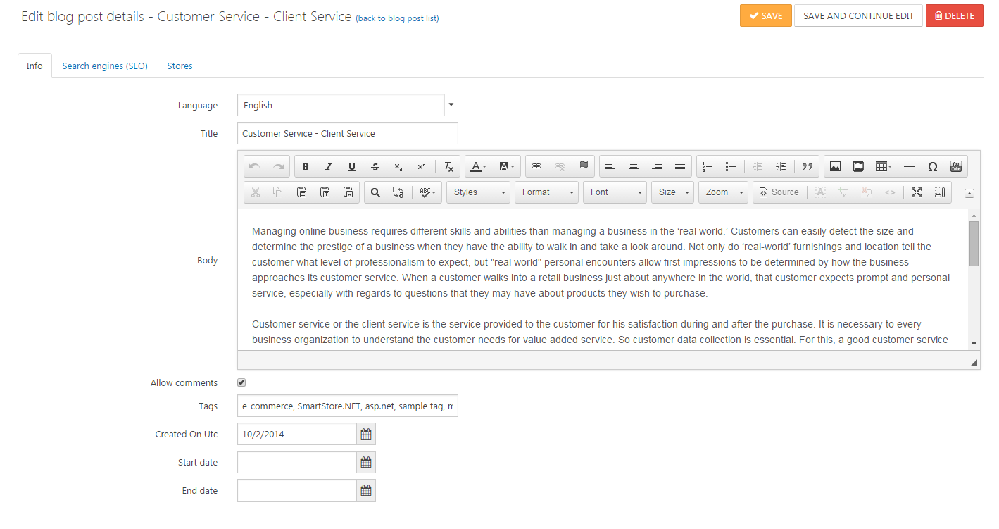

# Managing Blogs

*Content is King* is a commonly used phrase relating to search engine optimization, and it exists for a good reason. Google likes fresh content and gives a higher ranking to sites that are always creating new textual content. Smartstore contains a system to manage your own blog, enabling you to create new content on a regular basis.

## Creating Blog Posts

### Info

| **Input Field** | **Description** |
| --- | --- |
| Language | The language of this blog entry. A customer will only see the blog entries for their selected language. |
| Title | The title of this blog entry. |
| Body | The full description of this blog entry. |
| Allow Comments | When this option is selected, customers can leave comments about your blog entry. |
| Tags | Tags are keywords by which this blog post can also be identified. Enter a comma-separated list of the tags to be associated with this blog post. |
| Created On UTC | Allows you to enter the date this blog entry was created so that you can organize the display order of your blog entries. |
| Start Date | Set the news item start date or leave empty when this entry should be visible right away. |
| End Date | Set the news item end date or leave empty when this entry should be visible permanently. |

### Search Engines (SEO)

In this tab you can enter specific SEO values for the blog post e.g. **Meta title**, **Meta keywords** or a SEO friendly **URL alias**. For more information about the fields in the **Seach engines** tab read the topic [SEO](https://smartstore.atlassian.net/wiki/display/SMNET/SEO).

### Stores

In this tab, you can manage which store(s) the blog post should be published in. For more information about multiple stores, read the topic [Working with Multiple Stores](https://smartstore.atlassian.net/wiki/display/SMNET/Working+with+multiple+Stores).

## Managing New Comments

If you have allowed customers to leave comments on your blog posts, you need to review the comments and perhaps delete them. You can manage the comments to your blog posts by navigating to **CMS > Blog > Blog Comments**. In this section, you can see an overview of all the comments along with additional information such as the customer who created the comment, his IP address or the date the comment was created. You can also delete comments here.