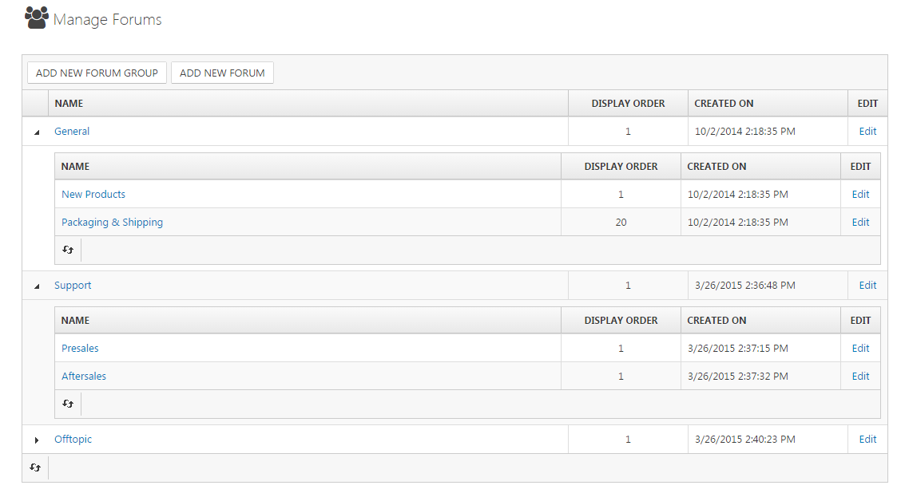

# Managing Forums

Smartstore provides the means to manage a user forum out of the box. In the administration area, you can freely create **Forum Groups** and **Subforums** and configure your forum. The administration of topics created by your customers will be managed in the frontend. The user in charge of managing forum topics needs access permission to manage the forums. The corresponding permission name is  **Admin area. Manage** **Forums**. For more information about access rights, read the topic [Access Control Lists (ACL)](../../user-guide/common-concepts/access-control-lists-acl.md).

## Configuration in the Backend

You can configure your forum by navigating to **CMS > Forums**. Here, you can create **Forum Groups** for which you can enter the **Name**, a **Short Description** and the **Display Order** through which you can organize the display order in the frontend. For subforums, you can determine the forum group in which the forum should be displayed, the **Name**, the **Short Description** which will be displayed right under the forum name in the frontend, and the **Display Order**.

## Management in the Frontend

The administration of topics created by your customers will be managed in the frontend. The user who wants to manage forum topics needs access permission to manage the forums. The corresponding permission name is  **Admin area. Manage**  **Forums**. For more information about access rights, read the topic [Access Control Lists (ACL)](../../user-guide/common-concepts/access-control-lists-acl.md). 

When you're logged in and have the permission to manage the forum, you're able to **Edit**, **Delete** and **Move** topics to any other forum.

