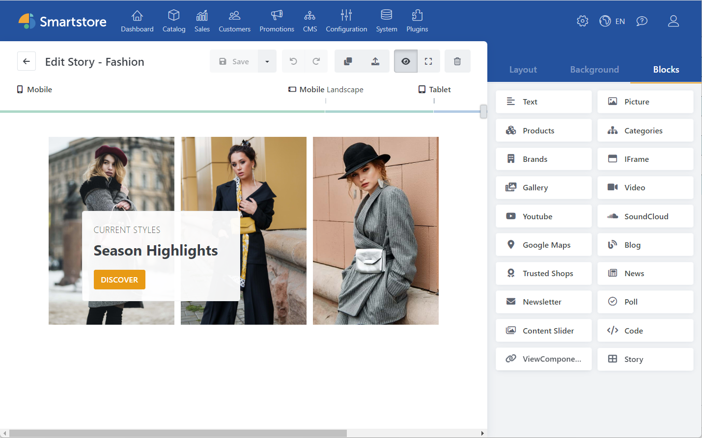

# Smartstore CMS Page Builder

## What is the Page Builder?

Smartstore Page Builder is a content management tool that allows you to quickly and easily design impressive shopping worlds, without any expertise in HTML, CSS or web design. Target pages and positioning can be determined at the push of a button, allowing you to design entire pages with fascinating content and extensive customization and presentation options, completely device-independent. Use the Page Builder to place your products with eye-catching appeal. This allows you to sell certain products or promote discount promotions, for example.

## What is a Page Builder Story?

Content in Smartstore Page Builder is grouped into so-called stories. Stories can range from a small widget with a few blocks to entire pages with extensive and engaging content. A story can be composed of text, images, videos, shapes and colors, as well as effects and product lists.

## What are blocks?

Blocks are atomic elements of a story that serve as containers for all content. With the help of blocks, it is possible to easily insert, modify, and position content. A variety of different block types are available for different content such as text, images, or videos.

In the image above you can see two marked blocks. The block on the left is an image block, and the one on the right is a text block. To learn more about the different blocks, see Blocks overview.

## First Steps

You can find the Page Builder after installation under Admin > CMS > Page Builder.  
If you are working with the Page Builder for the first time, use one of the numerous templates and simply replace the content of the blocks with your own texts and images. To do this, select the desired block and call up the block settings via the gear icon or via the drop-down menu in the Block Manager.