# Basic settings

Blocks have common basic settings. These can be found in the top bar in the Block Actions: General, Background, Box, Effects and Advanced.

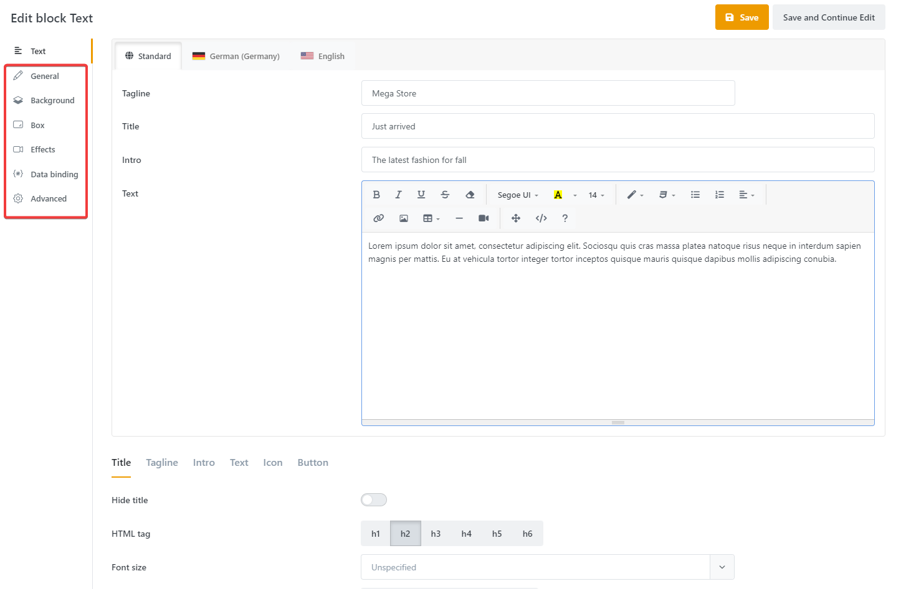

## General Settings

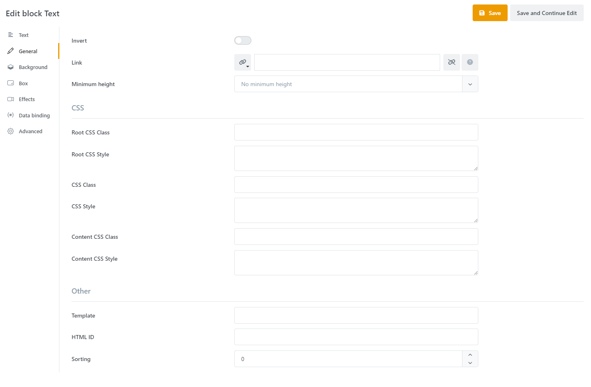

**Invert**: Inverts the text and fade effect color, but only affects this block. This option should be enabled for a dark block background.

**Link**: Adds a link to the entire block. Enter the destination URL or select one of the possible link destinations. For example, it is possible to link products or merchandise groups directly with just a few clicks.

**Minimum height**: Determines the minimum height of the block container, independent of content. Is only applied from tablet-landscape resolution. Settings are Medium (400px) and High (700px).

**Root CSS Class**: Extra CSS classes for the outer block container.

**Root CSS Style**: Inline CSS for the outer block container.

**CSS Class**: Extra CSS classes for the outer block container.

**CSS Style**: Inline CSS for the outer block container.

**Content CSS Class**: Extra CSS classes for the inner block container.

**Content CSS Style**: Inline CSS for the inner block container.

**Template**: (For advanced users only) Razor template name. If no template is entered, the default template Public will be applied to the block. The templates for the blocks can be found at:

\[Plugin\] > Views > Story > BlockTemplates > \[BlockType\] > \[Template\].cshtml

For example, you can find the default template for the image block under:

SmartStore.PageBuilder > Views > Story > BlockTemplates > Picture > Public.cshtml.

Now, if you want to include a custom template, you need to save your template in the appropriate block directory and enter the template name.

**HTML ID**: Sets the HTML ID of the block.

**Sorting**: Specifies the arrangement of the blocks in the output of the HTML code.

## Background

This tab lets you edit the background of the block. It works in the same way as the story background overlays. So, you can add background layers on top of each other here as well to create attractive backgrounds.  
For more information about backgrounds, see [Background](https://smartstore.atlassian.net/wiki/spaces/SMNET60/pages/2511047936/Background).

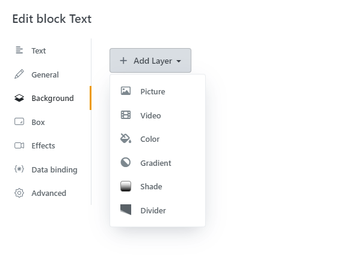

## Box

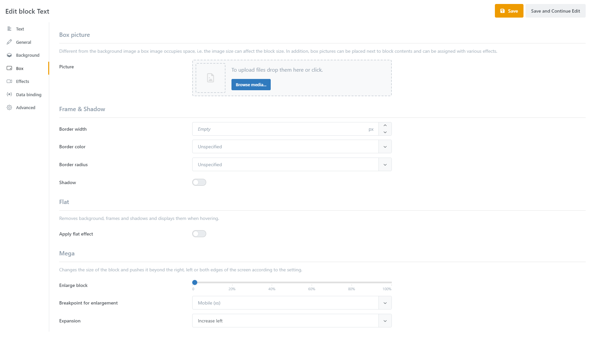

**Box picture**: Note that a box image takes up space. This means that the image size can have an influence on the block size. In addition, it is possible to determine the position of the box image and thus arrange it behind, below, next to or above the block contents. This allows you to create visually vivid blocks with an integrated image.

In addition to size settings, image effects such as zoom in/out on hover , as well as grayscale effects and blur are available.

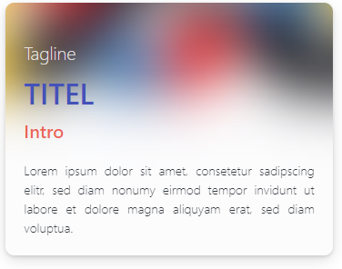

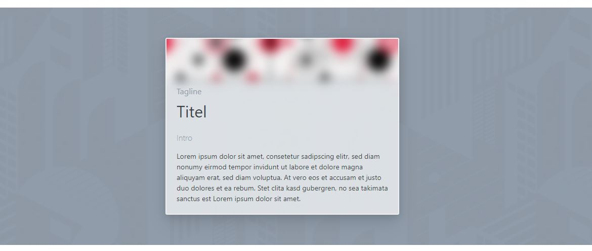

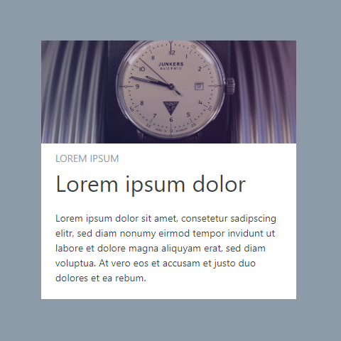

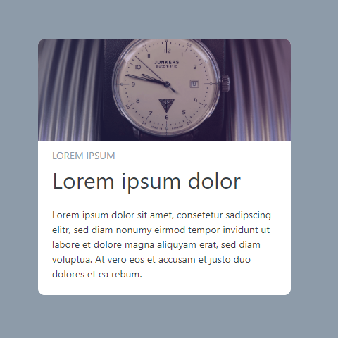

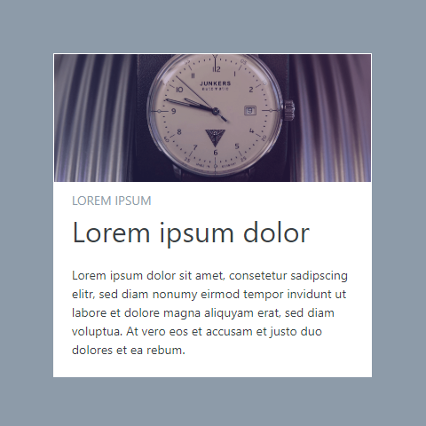

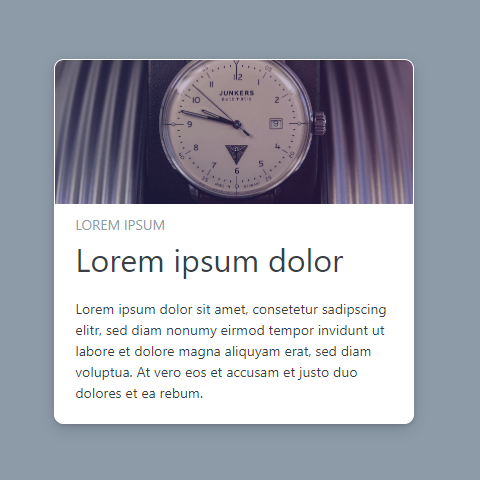

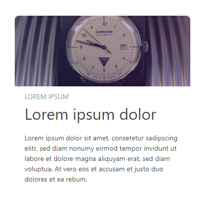

Mega: Enlarges a block so that it overlaps other blocks or extends out of the screen. Depending on the setting, blocks can extend beyond the left edge, the right edge, or both edges. This allows you to create eye-catching layouts that break up strict design layouts with deviations and irregularities, making your page look modern.

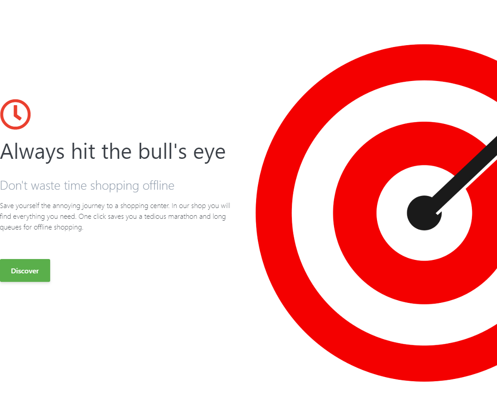

## Effects

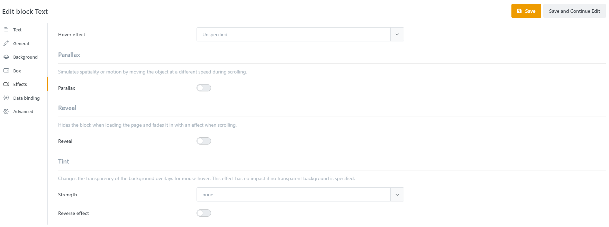

### **Hover effect:**

Determines the effect that is applied when the mouse hovers over the element. You can choose between rise and scale. With the Rise effect, the element is moved slightly upwards. The Zoom in slightly effect makes the image larger. Effects that are geared towards mouse interaction are ideal for clearly highlighting links to images or similar for the customer.

### Parallax

This effect allows you to move a block along with the scrolling of the page. With the Parallax effect it is possible to simulate spatiality. To do this, you need blocks that move independently of each other and of the page as you scroll. Elements that should be in the background must move slower in relation to elements in the foreground. This allows you to create spatial depth effects. Unlike background parallax, you can specify in which direction the image should scroll and whether only content or the entire block is affected. Often the parallax effect makes little sense on small resolutions, so you can define a filter that suppresses the effect depending on the resolution. For the filter, specify the resolution level and an operator that determines when the effect is applied.

Resolution levels are defined as follows:

**xs**: extra-small (Mobile)

**sm**: small (Mobile Landscape)

**md**: medium (Tablet)

**lg**: large (Tablet Landscape)

**xl**: extra-large (Desktop)

Possible operators are:

< smaller than

> greater than

<= less than or equal to

> \= greater than or equal to

A definition of ">=md" would mean that the resolution must be at least tablet dimensions (medium) for the effect to be applied.

### Reveal

You can use the Reveal effect to fade in blocks with an effect. This can be used, for example, to draw the visitor's attention to a specific block content. Reveal effects are started as soon as the story or the block is visible in the image section. There are several settings available to adjust the effect as desired. In addition to the type of fade-in effect, you can specify the animation curve, duration and delay, as well as the initial offset of the block.

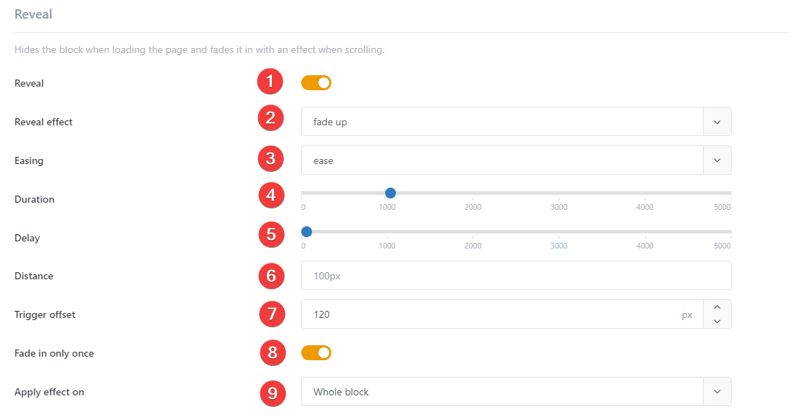

1. **Enable Reveal**: Determines whether the effect is enabled. Further options appear only when activated.
2. **Reveal Effect**: Determines the effect used to fade in the block. Various effect types such as Fade (fade in), Flip (rotate), Slide (slide) or Zoom (zoom in/out) are available.
3. **Easing**: Determines the speed curve of the fade-in . In addition to a linear curve, a selection of elastic curves is also available.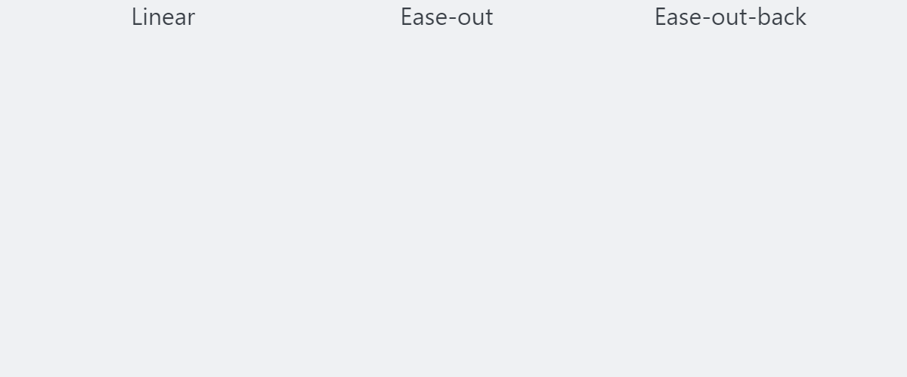
4. **Duration**: The duration of the animation in milliseconds.
5. **Delay**: The delay until the animation starts in milliseconds.
6. **Distance**: Distance between start and end position while animating the block (CSS size unit, default 100px).
7. **Trigger Offset**: The effect ist triggered when the upper edge of the block hits the lower edge of the screen. This trigger point can be adjusted using a pixel offset. A negative offset ist also valid. Default value is 120.
8. **Fade In Only once**: Determines whether the effect is applied to the block each time it appears.
9. **Apply effect to**: Defines the elements that are affected by the animation. You can apply the effect either to the complete block or only to the block content

### Tint

The Tint effect changes the transparency of the background on mouse hover. Note that the block background must have transparency for the effect to be applied.

> [!INFO]
> Note: Some effects are not applied in the Edit view. Switch to *Preview mode* to test them.

### Databinding

See Data binding

### Advanced

In this tab, the layout configuration is specified as a JSON object. Here you can specify spacing, rows and columns, and alignments for each resolution level. Direct modification of these values is intended for experienced users only.