# Block specific settings

### Text

The Text block provides comprehensive options for formatting text. The Title field allows you to assign a formatted title to the block. The title is displayed above the intro and text element. In addition, the block is given the title as a name in the Block Manager. Alternatively, you can hide the title, which will cause it not to be displayed as text within the block. The tagline is displayed above and the intro below the title. The text field, which is intended for continuous text, has an extensive text editor that you can use to format your continuous text. Furthermore, the individual text elements offer options to configure font size, font type, font color, HTML tags and spacing.

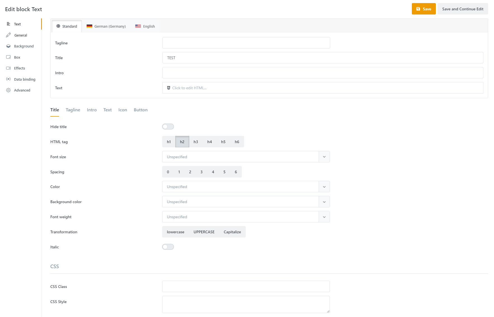

Alternatively, you can find a video explaining the text block at: [https://www.youtube.com/watch?v=TRuKwwOs-nl&list=PLog4smYIQ2NSZ5gflnsPxi-qGxMKCOf-s&index=2](https://www.youtube.com/watch?v=TRuKwwOs-nl&list=PLog4smYIQ2NSZ5gflnsPxi-qGxMKCOf-s&index=2) .

### Picture

For the image block, in addition to the option to select the graphic, there is also the option to limit the maximum size, i.e. the longest side of the image, in pixels.

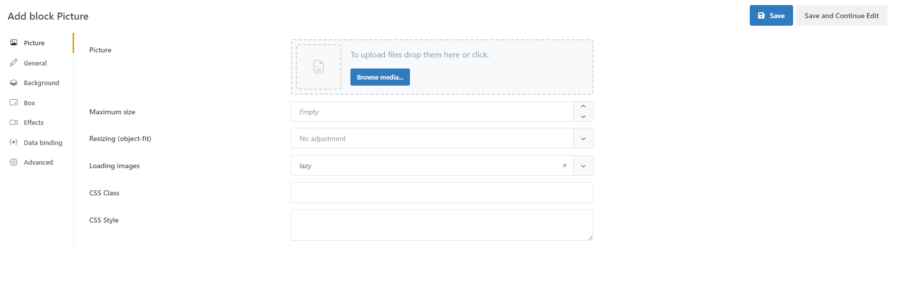

### Products list

With the product list block you can clearly display a selection of products. Display options such as slider, grid or list view are available. Configure the number and presentation of the displayed products. For example, you can specify whether prices, short descriptions, delivery times or other attributes of the products should be displayed.

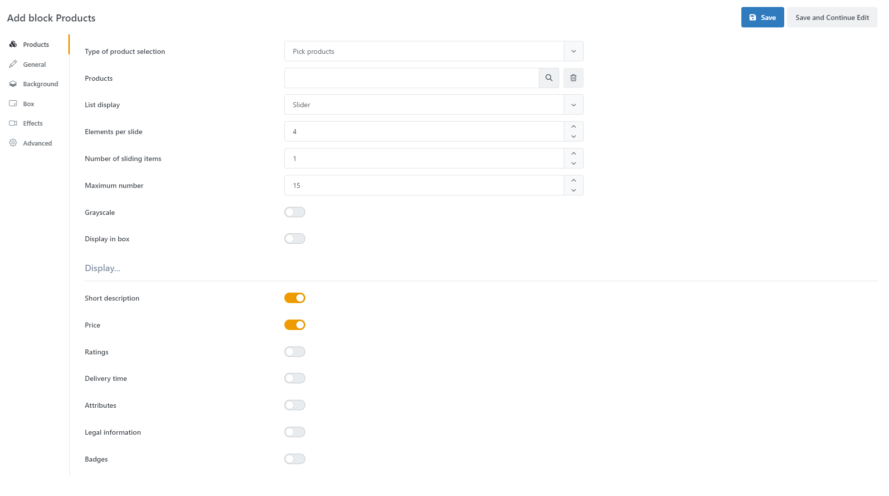

### Categories list

With the product group block you can clearly display a selection of product groups. The product group block has the same configuration options as the product list block.

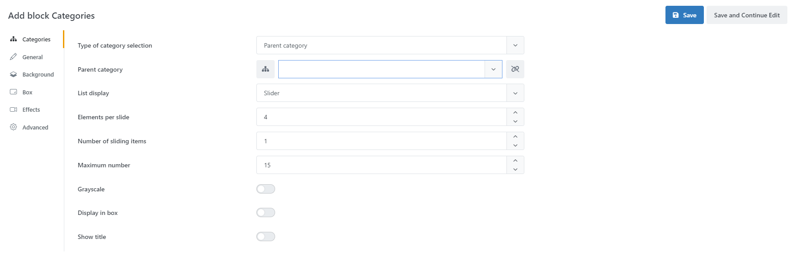

### Brands list

With the manufacturer list block you can clearly display a selection of products. The manufacturer list block has the same configuration options as the product list block.

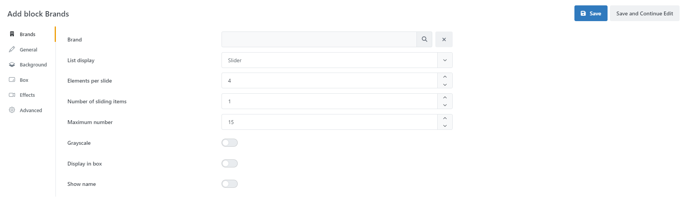

### IFrame

With the IFrame block you can display an external page in a window. To do this, you must specify the URL of the page.

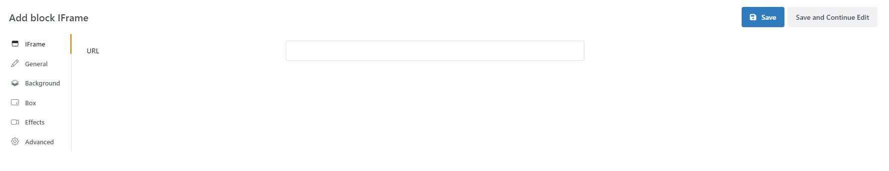

### Gallery

The Gallery Block can be used to insert media galleries with different styles and effects as content in pages.

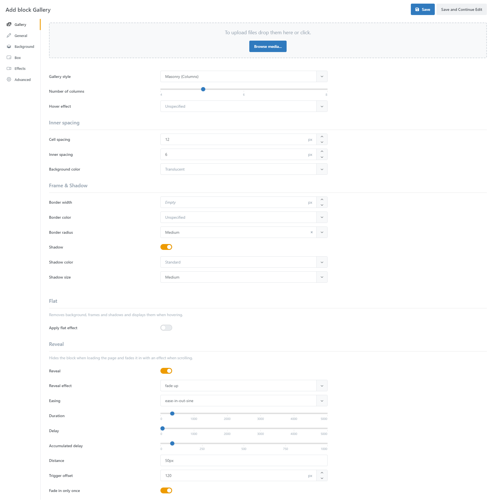

### Video

You should upload your video as an MP4 file, as this file format is supported by most browsers. You can also upload WebM and Ogg files. Moreover, there are various setting options like image format or controls to customize your video player.

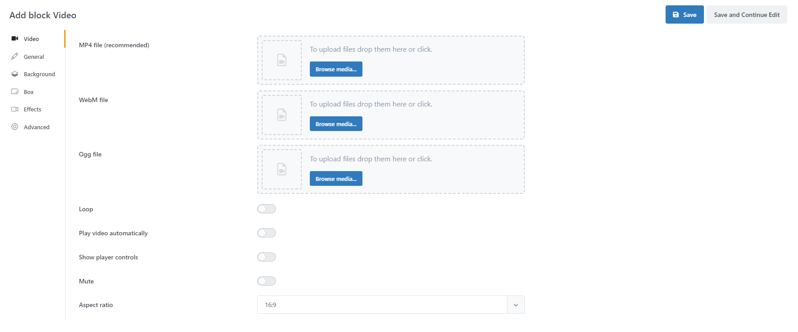

### YouTube

The YouTube block offers similar setting options as the Video block. Instead of uploading a video, you need to specify the YouTube ID or URL. In addition to options such as image format and privacy mode, you can also select a section of the video to play.

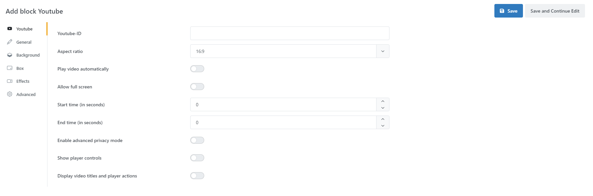

### SoundCloud

This block can be used to integrate audio streams from the [SoundCloud](https://soundcloud.com/) service. Only the URL must be specified for the integration. In addition, various options are available for configuring the display.

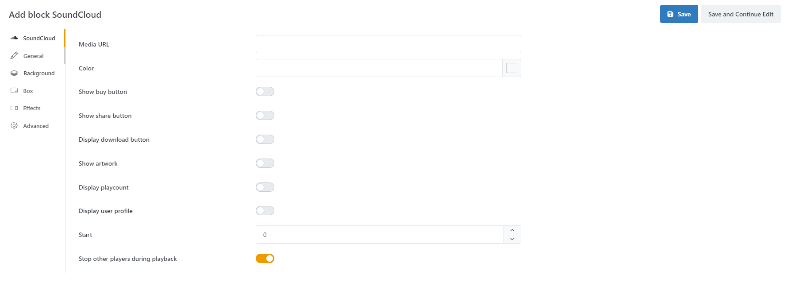

### Google Maps

With the Google Maps block you can display an address in Google Maps. To do this, you need to specify your Google Maps API Key and the coordinates (longitude and latitude) of the desired location.

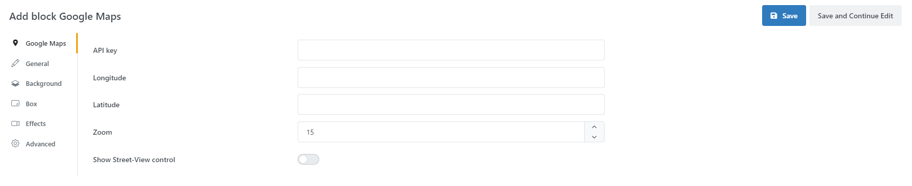

### Blog

This block allows you to insert blog posts from the Smartstore blog plugin.

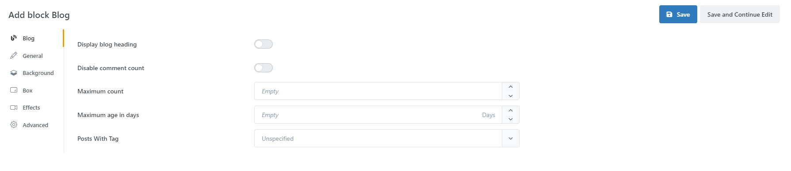

### Trusted Shop

Trusted Shops ratings are displayed in this block. A Trusted Shops ID is required.

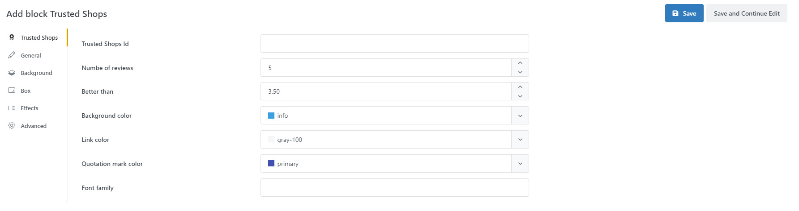

### News

This block displays news from the Smartstore News plugin.

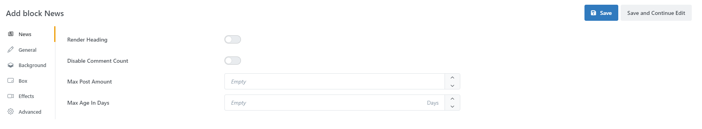

### Newsletter

This block represents the input field for the newsletter registration and thus enables a registration to the newsletter.

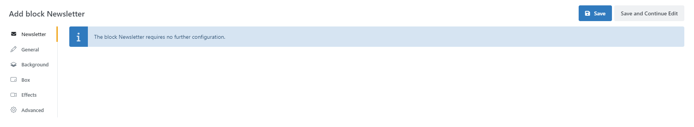

### Poll

With this block, a poll can be selected and displayed from existing polls.

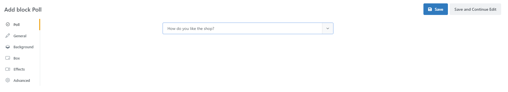

### Content Slider

A slide can be selected and displayed from the existing Content Slider slides.

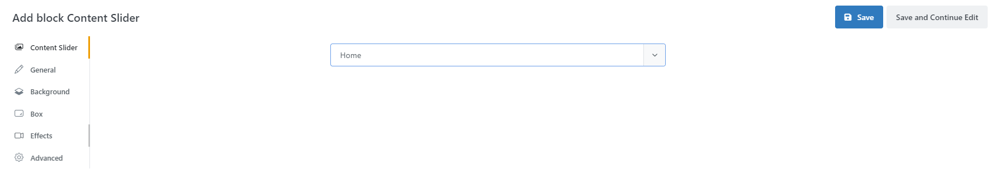

### Code

With the code block you can insert your own (source) code. For example, you can include custom functions or format your text yourself. While coding you are supported by IntelliSense.

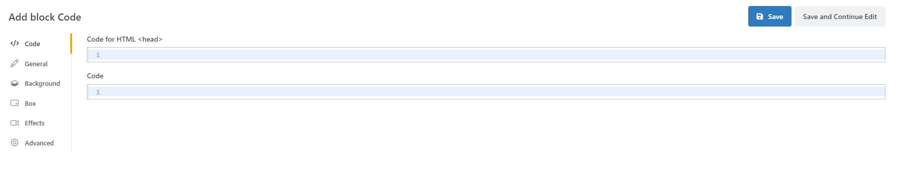

### View Component

This block supports the display of so-called View Components (see NET Core).

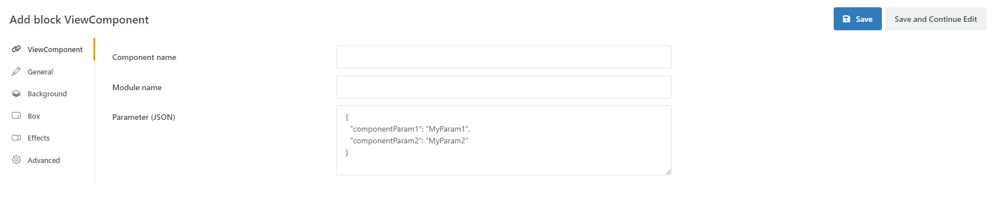

### Story

The Story Block lets you insert complete stories as atomic elements into your current story. This makes it easy to organize and manage complex stories that consist of several small stories and span the entire page in one story.

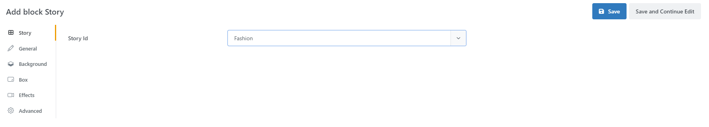