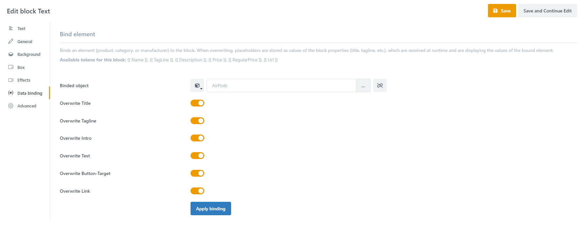
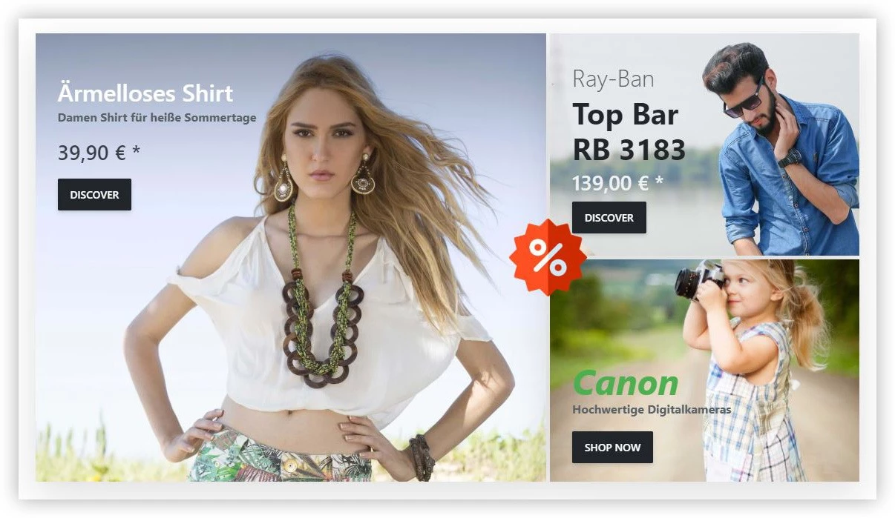

# Data binding

Allows products, merchandise categories and manufacturers to be bound to a block. This allows current data of these store entities such as product name, price or description to be displayed using placeholders within a block. In addition, it is possible to link the block to the desired store page.

Two block types support data binding:

- Text
- Image

So, unlike other blocks, when you include one of these two block types, you will see the Data Binding tab in the configuration view of the block.

This makes it easy to create stories that directly promote individual products or a selection of products from manufacturers or product groups. When changes are made to one of the products, all data within the story is automatically updated.

### Settings

Allows to bind products, commodity groups & manufacturers to a block. To link a block to e.g. a product, you only have to select the desired entity within the block editor under the tab Data Binding . Once an element has been assigned to the block, placeholders can be inserted into input fields such as title, tagline, text or URL at the click of a button. These placeholders ensure that product-related information is displayed directly in the story.

The following placeholders & constructs are available:

Name / Title: **{{ Name }}**

Manufacturer / Tagline: **{{ TagLine }}**

Short Description / Intro: **{{ Description }}**

Price: **{{ Price }}**

Old Price: **{{ Regular Price }}**

Link: **{{ Url }}**

Query for content: **** Then..... ****

In some cases it is useful to check a placeholder for a specific content. For example, it can be checked whether a RegularPrice (old price) is assigned to the article. If this is the case, a special text should be output to draw the customer's attention to this. Such a functionality could look like this:

 Special offer! Instead of {{ RegularPrice }} pay  only {{ Price }}.

With such a query, your text could look like this:

With value: "Special offer! Instead of 69,90€ you pay only 29,90

Without value: "only 29,90€".

With this methodology it is possible to create dynamic, engaging and always up-to-date product stories.

To get a deeper insight into this topic, watch our video about Data Binding: [https://www.youtube.com/watch?v=gs52tRjfqyA&list=PLog4smYIQ2NSZ5gfInsPxi-qGxMKCOf-s&index=6&t=1s](https://www.youtube.com/watch?v=gs52tRjfqyA&list=PLog4smYIQ2NSZ5gfInsPxi-qGxMKCOf-s&index=6&t=1s)

> [!INFO]
> Note: Data Binding is only supported for text and image blocks.