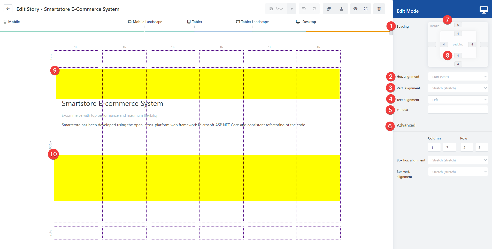
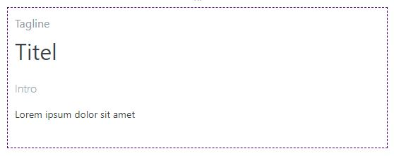
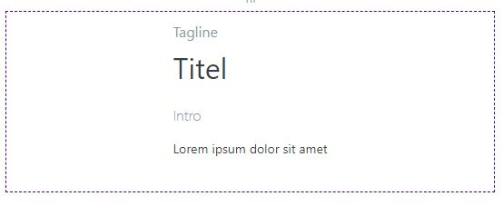
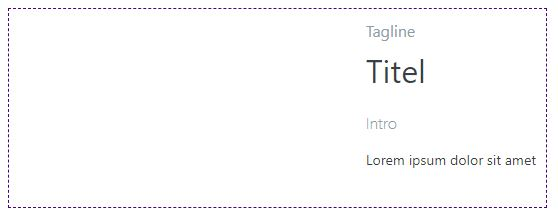
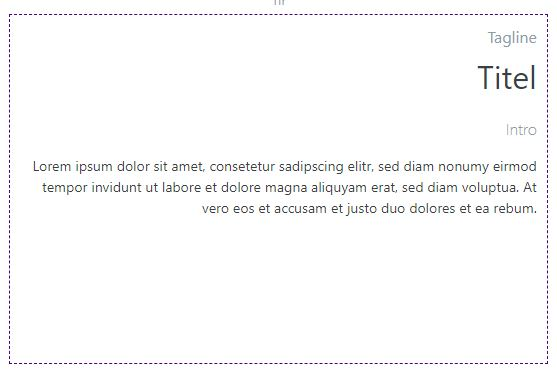
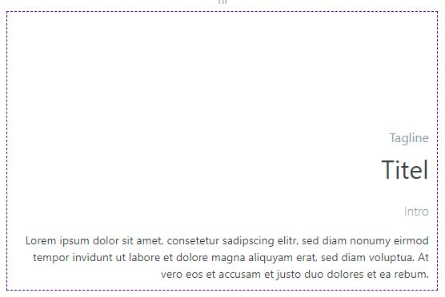
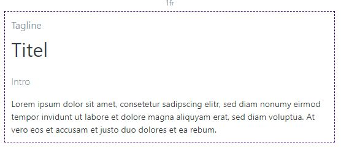
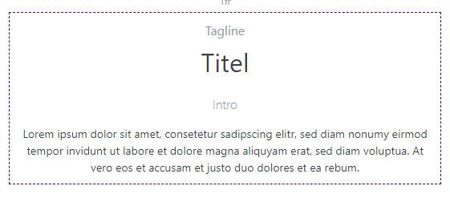
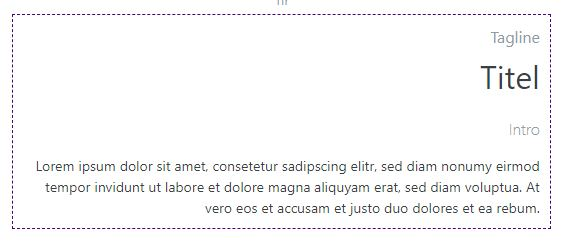

# Toolbox Block Options

When you have selected a block, the block options are displayed in the toolbox. Here you can adjust the display and alignment of the content for the current resolution level. Since stories expand dynamically to fit the available space depending on the screen size, you should check the alignment of the content for each resolution level and adjust it if necessary to ensure that the story is displayed correctly at all resolutions.

1. **Spacing**: This is where margin (outer block spacing) and padding (inner block spacing) are defined. To adjust these values, click with the mouse in one of the boxes and drag the mouse with the (left) mouse button pressed upwards to increase the spacing or downwards to decrease the spacing. You can enter values from 0 to 6. 0 stands for no distance and 6 for a very large distance. If no value is entered in the field, the value of the previous resolution level is used.
2. **Horizontal alignment**: Determines how the block content is to be aligned in the horizontal axis (**Start**, **Center**, **End**). By default, the block occupies the entire width of the cell (**Stretch**).

3. **Vertical alignment**: Determines how the block content is to be aligned in the vertical axis (**Start**, **Center**, **End**). By default, the block occupies the entire height of the cell (**Stretch**).

4. **Text alignment**: Determines the horizontal text alignment. You can choose between **left**\-, **center**\- or **right**\-justified.

5. **z-index**: Determines the display order of the blocks in the story and the order in the block manager.
6. **Advanced**: (Only for experienced users) Here the block position can be edited manually according to the CSS grid specification. From column/row (inclusive), to column/row (exclusive). This corresponds to the CSS attributes grid-column: StartCol / EndCol and grid-row: StartRow / EndRow.