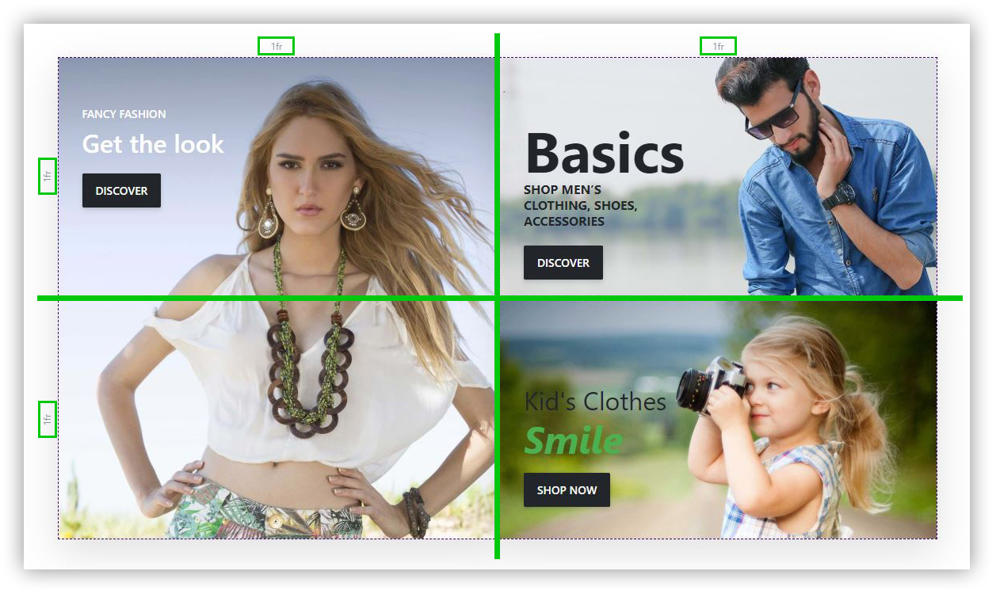
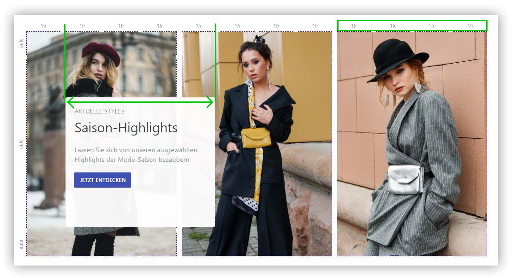

# Create a Layout

If you want to create your own template or a new story, you can start with a completely empty story. When you have created your new story, first give it a system name and save it. Now you can create a layout for the story's grid.

## Creating a simple layout

To give your story a descriptive and responsive layout, you need to define your grid accordingly. As an example, let's use the For Sale story template, but with a somewhat simplified layout, since the percent sign in the middle is omitted at this point.

The finished story should be displayed as follows:

In this story, 3 blocks are used. These are to be arranged as tiles within a grid with the dimensions 2x2 (i.e. 2 columns and rows each). The arrangement of the images changes with mobile or desktop resolutions, but the 2x2 grid is sufficient for this functionality. You will often need to extend or adjust your grid if you want to have a variation in display between resolutions.

To define the layout as desired, you need to delete columns and rows or add new ones using the grid tools.

## Create an advanced layout

Because the text block in the Fashion template overlays ¾ of the first image and ¼ of the second in the desktop view, the grid must also be designed for this. In order for the text block to achieve the desired overlay of the images, the columns of the images must be split 4 at a time. Thus, it is possible for the text block to overlay ¾ of the first image and ¼ of the second, so to speak, three of four columns of the first image, plus one of the next. This looks like this:

The rows are given the unit auto, which means that the minimum height of the cells is determined by the content. In this configuration, the text block is at least high enough to fit the content (with spacing) into the cell. The other two rows are also set to auto, thus dynamically adjusting to the space requirements of the middle row. For a listing of all available units of measure, see Size Units.

A video on how to create a simple story can be found at: [https://www.youtube.com/watch?v=gCHPlywtAZI&list=PLog4smYIQ2NSZ5gfInsPxi-qGxMKCOf-s&index=1](https://www.youtube.com/watch?v=gCHPlywtAZI&list=PLog4smYIQ2NSZ5gfInsPxi-qGxMKCOf-s&index=1)