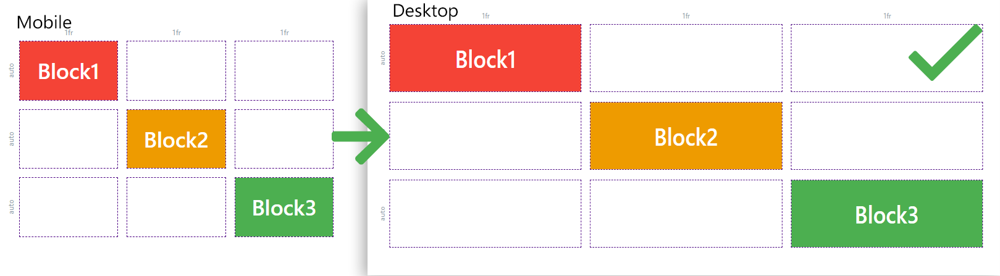
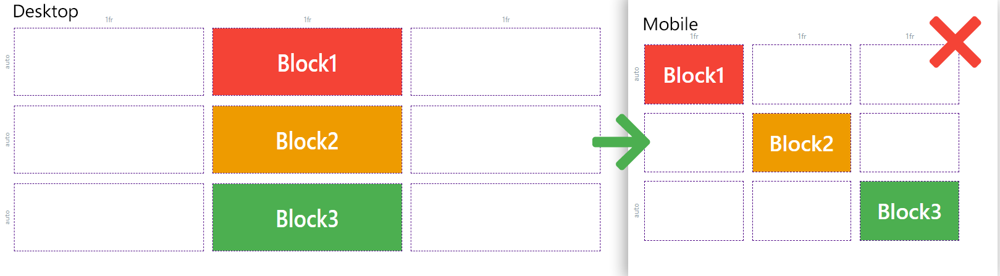
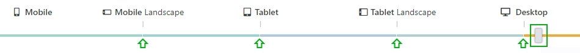

# Responsive display

## Mobile First

In order to realize a responsive display for all resolutions and end devices, the Page Builder follows the Mobile First concept. Mobile First means that the display on mobile devices should have the highest priority in the design of a page. Therefore, the mobile version of the story is configured first. Based on this, incremental adjustments are made for higher resolutions in order to design the layout to fit the space available in the process.

Here you can see a comparison between the mobile view and the view for desktop resolutions, the For Sale Story.

As you can see, the positioning of the content has been adjusted to use all the space at the desktop resolution. The blocks are displayed larger to use the available space more effectively. There are five different resolution levels to provide a suitable display for all devices and resolutions.

> [!INFO]
> Note the correct configuration order of the Stories resolution levels.

**Correct configuration** **order** \- mobile to desktop:

**Incorrect configuration order** - desktop to mobile:

## Device-Slider

Stories are responsive and are dynamically adjusted to different resolutions. Content settings can have different configurations per resolution level, allowing each level to have different configurations in design and layout. However, the grid itself is global to the story.

By positioning the device slider on the respective colored section, the current resolution setting is selected. There are 5 resolution levels: Mobile > Mobile Landscape > Tablet > Tablet Landscape and Desktop.

Due to the **mobile-first concept**, each resolution level passes your settings to the next higher resolution level if it has no entered values for the respective setting. This means that all mobile configurations are also applied to all other resolutions such as tablet or desktop if no explicit settings have been specified for the respective resolutions.

If you subsequently make changes to your layout or content, make sure that settings to higher resolutions are still as desired.

If you now view the Fashion story template, you will see that the mobile layout of the content is different from the desktop layout.

