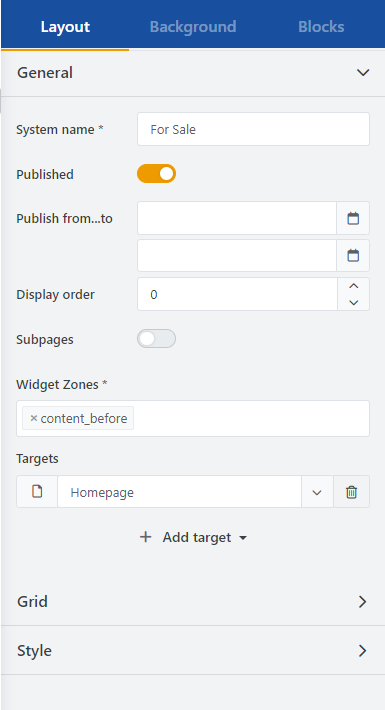
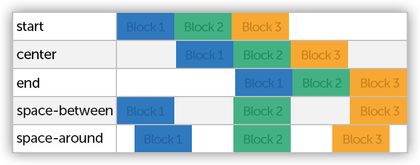
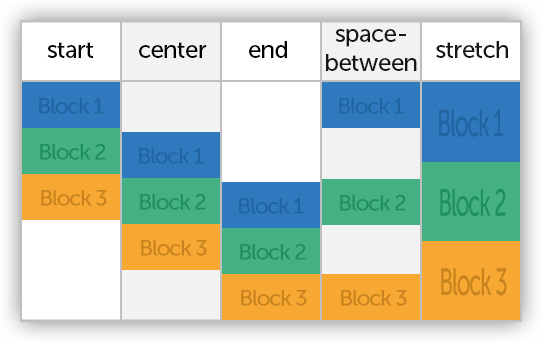
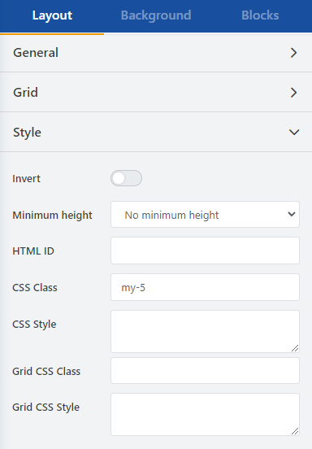

# Toolbox Story Options

## Layout

### General Settings

**System name**: Name of the story

**Published**: Determines whether the story will be displayed (See Publishing Options).

**Publish From...To**: Limits the time period during which the story is displayed (optional).

**Sort Order**: Determines the display order of multiple stories within the same widget zone.

**Show in subpages**: Determines whether the story should also be displayed in subpages. This includes lists with a page index greater than 1 or with at least one active filter.

**Widget Zones**: Determines the positioning of the story on the page. (See Widget Zones)

**Targets**: Determines the destination page(s) where the story will be displayed. (See Publishing options)

### Publishing options

A story can be displayed in multiple widget zones and on multiple target pages at the same time.  
To display your story on the desired page, make sure that at least one **widget zone** and **target page** have been specified, and that “**Published”** is also turned on. Widget zones determine the positioning of your story on the desired page.

### Grid options

**Cell spacing**: Defines the spacing between the cells. Here you can choose between relative and absolute specifications. All possible units of measurement can be found under Size units.  
[https://css-tricks.com/snippets/css/complete-guide-grid/#prop-grid-gap](https://css-tricks.com/snippets/css/complete-guide-grid/#prop-grid-gap)

**Container**: Defines the width of the outer container. (See Container sizes)

**Content Container**: Sets the width of the inner container. (See Container sizes)

**Spread cells horizontally**: Specifies how cells are distributed horizontally when the container is wider than all cells combined. (See Distribute cells horizontally - justify-content).  
[https://css-tricks.com/snippets/css/complete-guide-grid/#prop-justify-content](https://css-tricks.com/snippets/css/complete-guide-grid/#prop-justify-content)

**Spread cells vertically**: Specifies how cells are distributed vertically when the container is taller than all cells combined. (See Distribute cells vertically - align-content)  
[https://css-tricks.com/snippets/css/complete-guide-grid/#prop-align-content](https://css-tricks.com/snippets/css/complete-guide-grid/#prop-align-content)

**Auto flow**: *(For advanced users only)* Defines how the algorithm for automatic placement of elements proceeds. (See Auto flow)  
[https://css-tricks.com/snippets/css/complete-guide-grid/#prop-grid-auto-flow](https://css-tricks.com/snippets/css/complete-guide-grid/#prop-grid-auto-flow)

**Columns**: *(Only for experienced users)* Here you can define columns manually. Simply enter the desired size and unit of your column. Separate individual entries with spaces. It should be noted here that editing the grid using the grid tools is more comfortable and intuitive.

**Rows**: *(For experienced users only)* Here you can define rows manually. Simply enter the desired size and unit of your row. Separate individual entries with spaces. Please note that editing the grid using the grid tools is more comfortable and intuitive.

### Container sizes

**Full Width**: Container occupies the full display width.

**Adaptive**: Limits the container size to 88% of the available display width. 6% padding is applied to each of the two sides, left and right.

**Boxed**: Limits the container width to the width of the content area.

### Distribute cells horizontally - justify-content

This setting defines how additional free space within the container is used and arranged on the horizontal axis. Additional free space within your story can occur if the size of all cells is smaller than the container. For example, if you define three columns with absolute values of, say, 20%. So all columns of your story take only 60% of the container width, 40% are free space.

**Start**: All elements are left-aligned.

**Center**: All elements are aligned to the center.

**End**: All elements are right-aligned.

**Space-between**: Elements are arranged so that the free space between them is distributed.

**Space-around**: The free space is divided around each element.

### Distribute cells vertically - align-content

This setting defines how additional free space inside the container is used and arranged on the vertical axis.

**Start**: All elements are aligned at the top.

**Center**: All elements are aligned to the center.

**End**: All elements are aligned to the bottom edge.

**Space-around**: Elements are arranged so that the free space between them is distributed.

**Stretch**: All elements are stretched over the free space and completely fill the container.

### Auto flow (For experienced users)

If elements are not explicitly placed on the grid, they will be arranged automatically. For this, you have the following configuration options to customize the arrangement by the algorithm:

**Rows**: Fills rows first, adds new ones if needed.

**Columns**: Fills columns first, adds new ones if needed.

**Rows without spaces**: Similar to rows, but tries to fill gaps if possible. If subsequent elements are smaller and can fill spaces, they will be placed there.

**Columns without spaces**: Similar to columns, but tries to fill gaps if possible. If subsequent elements are smaller and can fill spaces, they will be placed there.

### Style

**Invert**: Inverts text color and fade effect. This option is recommended for dark background colors to make text clearly readable.

**Minimum height**: Determines the minimum height of the container, independent of content. Applied only from tablet-landscape resolution. Settings are Medium (400px) and High (700px).

**HTML ID**: Sets the HTML ID.

**CSS Class**: Extra CSS classes for the outer container.

**CSS Style**: Inline CSS for the outer container.

**Grid CSS Class**: Extra CSS classes for the story container.

**Grid CSS Style**: Inline CSS for the story container.