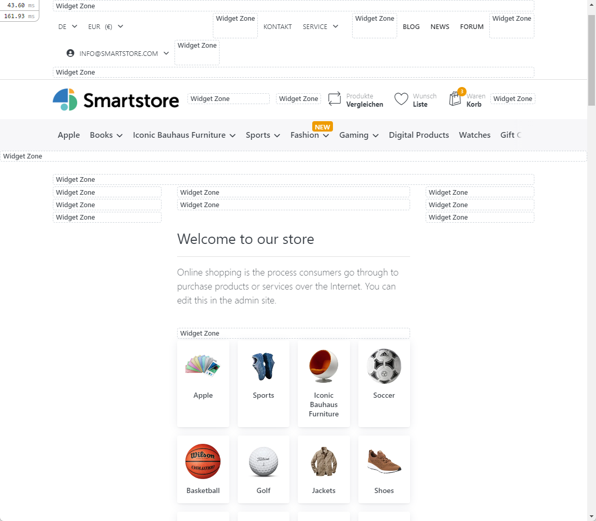

# What are widget zones?

Widget zones are placeholders that are defined in large numbers on all Smartstore pages. Widget zones are used to place and display stories, widgets, and page content. To find out where widget zones are positioned everywhere, enable widget zone display in **Admin > Plugins > Developer Tools**.

When this option is enabled, widget zones are displayed. If you want to know what a Widget Zone is called, hover over the "Widget Zone" text and the name will be displayed in a popup. Widget zones are visible only to users with administrator privileges. Your customers will not be able to see them at any time.

The most important widget zones are:

**content\_before**: Before the page content, first widget zone on the page (after header, navbar & slideshow).

**content\_after**: After the page content, before the footer

**teaser**: After content\_before, before homepage products

**main\_column\_before**: After teaser and before homepage products

**main\_column\_after**: Before content\_after

These widget zones can be found on all pages.

