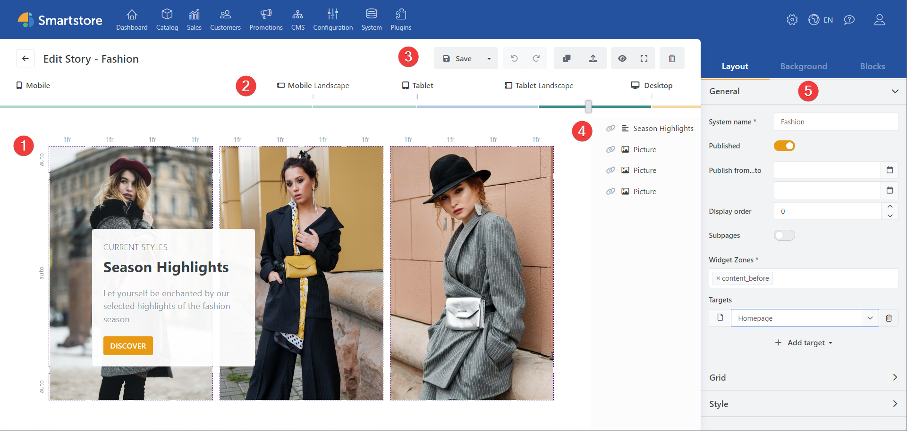
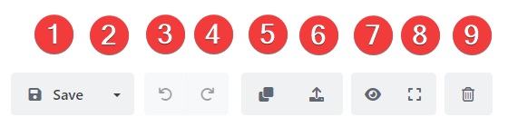

# User interface

1. **Grid**: The story is composed in the grid. Here you can edit the layout and content. You can also see directly how your story will be displayed.
2. **Device slider**: The position of the slider determines the currently selected resolution setting. The story preview adjusts directly to the change in slider position.
3. **General controls:** These buttons provide basic functionalities such as save story, undo change, delete story, among others.
4. **Block Manager:** Here you can see all the blocks that are used in a story. The order in the list determines the order in which the blocks are displayed.
5. **Toolbox**: The Toolbox provides access to essential story features and content. You can configure how the story is displayed and published, and you can access the Blocks library from the Toolbox. When a block is selected, block-related settings are displayed at this point.

Elements of the General Controls

1. **Save**: *(CTRL + S)* Saves the story.
2. **Save as**: Use the drop-down menu to save the story as a template.
3. **Undo**: *(CTRL+Z)* Undoes the last change.
4. **Restore**: *(CTRL+Y)* Restores the previous change.
5. **Duplicate**: Creates an exact copy of the current story.
6. **Export**: Exports the story as a template.
7. **Preview mode**: *(CTRL+ALT+P)* Shows a preview of the story. The preview shows your story as it will appear on the page when published, without a grid and with effects, video, and audio.
8. **Full Screen Mode**: *(CTRL + F11)* Shows the Page Builder in full screen.
9. **Delete**: Deletes the current story permanently.