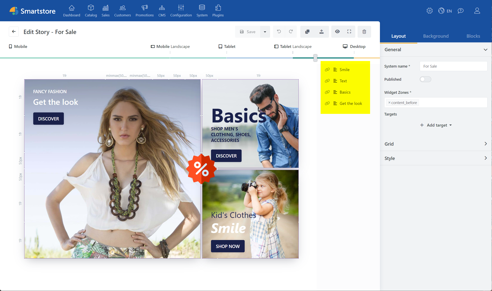
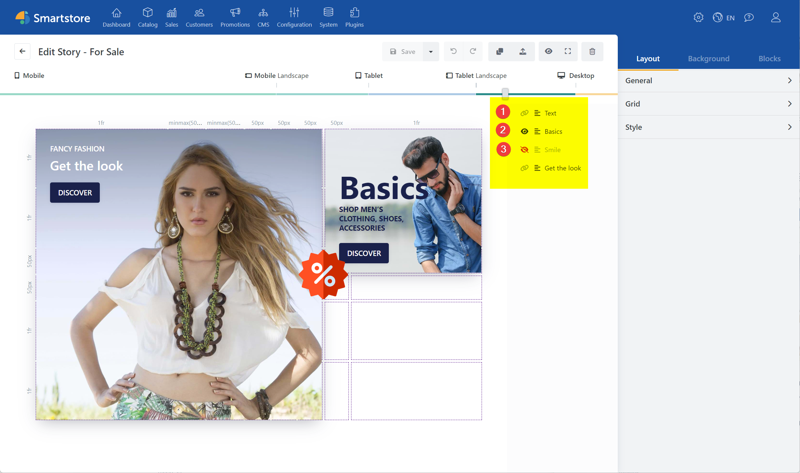

# Block Manager

In the Block Manager to the right of your story, you can see all the blocks placed in the story clearly listed. The Block Manager offers the possibility to edit blocks, to adjust the order and to activate or deactivate the display of the block.

The order of listing, as well as the display order of blocks within the story, is determined using the z-index setting of the block. The display order of blocks can therefore be freely adjusted. This allows additional elements to be placed before or after each block. This allows you to create modern and vivid designs by overlaying different blocks.

## Settings

In the Block Manager, a small icon is displayed to the left of each block. This icon indicates the current display properties of the block. It is possible to show or hide blocks at different resolution levels.

1. **Undetermined**: Block gets visibility transferred from previous resolution
2. **Visible**: Block is displayed
3. **Invisible**: Block is not displayed

> [!INFO]
> Note at this point that the *Smile* block will no longer be displayed because its visibility has been turned off. However, the *Basics* block will be displayed in any case, as it now overwrites the setting of the previous resolution.