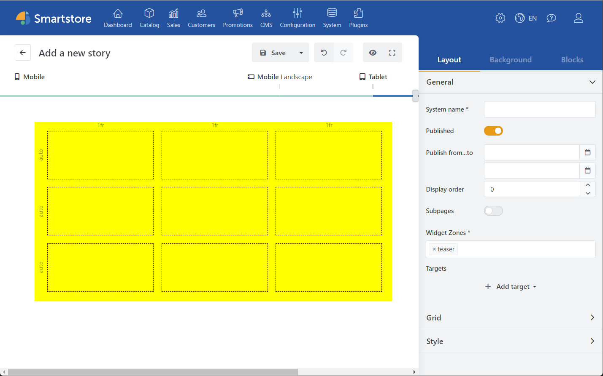
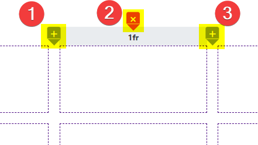

# Grid

Using the native CSS grid layout system, it is possible to define grids with any number of rows and columns. Content can be placed on such a grid, which is rendered responsively and device-independently in all resolutions. The contained content determines, depending on the grid configuration, the size of the individual cells.

## Grid Tools

The grid tools let you define and adjust the layout of the story. These tools appear when you move the mouse over the edge of the grid.

1. **Add**: Adds a new row or column.
2. **Delete**: Deletes the selected row or column.
3. **Define size**: Defines the size (width or height) of the cells in this axis. In addition to the size value, the size units can also be defined.