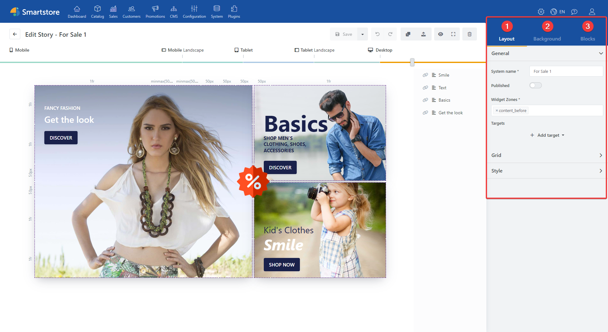
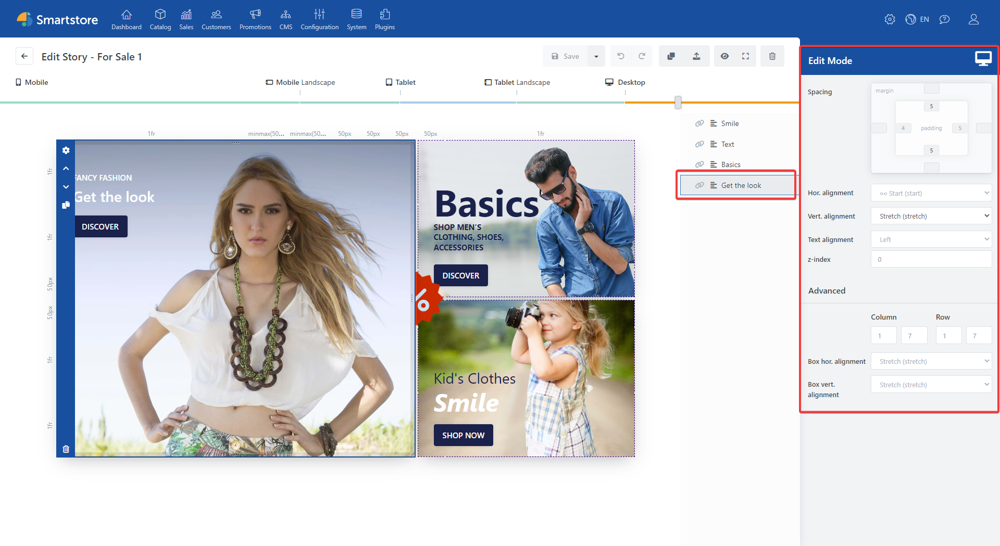

# Toolbox

# Story View

1. **Layout**: Includes general story options. For example, publishing options or display options. (See Layout)
2. **Background**: Provides options for customizing the background of the story with images, color effects, or videos. (See Background)
3. **Note**: The Toolbox view changes when a block is selected. To display the story options again, deselect the block or click a free space within your story.

> [!INFO]
> Note: The Toolbox view changes when a block is selected. To display the story options again, deselect the block or click a free space within your story.

# Block view

When you select a block, it is highlighted and brought to the foreground. In addition, the block actions are displayed at the left edge of the block. The gear icon opens the block's edit mode, which is used to configure content and effects.

The currently selected block is also highlighted in the Block Manager.

When a block is selected, block-related options such as content alignment and spacing are displayed in the toolbox on the right side of the page. Changes to block-related settings are always applied to the current resolution, which is determined using the top Device slider. These settings are also passed on to higher resolutions if no different configuration has been made there. (See Block options toolbox)