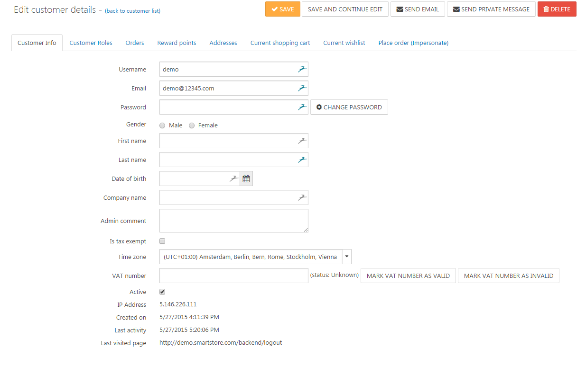
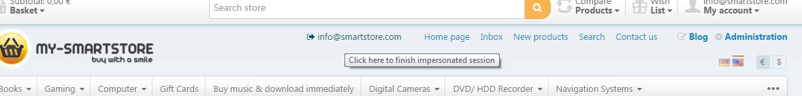

# Managing Customers

Every account that is created in Smartstore is a customer account that will have different roles such as guest, admin, registered, etc.. Therefore, even if shop visitors who have just entered your store or have just registered without having bought anything yet will be handled internally as customers. You can manage your customers by going to **Customers > Customers**. Here you can filter the customers of your shop depending on their customer role or you can search for certain customers with their e-mail address, username, first- & lastname, date of birth or company.

## Customer Details View

 By clicking on the e-mail address or the edit button you will get to the customer details view, whhere you can edit customer details, send them a direct e-mail/private message, or even delete the account. 

### Customer Info Tab

| **Field** | **Description** |
| --- | --- |
| Username | The customer's username. |
| Password | This field won't show any actual data as the password of the customer is confidential. It's purpose is to give you the possibility to alter the password of the customer. |
| Admin Comment | Admin comment regarding the customer. For internal use by the shop administrator only. In this field you can store any comments about the customer you want to remember. |
| Is Tax Exempt | Determines whether the customer is tax exempt. |
| Time Zone | The time zone of the customer. |
| VAT Number | Holds the company VAT number. NOTE: VAT numbers have to be entered with the country code (e.g. GB 111 111 11). This field will only be displayed if the option **EU VAT Enabled** in **Configuration > Settings > Tax Settings** is active. You can mark the contained value as **Vaild** or **Invalid** manually after you've checked it's validity. |
| Affiliate | If the customer was transferred to you by a affiliate the corresponding affiliate will be linked here so you can directly navigate to him. For more information about affiliates read the topic [Managing Affiliates](../../user-guide/marketing-promotions/managing-affiliates.md). |
| Last Visited Page | The page of your shop which the customer has visited last. |

> [!INFO]
> Fields like **Gender, Date of Birth, Company** and many others are only shown and can be edited in the **Customer Info Tab** if they are enabled in the **Customer Settings**. For more information about **Customer Settings** read the topic [Customer Settings](../../user-guide/configuration/general-settings-preferences/customer-settings.md).

### Customer Roles Tab

This tab shows all available customer roles. You can manually add or remove them from the customer in this tab by clicking on the corresponding checkboxes next to the customer roles.

### Orders Tab

This tab displays all orders in a clearly arranged grid. The presented data shows at a glance the **Order Total, Order Status, Payment Status, Shipping Status**, the **Store** the order was made in and the **Creation Date** of each order. By clicking on the **View**\-link of the corresponding order you will be referred to the details view of the order where you can edit its values. For more information about editing order details, visit the topic [Managing Orders](../../user-guide/sales/managing-orders.md).

### Reward Points Tab

Reward Points have to be activated by going to **Configuration > Settings > Reward Points**. They can be earned by your customers by performing certain actions, such as registering for a newsletter. The **Reward Points Tab** will display an overview of all reward points earned by this customer together with information why and when the customer has earned the reward points. You can also add reward points manually to the customer account in this tab, together with a descriptive message indicating the reason for earning the points you've assigned manually. For more information about reward points, read the topic [Understanding Reward Points](../customers/understanding-reward-points.md). 

### Addresses Tab

In the **Addresses Tab**, all the addresses the customer has created in your store will be displayed. You can enter the details view of the address, where you can edit it by clicking on **Edit** or delete it by clicking the **Delete** button.

### Current Shopping Cart Tab

This tab show all products the customer has currently in the shopping cart.

### Current Wishlist Tab

This tab show all products the customer currently has in the wishlist.

### Place Order (Impersonate) Tab

By clicking the button **Place Order**, you're able to see your shop through the eyes of your customer. You will see almost exactly what the customer would see while browsing your site, with the exception of the header menu, where you will see an additional link with the username of the customer. By clicking on it, you will end the session as the customer and return to the customer details view. By impersonating a customer, you can not only place an order on his behalf, but also check if certain **ACL** or **Customer Role** restrictions apply to the account as desired . Therefore, this function is ideal for testing the configuration of your own shop. 

## Delete Guest Accounts

As already stated above, all visitors of your shop will get their own customer account. Therefore, you need to delete your guest accounts on a regular basis. Of course, you wouldn't want to do this manually. There is a scheduled task named **Delete Guests** that will run once an hour by default to accomplish this automatically. For more information about scheduled tasks, read the topic [Managing Scheduled Tasks](../../user-guide/system-maintenance/managing-scheduled-tasks.md).