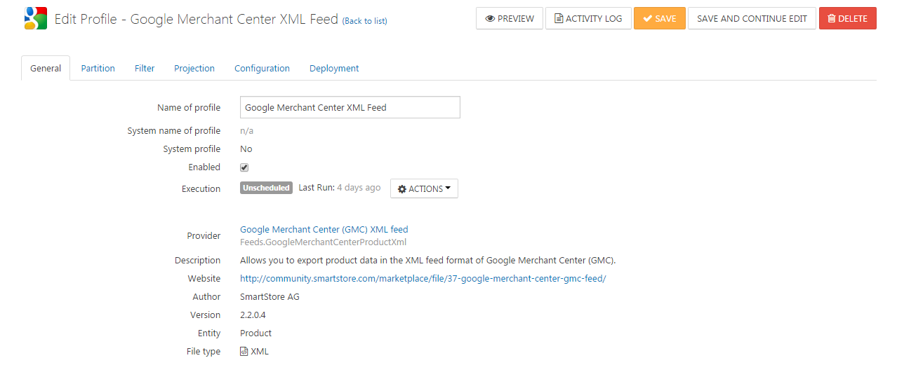
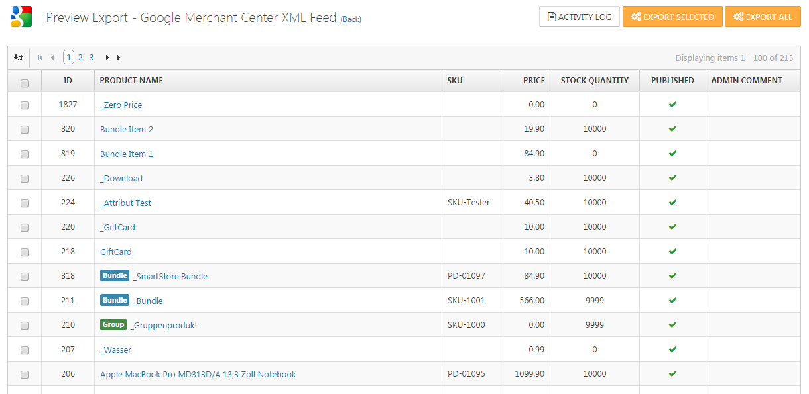

# Managing Export Profiles

The purpose of data export is to bulk export entities like products or customers so it can be used outside Smartstore.

An export profile is a configuration element that summarizes all information required for a data export with the aim to control the export process and to meet individual needs. These includes:

- **Scheduling**: Automatic scheduled exporting
- **Partition**: Partioning\\segmenting the data
- **Filter**: Limiting the data
- **Projection**: Projection information about the data
- **Configuration**: Specify format specific settings
- **Deployment**: Publishing information for the end of an export

Each export profile is associated with exactly one export provider. An export provider is a data formatter which is usually provided by plugins. Examples of export providers are OpenTrans, BMEcat, GMC feed etc.

To manage export profiles, go to **Configuration > Export**.

In the list you can directly execute a profile through Run Now and watch the progress of the export. Activity Log will open the log file of the last export. It contains all important information and any error message of the last execution of the export profile.

  

## Creating and Editing Export Profiles

Click on **Add New** to create a new export profile. A dialog appears where you must select the export provider. Optionally you can select an existing profile to copy its settings to the new profile. After clicking **OK**, you will be redirected to the new export profile.

To change an export profile, click the name of the profile in the profile list.

### 

### General Tab

In this tab you can enter the name of the profile and whether it is enabled. Disabled profiles are never executed. The page also summarizes the most important information about the export provider, such as author, version, file type, etc.

Data exports can run automatically via scheduled tasks at any time. Therefore a scheduled task is assigned to each export profile when it is created. This task is always unplanned by default, in other words the profile will not automatically execute. Click **Execution** to get a link to the related task and to change the scheduling settings. For more information about scheduled tasks read the topic [Managing Scheduled Tasks](../../../user-guide/system-maintenance/managing-scheduled-tasks.md).

### Partition Tab

In this tab you can define the partitioning of the data.

| 120px\|Input Field | Description |
| --- | --- |
| Offset | In this tab you can define the partitioning of the data. |
| Limit | Defines the maximum number of records to be exported. |
| Batch size | Defines the number of records per export file. By default this value is 0, that means all records are exported into one file. |
| Per store | Defines the number of records per export file. By default this value is 0, that means all records are exported into one file. |

### Filter Tab

In this tab you can define filter settings that limits the amount of data to be exported. The filters depend on the selected object type, i.e. a product export offers other filter options than an order export.

### Projection Tab

In this tab you enter settings that are projected onto the export as well as onto the data to be exported.

> [!INFO]
> A few of these setting are not included in the preview for technical reasons. They affect only the actual export.

### Configuration Tab

In this tab you configure the export provider you have selected to create the profile. Every provider can introduce his own configuration settings as it is needed during the export. When products are exported for the Google Mercant Center listing Google wants to know a special category that's defined by Google itself and more data (like: condition, age group, gender etc.) that are only relevant for the Google product export. Therefore the Google Merchant Center provider lets you configure default values for this information in the configuration tab. The configuration tab can also be empty if the provider requires no configuration.

### Deployment Tab

Through this tab, you specify what to be done with the data at the end of an export. In a first step the data is always stored in a temporary, local directory of the application where the data is not accessible through the Internet. The following settings are related to this temporary storing of the data:

180px|Input FieldDescriptionFolder nameThe name of the folder where to export the data.Pattern for file names

Specifies the pattern for creating file names. The **Example** button allows you to preview the result of the pattern resolving. The pattern supports the following placeholders:

| Placeholder | Description |
| --- | --- |
| %Profile.Id% | The numeric identifier of the export profile. |
| %Profile.FolderName% | The name of the export folder for the profile. |
| %Profile.SeoName% | The SEO friendly name of the export profile. |
| %ExportProfile.FolderName% | The name of the export folder for the profile. |
| %Store.Id% | The numeric identifier of the store of the current export run-through. |
| %Store.SeoName% | The SEO friendly name of the store of the current export run-through. Resolves to `allstores` if the **Per store** option is activated. |
| %File.Index% | A one based file index. |
| %Random.Number% | A random number. |
| %Timestamp% | A UTC timestamp. |

> [!INFO]
> Placeholders are intended to easier create unique file names. Please pay attention to avoid patterrns that lead to non unique file names and thus file name conflicts.

Create ZIP archive

Allows to combine all export files into one ZIP archive. The   archive   is   created   in   the   export folder   and   always  has the same   name   as   the   export folder .

Clean up at the endDeletes all created files at the end of an export, except the log file and the ZIP archive.Email notification

Sends a notification email about the completion of an export. Note that you can specify multiple email addresses where to send the email to.

> [!INFO]
> System exports (like product or category export) are always sending a notification email regardless  of  this   option.

  

In the next step you optionally create one or multiple publishing profiles to specify how to further proceed with the export files. There are four types of publishing: File System, Email, HTTP and FTP. General settings are:

| 180px\|Input Field | Description |
| --- | --- |
| Name | Name of the deployment. |
| Enabled | Defines whether the deployment is enabled and thus be executed. |
| Create ZIP archive | Defines whether to combine all export files into one ZIP archive and to copy the archive instead of the files. |

#### File System

The export files are copied in the local file system of the server the store is installed on.

| 180px\|Input Field | Description |
| --- | --- |
| Copy to public folder | Defines whether to copy files into the public **Exchange** folder of the store. Files in the **Exchange** folder are public because they are accessible through the internet. You do not have to specify a destination directory if this option is activated. |
| Directory path | The destination directory if previous option is deactivated. |

#### Email

A queued email with the export files as attachments is generated.

| 180px\|Input Field | Description |
| --- | --- |
| Email account | Specifies the email account used to sent the data. |
| Email addresses | Specifies the email addresses where to send the data. |
| Email subject | Specifies the subject of the email. |

#### HTTP

Transmits the export files via HTTP.

| 180px\|Input Field | Description |
| --- | --- |
| URL\\Host | Specifies the URL or the host name where to send the data. |
| HTTP transmission type | Specifies how to transmit the export files via HTTP. `Simple POST` makes a POST request for each file. `Multipart form data POST` sends all files in a single POST as multipart form data. |
| User name | Specifies the user name if required for the transmission. |
| Password | Specifies the password if required for the transmission. |

#### FTP

Transmits the export files via FTP.

| 180px\|Input Field | Description |
| --- | --- |
| URL\\Host | Specifies the URL or the host name where to send the data. |
| User name | Specifies the user name if required for the transmission. |
| Password | Specifies the password if required for the transmission. |
| Passive mode | Specifies whether to exchange data in active or passive mode. |
| Use SSL | Specifies whether to use SSL (Secure Sockets Layer) connection. |

## Export Data Preview

Click on **Preview** to reach the preview page. The export data will be displayed there in a data grid.

You can directly start the export process at this point. In addition to export all data, it is also possible to select certain records to be exported.

> [!INFO]
> A few projection settings are not included in the preview due to technical reasons. They affect only the actual export.