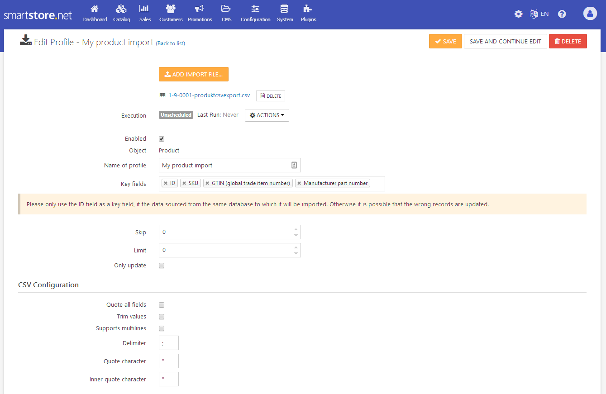
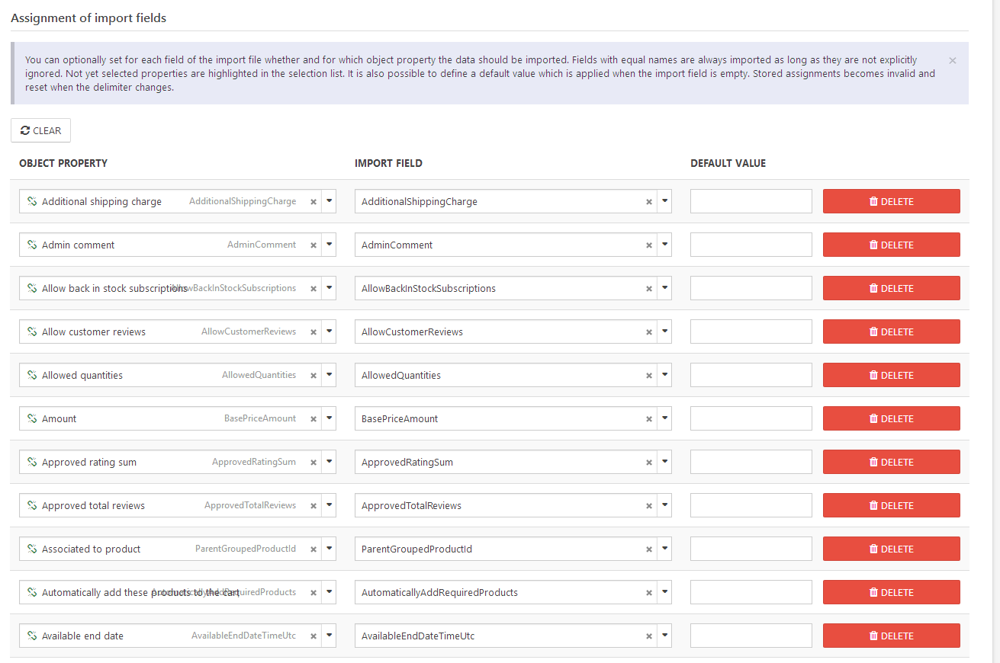

# Managing Import Profiles

The purpose of data import is to bulk import objects like products or customers from outside using delimiter structured files (CSV). The import functionality is also able to update a huge amount of data, e.g. product prices.

Import profiles summarize all required information to individually control the import operation. These include in particular:

- Uploading of files used as the data source
- Type of object to be imported, e.g. product, customer etc.
- CSV specific settings
- Import field data mapping
- Setup of automatic scheduled imports

To manage import profiles, go to **Configuration > Import**.

You can directly execute the scheduled task that is configured by a profile by **Run Now** in the profile list and watch  the progress of the import. **Activity Log** opens the log file for the last import. It contains important information (like errors) about the last execution of the profile.

## Creating and Editing Import Profiles

Click on **Add New** to create a new import profile. On the following page, you must upload your import file and select the import object. After clicking on **Save**, you will be redirected to the new import profile .

Click the name of the import profile to edit it.

Data imports can be executed automatically via scheduled tasks at any time. Therefore a scheduled task is assigned to each import profile when it is created. This task is always unscheduled by default, thus the profile will never automatically execute. Click **Execution** to get a link to the related task and to change the scheduling settings .

### Object Types

The import framework supports the following object types:

- Product
- Category
- Customer
- Newsletter Subscriber

### CSV specific settings

| Input Field | Description |
| --- | --- |
| Quote all fields | Defines whether to set quotation marks around all field values. |
| Trim values | Defines whether to remove space characters at start and end of a field value. |
| Supports multilines | Defines whether field values with multilines are supported. |
| Delimiter | Choose the field separator. |
| Quote character | Choose the quotation character. |
| Inner quote character | Choose the inner quote character used for escaping. |

> [!INFO]
> The first row of a CSV file must contain headers of the columns that they stand for.

### Import field data mapping

You can optionally set for each field of the import file whether and for which object property the data should be imported. Fields with equal names are always imported as long as they are not explicitly ignored. Not yet selected properties are highlighted in the selection list. It is also possible to define a default value which is applied when the import field is empty.

   

> [!INFO]
> By changing the data delimiter, stored assignments becomes invalid and reset.