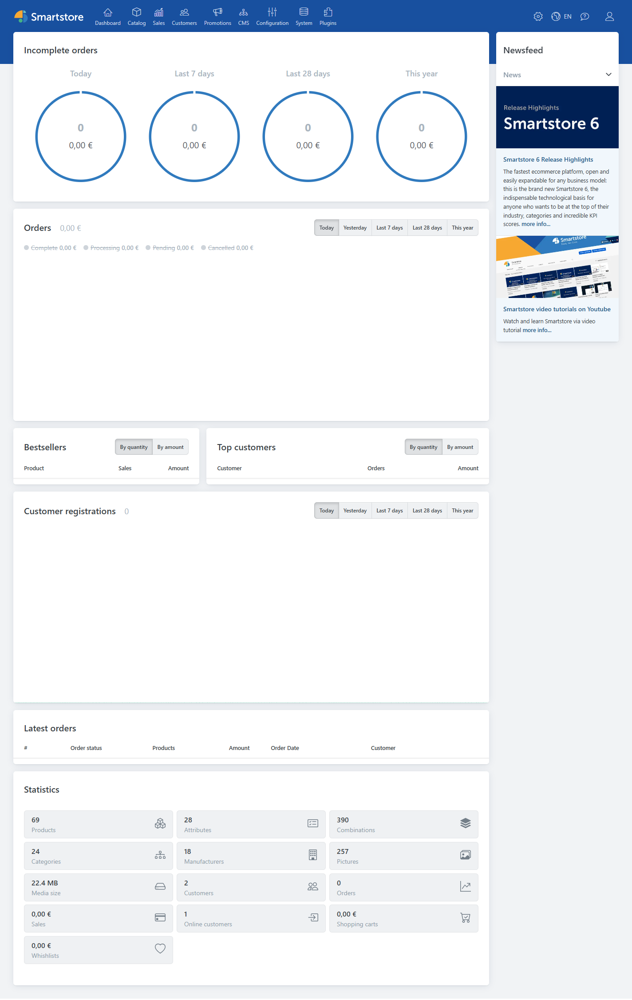
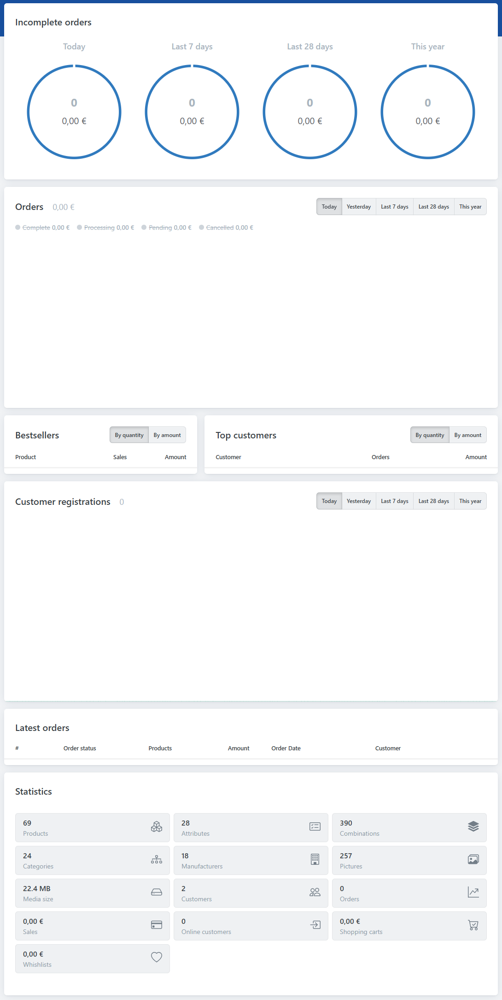

# Discovering the Backend

The **Smartstore** backend provides an interface that helps you to easily administer your store and manage your product catalog. To access the backend interface, log into the application. If you are logged in as shop administrator, there will be a link in the main navigation menu of the shop as well as in the account management menu.

1. Account Management Menu
2. Administration Link

The **Smartstore** backend interface will be displayed. 

The interface consists of the following components:

- Main Navigation Menu
- Top Right Links
- Workspace

## Main Navigation Menu

The **Main Navigation Menu** provides access to the core modules of the **Smartstore** application, such as **Dashboard, Catalog, Sales, Customers, Promotions, CMS, Configuration, System** and **Plugins.**

The **Main Navigation Menu** provides access to the following important modules. For more information, click the respective links.

- [**Dashboard**](../user-guide/the-dashboard.md) \- Allows you to view your store statistics related to order totals, bestsellers by quantity, bestsellers by amount, registered customers and incomplete orders.
- [**Catalog**](../user-guide/catalog.md) \- Allows you to define and manage categories and products. You can also manage manufacturers as well as product reviews, tags and attributes.
- [**Sales**](../user-guide/sales.md) \- Allows you to manage all orders, shipments, recurring payments, return requests, gift cards, the shopping cart, wish lists, bestsellers and products not purchased.
- [**Customers**](../user-guide/customers.md) \- Allows you to add, edit, remove and manage all customers. You can also manage their roles, orders, reward points, shopping carts and wish lists.
- [**Promotions**](../user-guide/marketing-promotions.md) \- Allows you to add, edit and manage discounts, affiliates, newsletter subscribers and campaigns.
- [**CMS**](../user-guide/content-management.md) \- Allows you to manage content related to your store such as topics, news, blogs, forums, polls and widgets. You can also customize message templates.
- [**Configuration**](../user-guide/configuration.md) \- Allows you to configure the core system and regional settings. You can also configure stores, payment methods, lists, e-mail accounts, access types, ACL and themes.
- [**System**](../user-guide/system-maintenance.md) \- Allows you to view and manage system logs, message queues, SEO and warnings and to schedule tasks.
- [**Plugins**](../user-guide/plugins-themes.md) \- Allows you to install and update plugins. You can also manage various SMS providers and developer tools.

## Top Right Links 

The **Top Right Links** allows you to configure account settings, view store, change language, access help and log out of the **Smartstore** application.

| **Option** | **Description** |
| --- | --- |
|  | Provides drop down list with options to view your store, clear cache and restart the application. |
| .png) | Allows you to change the language of the application. |
| .png) | Allows you to access online help. |
| .png) | Allows you to configure account settings and log out of the application. |

## Workspace

The **Workspace** is the area in which you can explore and work with all the modules within the **Smartstore** application.  

