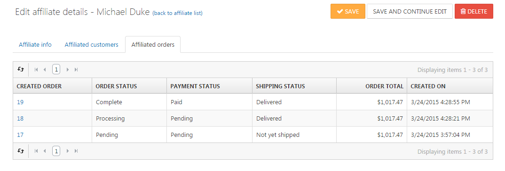

# Managing Affiliates

Affiliate marketing is a sales strategy through which you reward another online marketer for each visitor, customer or order he/she has brought to you by his/her own marketing efforts. Smartstore keeps track of all referred customers and the orders they place while visiting your store via the designated URL you provided to your marketing partner for this purpose. To manage affiliates, navigate to **Promotions > Affiliates**. After you've created an affiliate by entering all the relevant details such as name, address and e-mail address, Smartstore creates an affiliate URL that you can transmit to your marketing partner. The affiliate URL looks like this: [http://www.my-store.com/?affiliateid=1](http://localhost:63343/?affiliateid=1), where **1** is the affiliate ID. If customers visit your store through this URL, they will be assigned to the corresponding affiliate. The customers transferred to you and their corresponding orders can be seen in the tabs  **Affiliated Customers** and **Affiliated Orders** of the corresponding affiliate.

