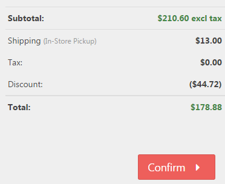

# Managing Discounts

Discounts are a powerful marketing tool that you can use to achieve various goals. With discounts, you can create certain sales incentives for your shop visitors, thereby generating higher   revenue. You can, for example, create seasonal or closing sales or promote slow selling products.  For more ideas on how to use discounts, please refer to the **Example Scenarios** section below. 

You can manage discounts by navigating to **Admin > Promotions > Discounts**. By clicking on **Add New**, you create a new discount. 

## Discount Info 

250px|FieldDescription**Name**Specifies the internal name of the discount.**Discount Type**

Specifies the entity to which the discount will be applied

**Options**:

| 150px\|Discount Type | Description |
| --- | --- |
| Assigned to products | The discount will be applied to the price of every product to which this discount is assigned. When this discount type is selected, a new tab will be shown in the product configuration area, where you can choose all of the discounts of this type and assign them to the product. A link to the assigned products will be shown beneath the discount type field. In the product details view of the frontend, the regular price will be crossed out and the new discounted price will be shown in bold next to it.   |
| *Assigned to categories* | The discount will be applied to the price of every product of the category to which this discount is assigned. When this discount type is selected, a new tab will be shown in the category configuration area, where you can choose all of the discounts of this type and assign them to the category . A link to the assigned categories will be shown underneath the discount type field. In the product page of your shop, the regular price will be crossed out and the new discounted price will be shown in bold next to it.   |
| *Assigned to order subtotal* | The discount will be applied to the order subtotal (total excluding shipping and payment fees) and will be shown in the shopping cart summary.   |
| *Assigned to shipping* | The discount will be applied to every shipping rate, which will be displayed to the user. |
| *Assigned to order total* | The discount will be applied to the order total and will be shown on the order confirmation page, after the customer has chosen the payment and shipping method (the order total includes payment and shipping fees).     |

**Use Percentage**

Determines whether to apply a percentage or a fixed value discount to the target.**Discount Percentage/ Discount Amount**The discount value as a percentage or a fixed amount.**Start Date**The date from which the discount is valid.**End Date**The date when the discount expires.**Requires Coupon Code**If this box is checked, a customer must supply a valid coupon code for the discount to be applied.**Coupon Code**The discount coupon code. For more information about coupon codes, please refer to the description below this table.**Discount Limitation**

The discount limitation enables you to set a threshold for the application of the discount. You can specify the number of times the code can be used by your customers either globally or specifically (i.e. per customer), or you can allow unlimited usage of the code.

- **Unlimited**: The number of times the discount can be applied is unlimited.
- **N times only**: The discount will only be applied **N** times.
- **N times per customer**: The discount will only be applied **N** times per customer.

**N times**The number of times the discount can be applied by your customers.

## Working with Coupon Codes

Coupon codes enable you to equip your customers with codes they can apply in the summary of the checkout process, thereby saving money on their purchases. This way, you can create attractive sales incentives. Coupon codes can be freely defined for every created discount. 

          

## Requirements

You can add an unlimited number of requirements that have to be met before the discount will be applied. 

| 250px\|Discount Requirement | Description |
| --- | --- |
| **Must be assigned to customer role** | The discount will only be applied if the customer is assigned to a certain customer role. When this requirement is chosen, a dropdown list will appear beneath the requirement, where you can choose the corresponding customer role. To add multiple customer roles, you need to add a requirement for each of the customer roles you want to specify as a requirement for the discount. |
| **Billing country is** | The discount will only be applied if the customer has the specified billing country. When this requirement is chosen, a dropdown list will appear beneath the requirement, where you can choose the corresponding billing country. To add multiple billing countries, you need to add a requirement for each of the billing countries. |
| **Shipping country is** | The discount will only be applied if the customer has the specified shipping country . When this requirement is chosen, a dropdown list will appear beneath the requirement, where you can choose the corresponding shipping country. To add multiple shipping countries, you need to add a requirement for each of the shipping countries you want to specify as a requirement for the discount. |
| **Customer has one of these products in the cart** | The discount will only be applied if the customer has one of the specified products in his shopping cart .  When choosing this requirement, you specify the products that belong to the requirement by entering a list of product identifiers separated by commas (e.g. 77, 123, 156) in the field that appears below . You can find a product ID on its edit page. You can also specify the comma-separated list of product identifiers with quantities ({Product ID}:{Quantity}, e.g. 77:1, 123:2, 156:3). Also, you can specify the comma-separated list of product identifiers with a quantity range ({Product ID}:{Min quantity}-{Max quantity}, e.g. 77:1-3, 123:2-5, 156:3-8). |
| **Customer has all of these products in the cart** | The discount will only be applied if the customer has all of the specified products in his shopping cart . When choosing this requirement, you specify the products that belong to the requirement by entering a list of product identifiers separated by commas (e.g. 77, 123, 156) in the field that appears below . You can find a product ID on its edit page. You can also specify the comma-separated list of product identifiers with quantities ({Product ID}:{Quantity}, e.g. 77:1, 123:2, 156:3). Also, you can specify the comma-separated list of product identifiers with a quantity range ({Product ID}:{Min quantity}-{Max quantity}, e.g. 77:1-3, 123:2-5, 156:3-8). |
| **Customer had spent x amount** | Discount will be applied if customer has spent/purchased x.xx amount. |
| **Restricted to store** | The discount will only be applied if the customer purchases products from the assigned store . When this requirement is chosen, a dropdown list will appear beneath the requirement, where you can choose the corresponding store. To add multiple stores, you need to add a requirement for each of the stores you want to specify as a requirement for the discount. |
| **Customer has selected payment method** | The discount will only be applied if the customer has chosen one of the specified payment methods . When this requirement is chosen, a dropdown list will appear beneath the requirement, where you can choose from multiple payment methods. |
| **Customer has selected shipping option** | The discount will only be applied if the customer has chosen one of the determined shipping options . When this requirement is chosen, a dropdown list will appear beneath the requirement, where you can choose from multiple shipping options. |
| **Customer had previously purchased one of these products** | The discount will only be applied if the customer had previously purchased one of the specified products.  When choosing this requirement, you specify the products that belong to the requirement by entering a list of product identifiers separated by commas (e.g. 77, 123, 156) in the field that appears below . You can find a product's ID on its edit page. |
| **Customer had previously purchased all of these products** | The discount will only be applied if the customer had previously purchased all of the specified products.  When choosing this requirement, you specify the products that belong to the requirement by entering a list of product identifiers separated by commas (e.g. 77, 123, 156) in the field that appears below . You can find a product's ID on its edit page. |

## Usage History

In the tab usage history, you can see a list of all the orders to which the discount was applied.

## Example Scenarios

### General discounts for products & categories for different customer groups

There might be certain customer groups like resellers to whom you want to give a special discount on certain products or even entire product categories. In this case, you would create a discount with the **Discount Type** *Assigned to products* or  **Assigned to categories** , specify the products and categories for which the discount is valid, and add the **Discount Requirement**  *Must be assigned to customer role.*

### Special discounts for customers who have reached a certain order total 

You could encourage customers to buy as much as possible by granting a discount at a certain order total. The **Discount Type** you would create for this purpose would be *Assigned to order total* or *Assigned to order subtotal*, and the **Discount Requirement** would be *Customer had spent x* (Euros? Currency should be filled in here). 

### Temporary discounts for special sales promotions (e.g. seasonal or closing sales)

Let's say you want to create a summer sale or an X'mas special where you offer your customers a temporary discount. To do so, you would create a discount with the  **Discount Type**  *Assigned to order total* or *Assigned to order subtotal* and specify a **Start Date** and an **End Date**. 

### 100% product discount for special sales promotion: "Buy one product, get another one free"

Imagine you want to persuade your customers to buy a certain product by giving another product away for free. For this purpose, you would create a discount with the **Discount Type**   *Assigned to products*. You would select the option **Use Percentage** and set the **Discount Percentage** to 100%. Next, add the **Discount Requirement**  *Customer has one of these products in the cart* and enter the ID of the product that needs to be purchased. Finally, you would assign the discount to the product to be given away for free by navigating to the product and activating the discount in the discount tab of the [product details area](../../user-guide/catalog/managing-products/creating-and-editing-products.md) in the administration area.

### One-Time discount when a product that was previously not in stock becomes available again  

Imagine a customer has subscribed to get a notification if a product that wasn't in stock becomes available again. To convince him to buy the product at once, you could create an incentive by sending him a coupon code by e-mail, advising of the product's availability ( *Customer.BackInStock*\-Message Template). 

### Cash discount for certain payment methods

You may favor some payment methods over others (e.g. cash in advance). In that case, you would encourage your customers to choose your preferred payment method by creating a discount with the **Discount Type** *Assigned to order total* or *Assigned to order subtotal* and the **Discount Requirement** *Customer has selected payment method*, for which you choose your preferred payment method.

### One-Time discount for newsletter subscription

Newsletter campaigns are a very good way to reach your own customer base on a regular basis. Therefore, you want to get as many subscribers to your newsletters as possible.  To persuade more visitors to subscribe to your newsletter, you could offer them a certain discount on one of their next orders. The discount to be created for this purpose has the **Discount Type** *Assigned to order total* or *Assigned to order subtotal.* Additionally, you should check the option **Requires Coupon Code** and specify the **Coupon Code** which you would place in the [Message Template](../../user-guide/content-management/customizing-message-templates.md) *NewsLetterSubscription.ActivationMessage.*