# Dimension pricing plugin

Dimension pricing plugin primarily allows the owner of a Smartstore webshop to expand his offer of products that can be sold, not by piece, but by dimensions. The best example of the use are the so-called 'cut-to-size' products, ie products for which the customer needs to enter, for example, width and length, and the plugin calculates the price of the product based on the customers input. It also allows custom cost of shipping calculation of purchases on, for example, a pallet or container, methods that have not yet been presented in the basic version of Smartstore webshop.

In general, the plugin consists of 2 main parts:

- Dimension pricing
- Shipping by dimensions and weight (including Shipping by dimension and weight calculation method)

## Dimension pricing plugin on frontend

On the frontend, the plugin changes the way the product is added to the cart (**Dimension unit calculation widget**) and provides additional information to the customer at checkout. For the purposes of this tutorial, we marked dimension pricing data in red rectangles.

### Product details - Add to cart

The quantity input for a specific product when adding it to the cart has been replaced with a custom control that depends on the settings previously selected by the store owner. It is best to explain the capabilities of the plugin with 4 examples.

#### Example 1

When buying tiles, customers buy a certain area (usually in m²). For easier orientation we want to show the user how much 1 package m² contains. The product has fixed width and length (59.5 x 59.5 cm), which are used to calculate the area . Since the plugin has its widget enabled, it is shown with the Add to cart button. In addition to the quantity, the plugin adds another field for the area (in this case 1 package = 0.35 m²). The customer can now easily orientate which area (and consequently which quantity) to order. If the field quantity changes, the field area is changed and vice versa. Also, the total price of the ordered products is automatically displayed (below the quantity and area field).

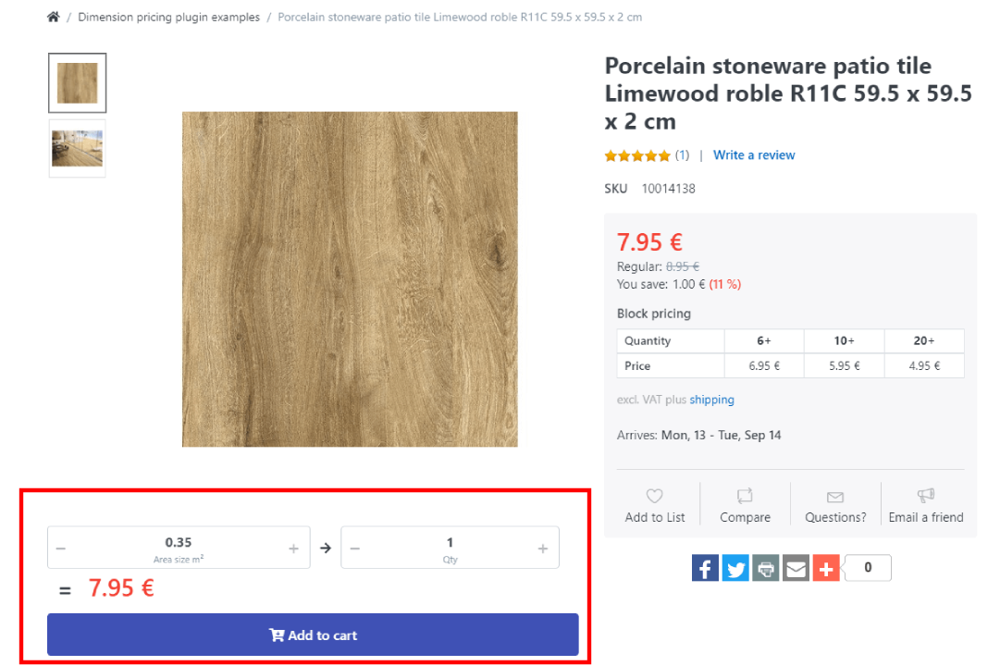

#### Example 2

This example is similar to the previous one, except that it calculates the volume in m3 (instead of area). The bag has a volume of 0.5 m3 with a price of 60.00€. The product also has tier prices which, in this example, set a price of 55.00€ with 10 bags or more. The customer can set, in the widget, the desirable volume and the plugin automatically sets the quantity and price. Plugin also respects the tier pricing and sets the price regarding the quantity. Also, note that the whole part for adding to the cart ('Add to Cart' button, quantity and volume size fields) is located on different position than in Example 1. It is also possible to configure in the plugin.

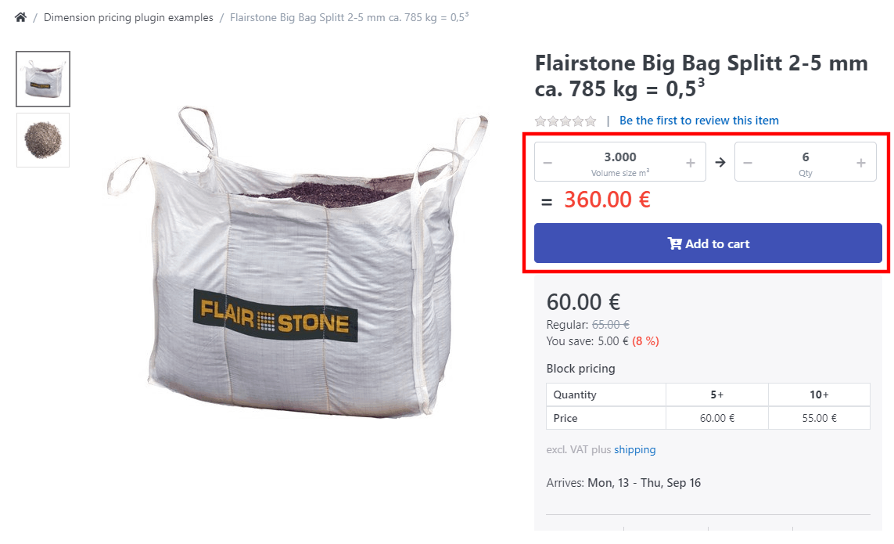

#### Example 3

In this example, the product uses a "cut-to-size" template which allows the customer to set the width and height of the slat. You can notice that the calculated area size and quantity are displayed below the dimension entry controls. The price of the product is 164,95 € (per m²). If the customer specifies the desired width and height in centimeters (in this case 250 cm x 150 cm, respectively), the area of the desired slat, in this example 3.75m², is calculated automatically. Since the quantity can be only a whole number, the plugin automatically rounds to the next whole number which is 4. The price is then calculated accordingly (4 x 164,95 € = 659,80 €). Under the "Add to cart" button, a message is displayed informing the customer that he cannot change the quantity in the cart.

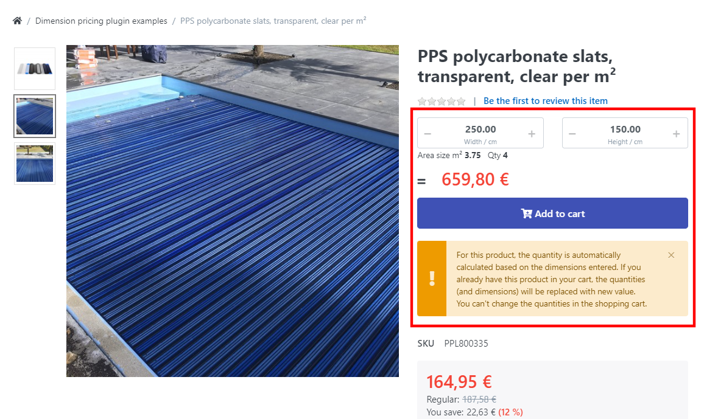

#### Example 4

This example will explain how to add formulas to combine 2 items to calculate shipping costs to save space. In the figure below you can see that we entered the value "A" and calculate the combined width as A + Width.  

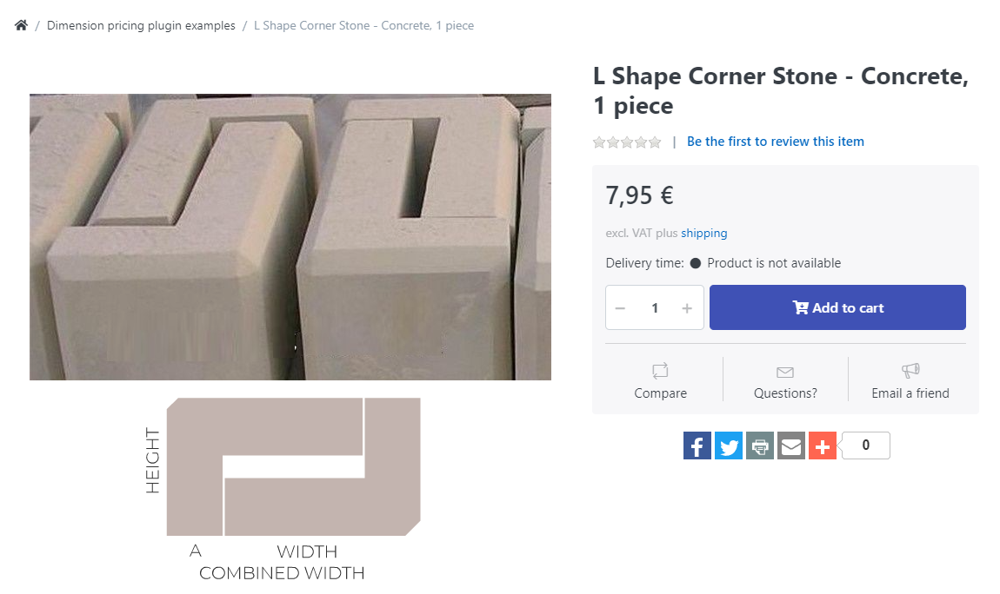

#### Dimensions tab

The plugin has the ability to display additional product dimensions in a special tab under the **Dimensions tab** on the product details screen. The following are the dimensions from the example 2 :

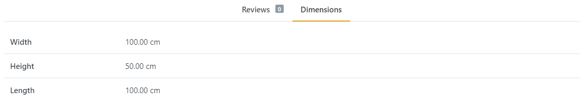

#### Mini-cart / cart

When the customer adds a product with dimension pricing enabled to the cart, the dimensions are displayed in the sidebar of the mini cart and in the normal cart.

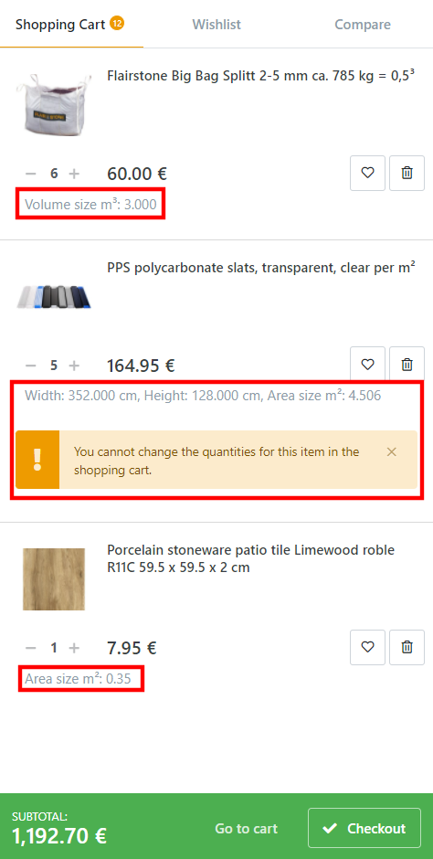

If a product has *Is custom dimension value entry* enabled property set (explained under ***Unit calculation widget***), the customer cannot change the quantity since the quantity is calculated trough the dimension formula (explained under ***Unit calculation widget***) which he will be notified with the appropriate message.

Changing the quantity of products that don't have the *Is custom dimension value entry* property enabled, the volume/area size is updated.

#### Checkout

On the checkout screen the customer will have the information same as in cart but with calculated shipping / payment method fees. 

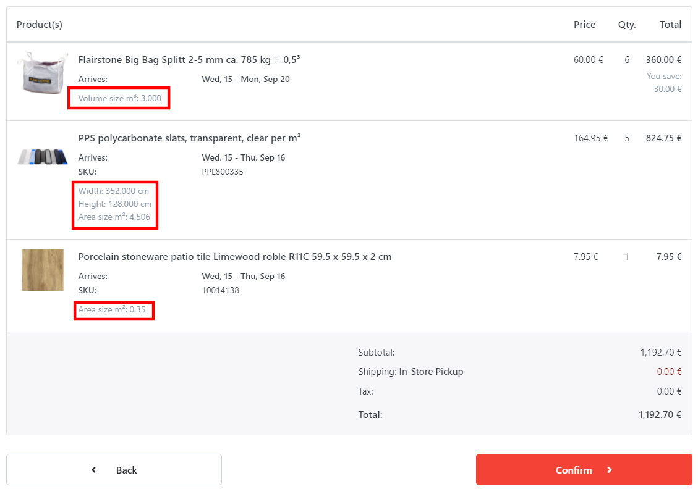

#### Shipping methods

Depending on the selected settings as well as the defined prices for shipping type, shipping unit and shipping type (here using the example of placement on pallets) and the defined prices for store, country and postal code from the customer's delivery address, the optimal product placement on the pallet is calculated and the price is displayed on each shipping method (for which data were entered).

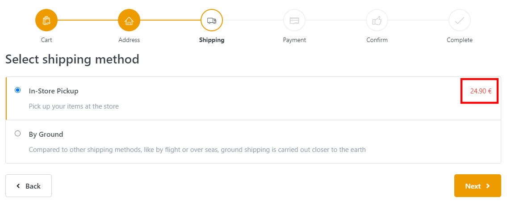

### Order

When a order is completed, the information will be showed on the order details screen as well in the confirmation e-mail that the customer receives.

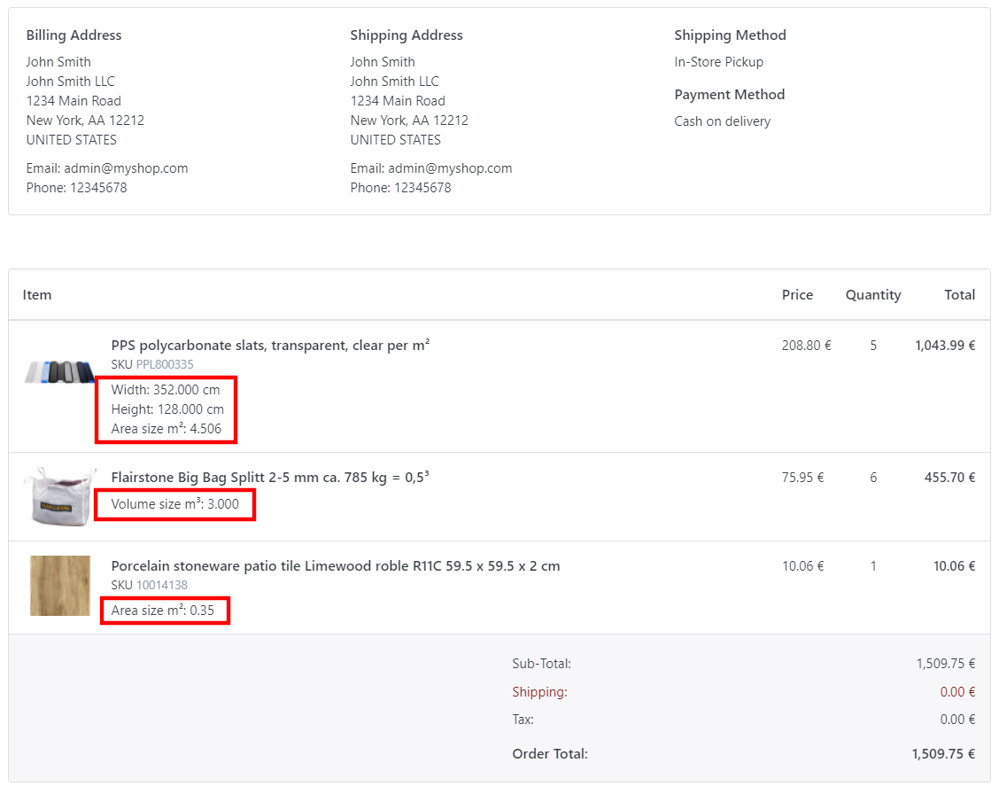

## Dimension pricing plugin on administration

After the installation of the plugin, it has its data filled with some basic information that can be changed or erased.

In the administration navigation menu, you will have few entry points available:

- **Plugins > Dimension pricing** – plugin settings and shipping part configuration
- **Catalog > Product dimensions** – dimension templates configuration
- **Configuration > Regional Settings > Shipping rate computation methods** \- selecting active shipping rate computation method(s)
- **Catalog > Edit product > Dimensions tab** \- selecting template and entering concrete values for product

You will also have a new shipping method set active (***Shipping by dimension and weight**).*

The plugin is divided in two main parts : shipping and dimension templates.

Shipping templates contain s**hipping types and units** and **shipping prices**.

Dimension templates contain **dimensions**, **unit calculation widget** and **custom formulas for shipping**.

Each feature will be explained below.

### Settings

To access the settings screen open the plugin configuration and click on the **Settings** tab. You will be presented with some options :

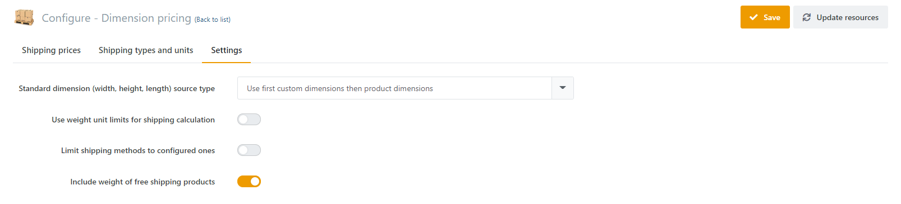

*Standard dimension (width, height, length) source type* option allows you to use standard dimensions (width, height and length) from the product details. This option applies to all retrievals of standard dimensions for the entire plugin area: dimension pricing as well as shipping price calculation method.

The dropdown has 4 options :

- Use only product dimensions - only the values of the main dimensions defined in **Admin> Edit Product > Product Info** are used
- Use only custom dimensions - in order for everything to work, it is necessary to define the width, height and length dimensions as custom dimensions and assign specific values to each product.
- Use first product dimensions then custom dimensions - If the **Admin> Edit Product > Product Info** value is 0, the value of the custom dimension is displayed.
- Use first custom dimensions then product dimensions - ice versa compared to the previous option

*Use weight unit limits for shipping calculation* option allows to consider weight of products and unit limits when calculating the shipping cost.

*Limit shipping methods to configured ones* option limits the customer shipping options. If checked, the customer can only choose one of the shipping options set in the plugin. Otherwise, the customer will be able to choose any existing shipping options even if they're not configured here.

*Include weight of free shipping products* specifies whether to include the weight of free shipping products in the calculation.

### Product dimensions

**Dimension templates** are used to display a custom unit calculation widget and to display custom product dimensions in the product details. You can later use this template and its dimensions when editing individual products to enter concrete values for specific dimensions for a particular product.

**Dimensions** are units of measurement and have multiple applications. They can be used in area/volume calculation formulas such as "width", "height" or "length". It is possible to add as many dimensions as needed for the formula, typically used in irregular shapes. 

**Unit calculation widget** is the widget that is shown on the product details screen. It, depending on how it's configured, displays the volume/area regarding the quantity and vice versa and allow the customer to set dimensions.

**Custom formulas** for shipping are used only when you ship packages of irregular shape (not cuboid) and need to group them into cuboid packages to save space. It can also be used if you define dimensions that do not have a standard name (eg if you need to define dimensions called "shipping\_width", "shipping \_height" and "shipping\_length").

#### Dimension templates

Dimension template list can be found under **Catalog -> Product dimensions** in the Administration area. Clicking on the option, the dimension template list screen will be opened.

Dimension template have a set of rules (regarding dimension pricing and shipping calculations) that determine how a product that uses that template behaves.  

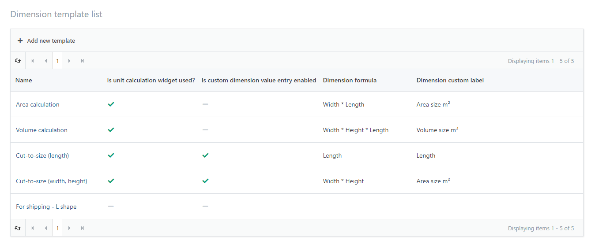

Clicking on the **Add new template** button, you will be redirected to a new screen:

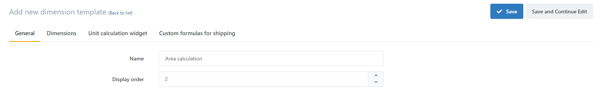

Set the *Name* and the *Display order* for the shipping type and click **Save** or **Save and Continue Edit**. After saving, you will be able to add dimensions, define the unit calculation widget or add custom formulas for shipping.

#### Creating dimensions

On the **Dimensions** tab you will be met with a graphic explaining the dimensions on an irregularly shaped object. 

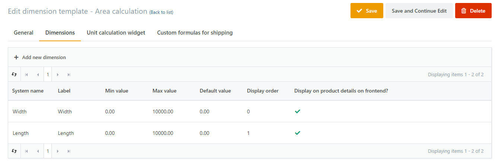

To add a new dimension, click the **Add new dimension** button which will open a popup:  

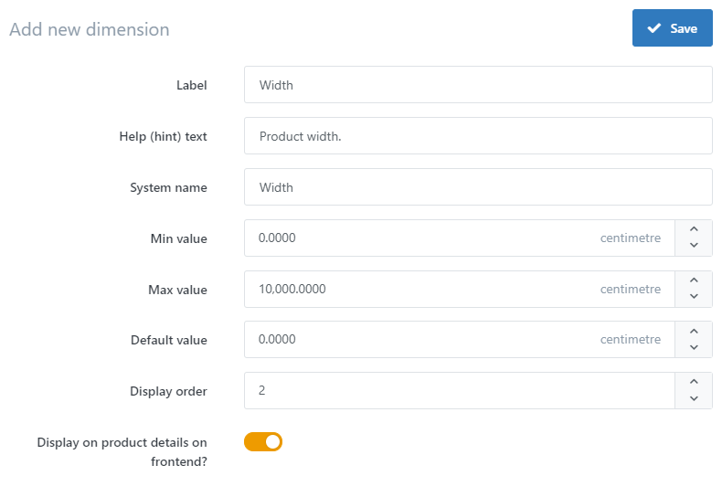

| Input field | Description |
| --- | --- |
| Label | The label which will be shown on the **Dimension tab** when editing a product. |
| Help (hint) text | Help text which will be shown on the **Dimension tab** when editing a product. |
| System name | System name used in the calculation formula. |
| Min value | Minimal value that the dimension can be on the **Dimension tab** when editing the product. |
| Max value | Maximal value that the dimension can be on the **Dimension tab** when editing the product. |
| Default value | Default value that the dimension can be on the **Dimension tab** when editing the product. |
| Display order | Display order of dimension on the **Dimension tab** while editing the product. Ordered by ascending. |
| Display on product details on frontend? | Whether the dimension will be displayed on the frontend. If the checkbox is checked, the dimension will be displayed in a special tab on the frontend. |

> [!INFO]
> A **dimension template** must be created before creating dimensions.

#### Unit calculation widget

On this tab you can set the formula that is used to convert the unit quantity of a product into any metric. Checking the *Is unit calculation widget used?* checkbox will allow you to set the widget zone, dimension formula, dimension ratio, the number of decimals, whether the custom dimension value entry is enabled, the dimension custom label and the quantity custom label.

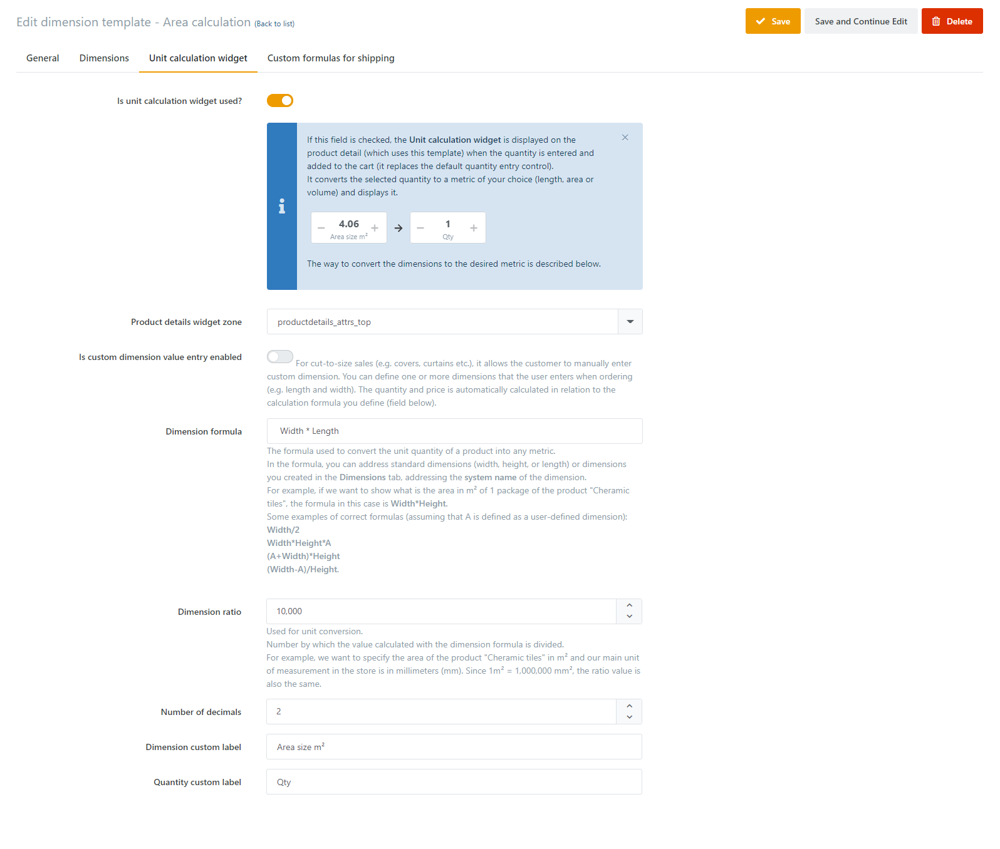

| Input field | Description |
| --- | --- |
| Is unit calculation widget used? | Sets whether the Unit calculation widget is displayed on the product detail (and thus replaces the standard 'Add to cart' button with quantity field only). |
| Product details widget zone | Sets where the selected widget is displayed on the product detail page. |
| Is custom dimension value entry enabled | Allows the customer to manually enter custom dimensions. Used for 'cut-to-size' products. |
| Dimension formula | The formula used to convert the unit quantity of a product into any metric.  In the formula, you can address standard dimensions (width, height, or length) or dimensions you created in the Dimensions tab, addressing the system name of the dimension. |
| Dimension ratio | Number by which the value calculated with the dimension formula is divided. |
| Number of decimals | Number of decimals displayed on unit dimension control (the calculated value is rounded to that decimal number). |
| Dimension custom label | Custom label indicating what custom metric represents (This value is displayed on the dimension entry control). |
| Quantity custom label | Custom label indicating what quantity control represents (This value is displayed on the quantity entry control). |

#### Unit calculation widget values for our examples

| Input field | Example 1 | Example 2 | Example 3 | Example 4 |
| --- | --- | --- | --- | --- |
| Is unit calculation widget used? | YES | YES | YES | NO  |
| Product details widget zone |     |     |     |     |
| Is custom dimension value entry enabled | NO  | NO  | YES | NO  |
| Dimension formula | width \* height | capacity\_width \* capacity\_height \* capacity\_length | width \* height |     |
| Dimension ratio | 10000 | 1000000 | 10000 |     |
| Number of decimals | 2   | 2   | 3   |     |
| Dimension custom label | Area size m² | Volume in m3 | Area size m² |     |
| Quantity custom label | Qty | Qty | Qty |     |

#### Custom formulas for shipping

It is possible to place 2 irregular objects next to each other or to rotate them on a pallet. These two scenarios will leave a different footprint on a pallet creating two different prices. With custom formulas for shipping, it is possible to define the number of items used which will create a cuboid-like shape which will have a combined footprint. Opening **Custom formulas for shipping** you can view the already created custom formulas.

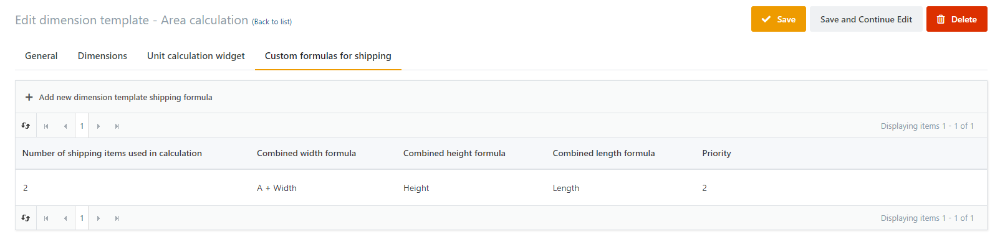

To add a new custom formula, click the **Add new dimension template shipping formula** which will open a popup :

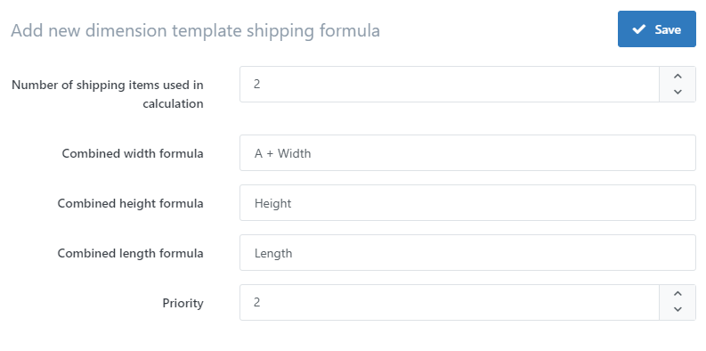

| Input field | Description |
| --- | --- |
| Number of shipping items used in calculation | How many items of the same product are combined together to save volume for shipping. |
| Combined width formula | Formula for the total width when combining several items. |
| Combined height formula | Formula for the total height when combining several items. |
| Combined length formula | Formula for the total length when combining several items. |
| Priority | Combining items are arranged ascending order in this field. |

> [!INFO]
> A **dimension template** and **dimensions** need to be created before adding custom formulas for shipping

#### Product Dimension tab

You can access the **Dimension tab** on the **Edit product** screen where you will see the Dimensions tab. Here you can use the defined dimension templates and enter specific dimension values for a product. 

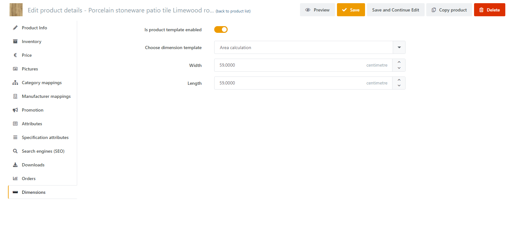

Upon enabling the *Is product template enabled* checkbox, you will be shown with the set dimension templates. Selecting one will show the dimensions you had set before with restrictions.

### Shipping / Shipping rate calculation

A **shipping type** is the shipping method for a certain carrier. For example: Pallet shipping, Parcel shipping, Container shipping etc. 

**Shipping units** are specific quantities with dimensional and weight restrictions related to the shipping type. In the example of pallet shipping, you can specify the restriction for ¼ pallet, ½ pallet and a full pallet.

**Shipping unit price** is a price of a shipping type and unit for a shipping method.

#### Create Shipping types and units

In order to set shipping prices, you have to create shipping types and units. To do so you will have to navigate to the **Shipping types and units** tab on the plugin configuration screen. If this is a fresh installation of the plugin, you will already have a shipping type. To create a shipping type, click the **Add new shipping type button** which will redirect you to a new screen :

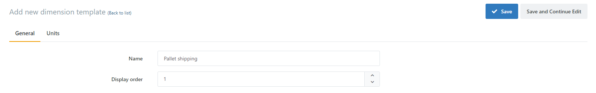

Set the *Name* and the *Display* *order* for the shipping type and click **Save** or **Save and Continue Edit**. After you save, you will have access to the **Units** tab where you can view, update, add new or delete the shipping type units.

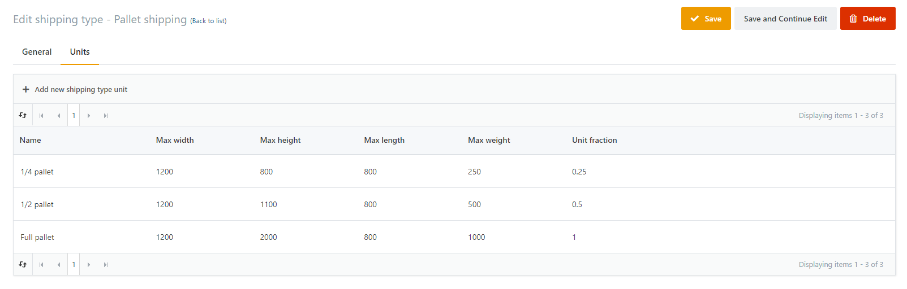

To add a new unit, click the **Add new shipping type unit** which will make a popup appear :

| Input field | Description |
| --- | --- |
| Name | The name of the Shipping type unit. |
| Max width | Width restriction. |
| Max length | Length restriction. |
| Max height | Height restriction. |
| Max weight | Weight restriction. |
| Unit fraction | The ration of the unit compared to the standard unit. |

> [!INFO]
> A **shipping type** must be created before creating a shipping type unit.

####   
Creating Shipping unit price

On the plugin configuration screen navigate to the **Shipping prices** tab. To create a new shipping unit price, click the **Add new shipping unit price** button which will open a popup:

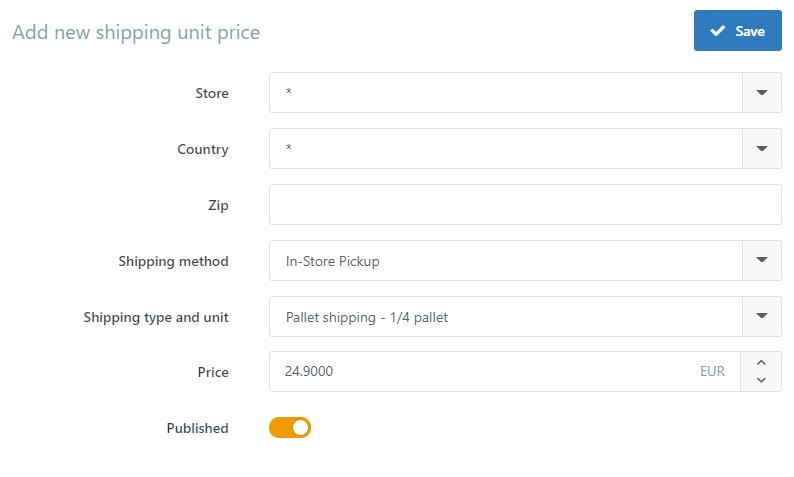

| Input field | Description |
| --- | --- |
| Store | Store where the Shipping unit price will be used. (\* for all stores) |
| Country | Country where the Shipping unit price will be used. (\* for all countries) |
| Zip | Zip code. |
| Shipping method | The shipping method for which the Shipping unit price will be used |
| Shipping type and unit | List of all shipping types and units combined. |
| Price | Defines the price of the Shipping unit price. |
| Published | Whether the Shipping unit price published. |

> [!INFO]
> Shipping price cannot be created without a **shipping type and unit**

###   
Orders

Every order that had it's product prices with the dimension calulation plugin calculated, the dimensions will be shown. This can be accessed on the order details under the **Products** tab.

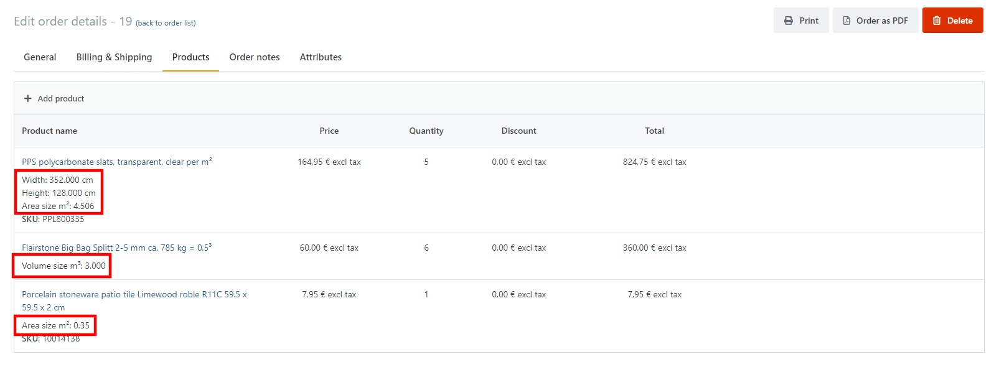