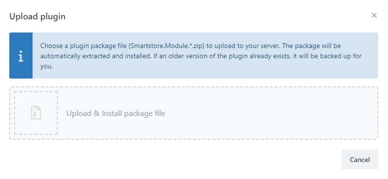
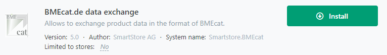
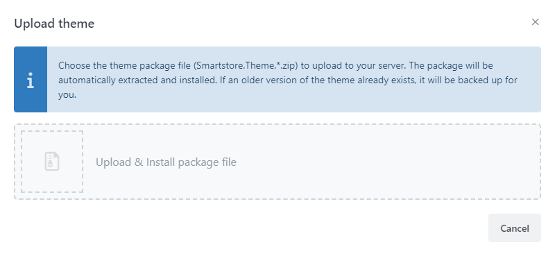
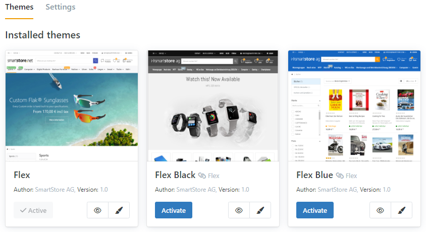

# Installing Plugins or Themes

Smartstore is delivered with plugins and themes already installed. You can find more plugins and themes in the [Smartstore Marketplace](http://community.smartstore.com/index.php?/files/) from Smartstore itself and from third-party providers. Smartstore plugin and theme files have the file format Zip and the extension `.zip`.

## How to upload and install a Plugin

Choose the menu item **Plugins > Manage plugins** and click on the button **Upload Plugin**. Choose the zip-file that contains the plugin. The plugin has now been uploaded and can be installed and configured in the plugin management area.

The plugin has now been uploaded and can be installed and configured in the plugin management area.

## How to upload and activate a Theme

Choose the menu item **Configuration>Themes** and click on the button **Upload Theme**. Choose the zip-file that contains the theme.

The theme has now been uploaded and can be configured and activated in the theme management area.

## Manual upload

You can also upload Themes and Plugins manually by uploading it to the corresponding folder. Themes are uploaded into the directory `/Themes`, and Plugins belong to the directory `/Modules`. After the upload, you have to reload the list of Themes  by clicking the button **Reload Themes** in the theme configuration area or for Plugins by clicking the button **Edit > Reload List Of Plugins**. Now, your new theme or plugin will be displayed in the corresponding configuration area and is ready to be configured and used.