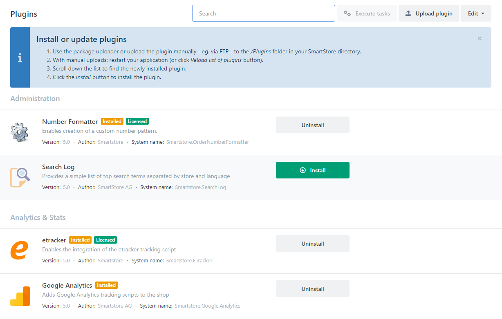
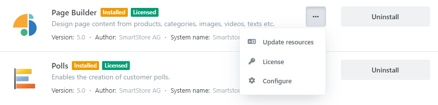
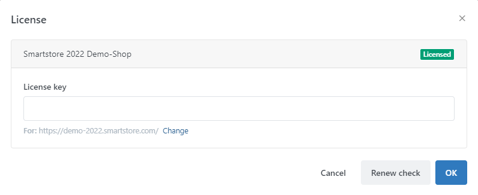

# Managing Plugins

Plugins in Smartstore can have multiple functionalities. They can serve as payment methods, shipment methods or widgets. Every plugin defines its own configuration area and can hold several settings which configure the behavior of the plugin. You can reach the configuration area of a plugin by clicking on the **Configure** button in the button bar of the corresponding plugin. Plugins are divided into several logical groups such as Administration, Marketing, Payment & Gateways, Shipping & Logistics, etc., so they can easily be found by scrolling to the corresponding plugin area. To find a plugin, you can also use the **Search** that's contained in the upper right button bar. Every plugin in the list will display information about itself such as the author, version and the system name of the plugin as well as the website where it can be obtained.

- For more information about payment methods, read the topic [Setting up Payment Methods](#). 
- For more information about widgets, read the topic [Arranging Widgets](#). 
- For more information about shipping methods, read the topic [Setting up Shipping Methods](#). 

 To manage plugins, go to **Plugins > Manage Plugins**. 

## How to Install a Plugin 

There are two ways to install a plugin. The way you choose depends on the package in which you've received the plugin. If you've received a nupkg file (such as the plugins you can obtain in the [SmartStore Community Marketplace](http://community.smartstore.com/index.php?/files/)), you can install the plugin via the plugin management area. If you've received a plugin directory, you install it manually by uploading it to the */Plugins* directory of the Smartstore application on your webspace. There are also some plugins that already come with Smartstore but are not yet installed, as not every shop administrator needs them. A plugin that hasn't yet been installed can be identified through the **Install** button next to the plugin. You can install multiple plugins in one step by clicking on the **Install** button of each of them. After you've selected all the plugins to be installed, click on the **Execute Tasks** button in the upper right button bar of the plugin management area, which contains the number of executable tasks. In the same step, you can uninstall installed plugins. To add them to the executable tasks list, click on the button **Uninstall** next to the plugin. 

### Installing a NUPKG File

Choose the menu item **Plugins->Manage plugins** and click on the button **Upload Plugin**. Choose the nupkg file and click on **Upload & Install**. The plugin has now been installed and can be configured. 

### Manual Installation of a Plugin

You can also install plugins manually by uploading it into the directory */Plugins*. After the upload, you have to reload the list of plugins by clicking the button **Edit > Reload List Of Plugins**. Now, your new plugin will be displayed in the plugin list and is ready to be configured and used. When updating a plugin this way, you may need to click the button **Update Resources** in order to load resources from the plugin which weren't added to your shop when you installed the plugin initially. You can also update the resources of all plugins in one step by clicking on the button **Edit > Update Language Resources Of All Plugins**  in the upper right button bar of the plugin management area.

## How to Obtain More Plugins

More plugins can be obtained in the [SmartStore Community Marketplace](http://community.smartstore.com/index.php?/files/). The **SmartStore Community Marketplace** is where all the resources that have been created for Smartstore are offered and can be either be downloaded for free or bought. For more information on how to buy and install plugins, please read the topics [How to Buy an Extension](https://smartstore.atlassian.net/wiki/display/SMNET/How+to+Buy+an+Extension) and [How to Install an Extension](#).

## How to License a Plugin

When installing a plugin in Smartstore that requires a license, you're free to test the functionality for 30 days in the demo mode. After this period, the plugin will cease to work until it is licensed. A green badge will inform you how many days you have left in the demo mode. Most of the plugins can be tested with full functionality when running in demo mode. Exceptions to this are the feed plugins which will only export a data set of 20 records. To license a plugin, just click on the **License** button in the button bar right beneath the plugin. The dialog will appear underneath, providing a license entry field for every shop that's configured. Enter the license key you've obtained through the purchase of a plugin in the [SmartStore Community Marketplace](http://community.smartstore.com/index.php?/files/) and click on OK. If the license key is valid, a green badge with the text **Licensed** will appear next to the plugin. Next to the label  **Limited To Stores**, all the stores will be listed for which the plugin has been licensed. With the **Renew Check** button, you can initiate a new check for the license you've entered against the database of the [SmartStore Community Marketplace](http://community.smartstore.com/index.php?/files/).

