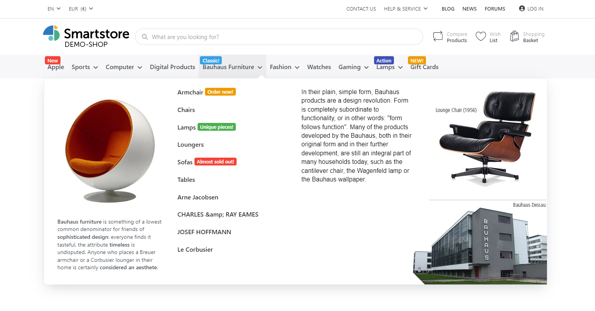
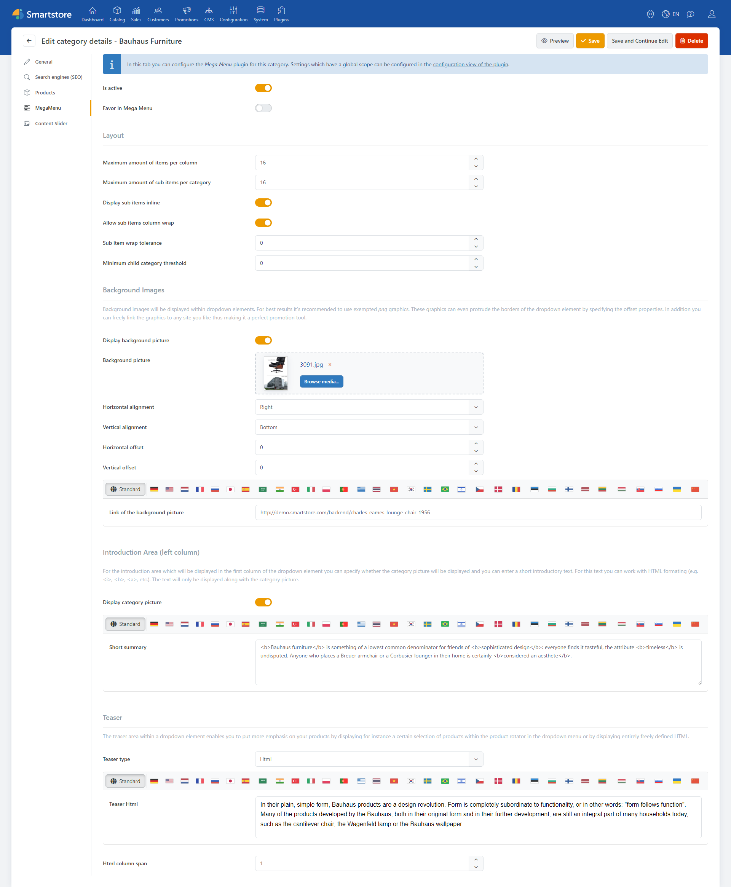

# Mega Menu

The Smartstore Mega Menu is an extensive menu system designed to organize large amounts of options or categories in a way that is easy for the user to grasp and navigate. It usually expands across the entire width of the website and offers multiple levels and columns for links, text, images and even videos.

## Configuration of the Mega Menu

The Mega Menu plugin is mainly used within the [categories configuration](../../user-guide/catalog/organizing-product-categories.md). For this purpose, there is a "Mega Menu" tab in the administration area of [categories groups](../../user-guide/catalog/organizing-product-categories.md), in which each Mega Menu can be configured individually. Only settings that have global validity are made in the configuration area of the plugin.

## Settings in detail

### General settings

|     |     |
| --- | --- |
| **Input field/option** | **Description** |
| Is active | activates/deactivates the Mega Menu for this element |
| Favor in Mega Menu | This only applies to categories within the dropdown list, and indicates whether the category should be preferred when building the navigation structure. |

### Layout

|     |     |
| --- | --- |
| **Input field/option** | **Description** |
| Maximum amount of items per column | The elements are displayed in columns. This setting determines the maximum number of elements per column. For example, you can determine how high or wide the menu should appear. |
| Maximum amount of sub items per category | Determines the maximum number of child categories per category. If the number of child categories is higher, a "more..." link is displayed. |
| Display sub items inline | Determines whether child categories are displayed wrapped (one line per category) or comma-separated. |
| Allow sub items column wrap | Determines whether the output of child categories can be interrupted and continued in the next column if the number of child categories still to be displayed exceeds the number of permitted navigation elements per column. |
| Minimum child category threshold | Defines the minimum number of child categories that a menu item must have for it to be displayed (0 means everything is displayed). |
|     |     |

### Background Images

|     |     |
| --- | --- |
| **Input field/option** | **Description** |
| Display background picture | Sets whether a background graphic is displayed in the Mega Menu dropdown. |
| Background picture | Upload a background image file via file selection or drag-and-drop. |
| Horizontal alignment | Defines the horizontal alignment of the background image. |
| Vertical alignment | Defines the vertical alignment of the background image. |
| Horizontal offset | Defines the horizontal offset of the background image. |
| Vertical offset | Defines the vertical offset of the background image. |
| Link of the background picture | Defines a URL link for linking the background image. |

### Introduction Area (left column)

For the introduction area which will be displayed in the first column of the dropdown element you can specify whether the category picture will be displayed and you can enter a short introductory text. For this text you can work with HTML formating (e.g. <i>, <b>, <a>, etc.). The text will only be displayed along with the category picture.

|     |     |
| --- | --- |
| **Input field/option** | **Description** |
| Display category picture | Specifies whether a category picture will be displayed in the first column (on the right side of the dropdown). |
| Short summary | Specifies text that will be displayed below the category picture. Thi stext will only be displayed if the category picture is displayed. HTML is allowed. |

### Teaser

The teaser area within a dropdown element allows you to highlight your products by displaying a specific selection of products within the product rotator in the dropdown menu, or by displaying completely custom HTML.

|     |     |
| --- | --- |
| **Input field/option** | **Description** |
| Teaser type: **Show no teaser** | Show no teaser: disables teaser |
| Teaser type: **HTML** | Displays HTML in the Teaser  **Teaser HTML**: enter HTML  **HTML column span**: Defines how many columns the HTML should occupy. 4 means that no child-categories are displayed. |
| Teaser type: **Product rotator** | **Rotator heading**: specifies the heading of the product rotator  **Teaser rotator item select type**: Defines the type in which products will be chosen. The types deep-top, deep-random imply to include products in child categories.  **Maximum amount of rotator items**: Specifies the maximum number of products to display in the rotator. |