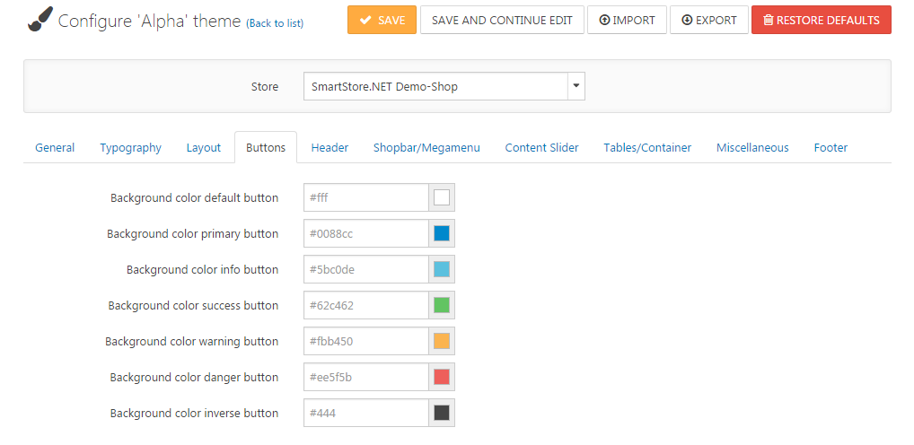

# Working with Themes

Themes in Smartstore define the design of your shop. There are two different types of themes. One defines the display of the desktop view, and the other defines the display of the mobile view which will automatically be displayed when a customer uses a mobile device to browse through your shop. One theme should be active for each of both types. To choose the default theme of your store, just click on the button **Activate**. 

To configure the theme for your shop, go to **Configuration > Themes**. 

## How to Configure a Theme

Themes provide several settings to make fine adjustments, thus allowing you to alter the appearance of your shop. To configure a theme, click on the little paint brush symbol in the theme box. You can configure different settings for each of the stores you have configured in Smartstore by using the store selector above the configuration area. You can define several colors, fonts, margins, layout settings and many more. Settings are provided by the theme itself and are therefore not general for all themes. So, the number of settings depends on the theme you're using. You can **Export & Import** your theme settings (in xml format). This way, you can safely edit your settings and always jump back to a previous state. You can also restore the default theme settings by clicking on **Restore Defaults**.

## Previewing a Theme

To preview a theme, click on the little eye symbol in the theme box. Your store will open in **Preview Mode**, showing the eye symbol on the left side of the browser. When you click on it, a sidebar widget will appear (as shown below), where you can choose one of your themes and one of your stores to be applied for the **Preview Mode**. You exit the preview mode by clicking on **Exit Preview Mode**.

| Collapsed | Enhanced |
| --- | --- |
|  |  |

## Settings

| Option | Description |
| --- | --- |
| Allow Customers To Select A Theme | Check the box to allow customers to select a store theme. If this option is active, your customers can choose a theme from a list in the footer which contains all the themes of your shop. |
| Save Theme Choice In Cookie | If this box is left unchecked, the user's theme choice is associated with the account. This may be undesirable, for instance, when multiple users share a guest account. |
| Mobile Devices Supported | Check the box to enable mobile devices support. If this option is active, Smartstore will automatically detect whether your customers are browsing your shop with a mobile device and will display the active mobile theme. |
| Enable Asset Bundling | Determines if asset files (JS and CSS) should be grouped together in order to speed up page rendering. Select "Auto" if bundling should depend on the debug setting in web.config.  > [!INFO] > ### Developer Tip > Disable resource bundling and caching in order to test and debug theme changes more easily. |