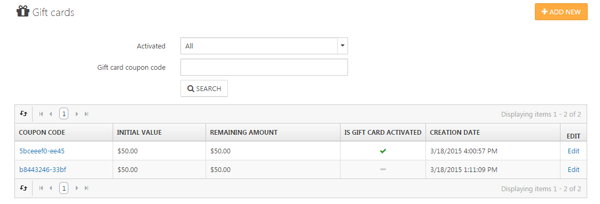
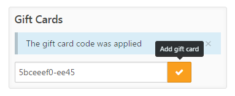

# Managing Gift Cards

Gift cards enable you to reach customers you normally would not reach, thus being an ideal method of stimulating additional purchases. Furthermore, a customer who receives gift cards is sure to be highly motivated to use them.

## How to Manage Gift Cards

Gift cards in Smartstore are simple products that are labeled as 'gift cards' in the product info tab when you are creating or editing a product. You need to choose whether the gift card is virtual or physical. If the gift card is virtual, the customer doesn't need to enter shipping information during the checkout process, since a virtual product doesn't need to be shipped. When a customer has bought a gift card, it needs to be activated before it can be used in the checkout process of your shop. This will be done automatically according to the settings in **Configuration > Settings > Order Settings**. You can choose if you want to activate gift cards when the order status is **Pending, Complete** or **Cancelled**, and you can also set a status for gift card deactivation. You can manage all purchased gift cards by navigating to **Sales > Gift Cards**. 

## How Your Customers Can Use Gift Cards

When the gift card is active, you need to notify the recipient of the available gift card by clicking on **Notify Recipient**. This will send an e-mail with the generated coupon code to the gift card recipient, who can use this in the order summary when going to the shopping cart. Simply by entering the code, the customer will have the gift card amount subtracted from the order total. If the order total is less than the gift card amount, your customer can use the gift card again until it's empty.

