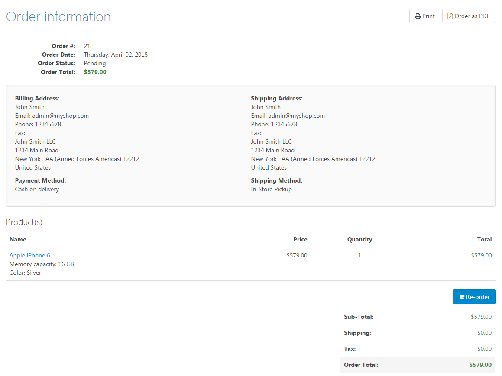

# Managing Orders

To manage orders, navigate to **Sales > Orders** within the administration area of your store. Beneath the search mask, all orders are displayed within a grid. You can filter the grid by date, customer name, billing e-mail address, order status, payment status, shipping status, store, order GUID or order number. If you know the order number, you can go directly into the edit mode of an order by entering the number in the designated field and clicking on **Go**. You can also export all orders or just the ones you've selected in the grid to several formats (PDF, Excel and XML). 

## Order Details View

### Info

In this tab, you can see general information about the order such as the order status, number or total. You can also set the order status and the payment status or edit the order totals.

### Billing Info

In this tab, you can see and edit the billing address of the order.

### Shipping Info

In this tab, you can see and edit the shipping address, the shipping method chosen by your customer and the shipping status of the order. You can also manage the shipments of this order in this tab. For more information about shipments, read the topic [Managing Shipments](../sales/managing-shipments.md).

### Products

In this tab, you'll find all the products corresponding to this order. You can make a return request as well as edit the prices and discounts of the ordered products. For more information about return requests, read the topic [Managing Return Requests](../sales/managing-return-requests.md).

### Order notes

In this tab, you can view and add order notes. Order notes are something like a log, recording every step of the order process (e.g. when the order was placed and when it was shipped). You can also add notes that are visible to the customer in the login area. To do this, just select the option **Display To Customer** for the note you want the customer to see.

### Attributes

In this tab, you can see all the attributes created for the order. Although the shop administrator can add values here, this feature was originally developed to let developers store data for the order (such as payment response data returned by payment gateways). 

### Other Tabs

There may be other tabs depending on the plugins you've installed. For information about these tabs, refer to the plugin developer.

## The Customer's View

Your customers can view the details of their orders in their login area by navigating to **My Account > Orders**. Here, they can see all the details of this order, print it, or download it as a PDF file.

