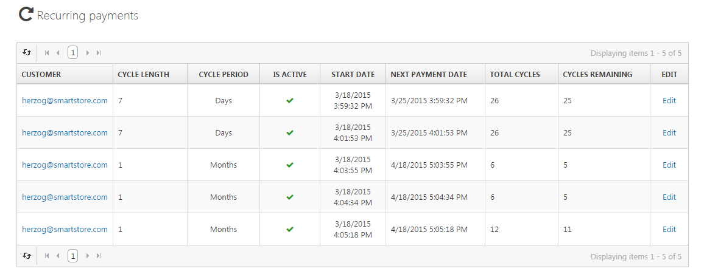

# Managing Recurring Payments

If you have configured recurring products, you need to manage the periodic payments (for more information about recurring payments, read the topic [Understanding Recurring Products](../../user-guide/catalog/managing-products/understanding-recurring-products.md)). You can manage recurring payments by navigating to **Sales > Recurring Payments**.

## Recurring Payment Detail View

In the detail view of a recurring payment, you can view the details of the Recurring Payment, alter its settings, and see the order recurrence history as well as cancel upcoming payments (e.g. when you did not receive the last payment) and you can **Process the Next Payment (Create a New Order)**. 

