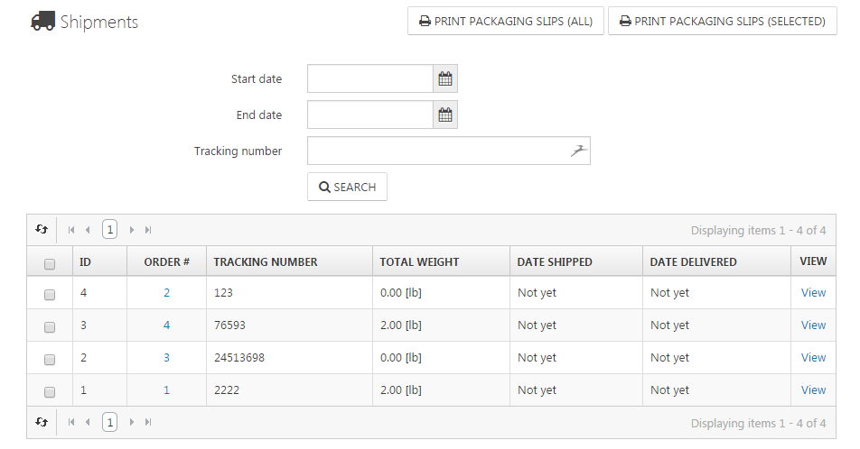

# Managing Shipments

You can add a shipment to every order that has been created in your shop. This will help you and your customers keep track of the dates on which the order was shipped and delivered. You can assign a tracking number to a shipment so that the customer can track it. To create a shipment, you have to enter the details view of the corresponding order. In the tab **Shipping Info**, you can create a shipment. To manage your shipments, navigate to **Sales > Shipments**. You can also **Print Packaging Slips** here for either all of your shipments or selected ones.

## The Details View of a Shipment

In the details view of a shipment, you can see all products belonging to the shipment, set a tracking number for this shipment, and set the status of the shipment to **Shipped** and **Delivered**. You can also **Print a Packaging Slip** that will be downloaded as a PDF file onto your computer.

