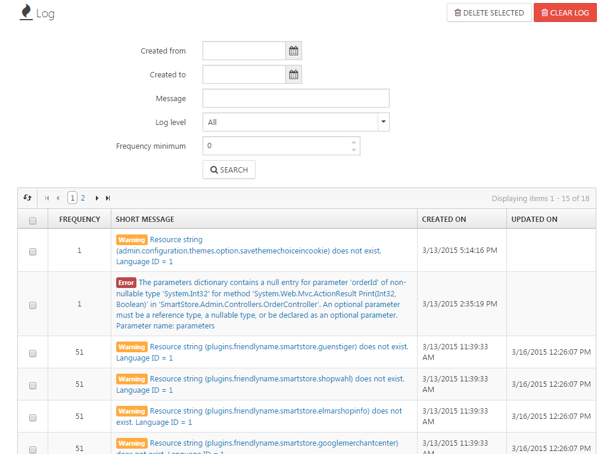

# Analyzing the Event Log

In the event log, all errors that occur during the operation of Smartstore are saved. If you encounter any errors or your customers report a malfunction in your shop, you'll be able to analyze this problem with the event log. Just search for the reported error and open its details view.

## The Details View of a Log Entry

| Information | Description |
| --- | --- |
| Frequency | Number of occurrences of this event. |
| Log Level | The level of log entry. There are five different log levels: **Debug, Information, Warning, Error, Fatal**. |
| Short Message | Contains a short description of the event. |
| Content Hash | Represents the log content. Is required for the frequency count. |
| IP Address | IP address of the machine that caused the exception. |
| Customer | Name of the customer who caused the exception. |
| Page URL | Originating page of exception. |
| Referrer URL | The referrer URL. |
| Created On | Date/Time the log entry was created. |
| Updated On | Date of the last update. |
| Full Message | The details for the log entry. In this field, the whole error description of the occurred exception is stored. |