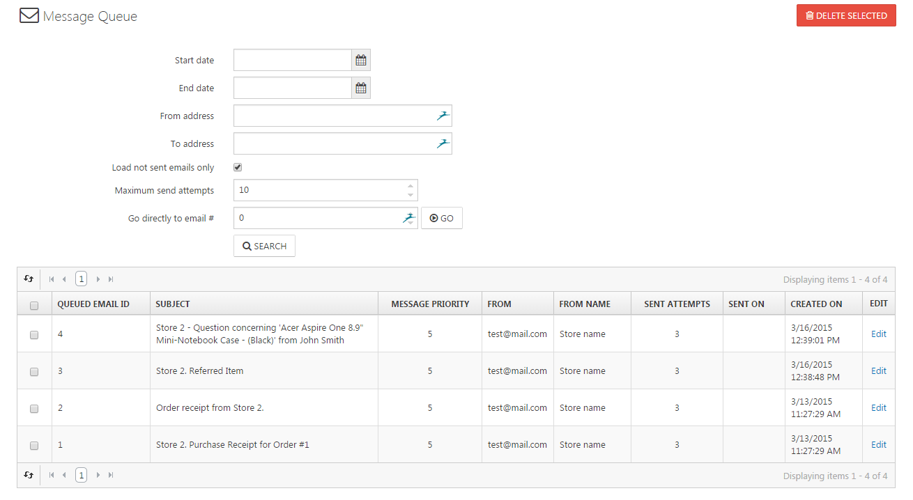

# Analyzing the Message Queue

You can analyze the message queue by navigating to **System > Message Queue**. In this section, you will find any message (e.g. order e-mails, forum messages, account activation emails, etc.) that was sent within your shop or is in the queue to be sent. In the details view of an email, you can edit the message and also re-queue it.

