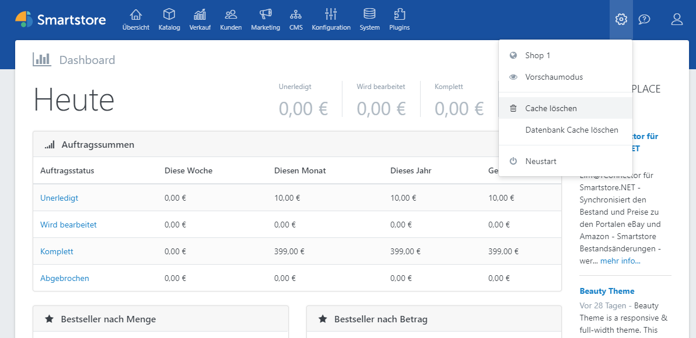

# Clearing Cache

There are different elements in the frontend of your shop, which are cached for performance reasons. The cache is automatically updated when you change something in the administration area of your shop. However, if you have changed the database directly, you have to clean the cache to see the changes. You can clean the cache by clicking on the cogwheel icon in the administration area and selecting **Clear Cache**.

> [!INFO]
> The following cache types are also available in Smartstore

### Database Cache

You can clean up the cache by clicking the gear icon in the administration area and selecting **Clear Database Cache**. If you want to clear the database cache manually, you can find the relevant files in your shop directory under **App\_Data > EfCache**.

### Output Cache

### ASP.NET Cache

To clear the ASP.NET cache, there are the following methods:

#### 1. Change the value of numRecompilesBeforeAppRestart

In the file *Web.config* in the root directory of your application you will find the variable "numRecompilesBeforeAppRestart".

<compilation targetFramework="4.6.1" numRecompilesBeforeAppRestart="251" batch="true" optimizeCompilations="true">

Change the value to e.g. 252 and save the file.

Reload the shop page, this process should now take a little longer. Your ASP.NET cache was successfully deleted.

#### 2. Rename Global.asax

In the root directory of your application you will find the file *Global.asax*.

Rename it to e.g. Global2.asax.

Confirm your change.

Now rename your file back to Global.asax.

Reload the shop page, this process should now take a little longer. Your ASP.NET cache was successfully deleted.

#### 3. Delete Manually

In the backend under **Admin > System > System Information > Loaded Assemblies** you will find the file path of the ASP.NET cache.

Stop your IIS/Server.

Delete the folder specified in the path.

Start your IIS/Server.

This process should now take a little longer. Your ASP.NET cache was successfully deleted.

### Image Cache

If necessary, the image cache can be deleted in **System > Maintenance**.

### Redis