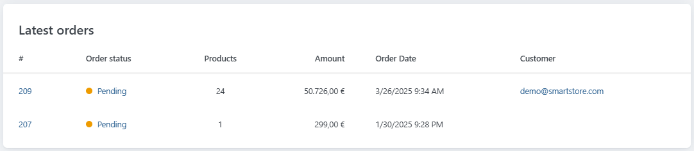
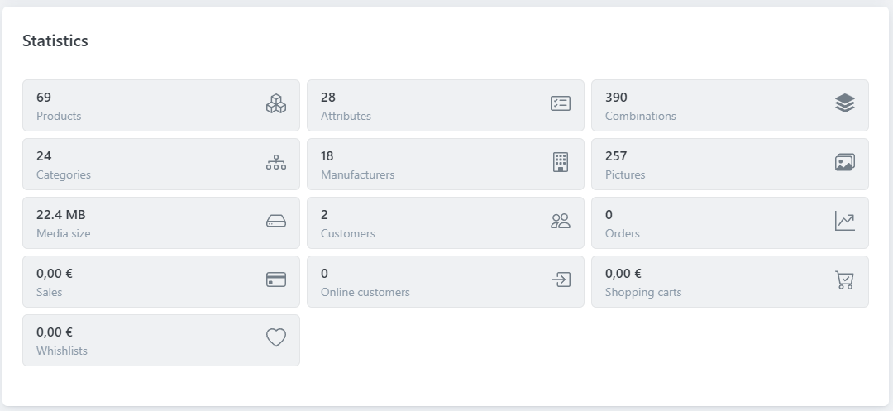

# The Dashboard

The **Dashboard** provides you with your store statistics related to order totals, bestsellers by quantity, bestsellers by amount, registered customers and incomplete orders, and displays the Marketplace News on the right-hand side. It has the following sections:

## Incomplete Orders

The **Incomplete Orders** section shows the list of all orders that have not been completed for various reasons. It shows the total value and count of these incomplete orders with reasons such as unpaid orders, not yet shipped orders, pending order status, etc. By clicking on any item link, you can navigate to the **Orders** page.

## Orders

The **Orders** section provides the total value of orders that are **Pending, Processing, Complete** and **Cancelled** for different periods: **Today, Yesterday, Last 7 days, Last 28 days** and **This Year.** By clicking on any order status link, you can navigate to the **Orders** page.

## Bestsellers by quantity/amount

The **Bestsellers by quantity/Amount** section shows the list of the top bestselling products based on the total quantity/amount of sales. By clicking on any product name link, you can navigate to the **Edit** **Product Details** page.

## Top customers by quantity/amount

The **Top customers by quantity/amount** section shows the list of the top customers based on the total quantity/amount of purchases. By clicking on any customer name link, you can navigate to the **Edit** **Customer Details** page.

## Customer registrations

The **Customer registrations** section shows the total number of customers registered over different periods. It shows the count for **Today, Yesterday, Last 7 days, Last 28 days** and **This Year.**

## Latest orders

In the section **Latest orders**, the **Number, Order status,** amount of **Products,** Cost **Amount, Order date** and **Customer** are displayed.

## Statistics

In the **Statistics** section, all **Products, Attributes, Combinations, Categories, Manufacturers, Pictures, Media size, Customers, Orders, Sales, Online customers, Shopping carts** and **Whishlists** are displayed.

## Newsfeed

In the section **Newsfeed**, News about the latest Version of Smartstore and other important Information are displayed.

