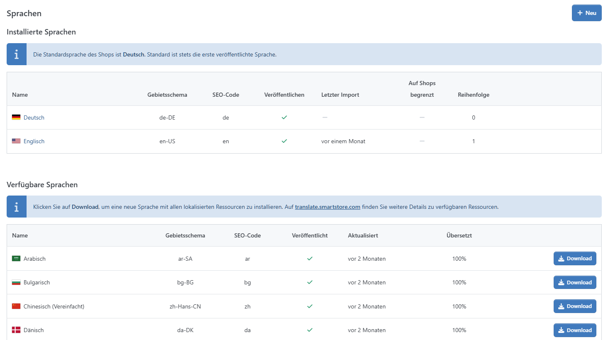
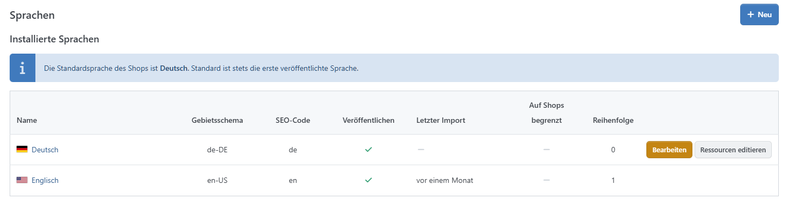
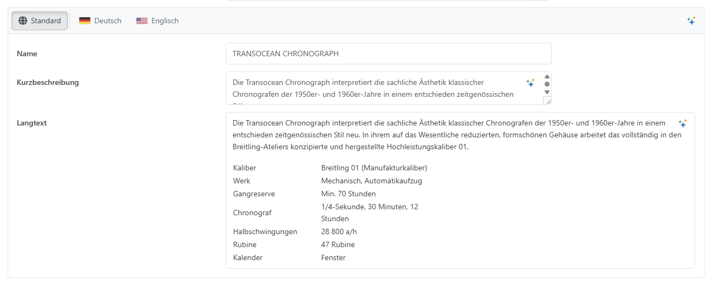

# Mit mehreren Sprachen arbeiten

Smartstore beinhaltet nach der Installation die ausgewählte Standardsprache. Sie können aber eine unbegrenzte Anzahl weiterer Sprachen hinzufügen. 

## Wie man eine Sprache hinzufügt

Um eine weitere Sprache hinzuzufügen, gehen Sie zu **Konfiguration > Regionale Einstellungen > Sprachen.**

Hier gibt es zwei Möglichkeiten, Sprachen hinzuzufügen. Über die Funktion **"Verfügbare Sprachen"** bieten wir Ihnen kostenlos Sprachen an. Nach dem Download muss die neue Sprache nur noch veröffentlicht werden. Sollte die gewünschte Sprache nicht in den "Verfügbaren Sprachen" vorhanden sein, haben Sie die Möglichkeit über **Neu** die Sprache manuell anzulegen und die Sprach-Ressourcen über eine XML-Datei zu importieren.

## Eine Sprache manuell hinzufügen

| **Eingabefeld** | **Beschreibung** |
| --- | --- |
| Name | Der Name der Sprache. Dieser Name wird angezeigt, wenn ein Nutzer über die Flagge im Frontend fährt, dort kann er seine bevorzugte Sprache auswählen. |
| Gebietsschema | Das sprachspezifische Gebietsschema. Das sprachspezifische Gebietsschema enthält den Namen des Gebiets, das Zeichensystem, den Kalender und die Formatierungsarten für Daten und zur Sortierung von Zeichenfolgen. |
| SEO Code | Der eindeutige SEO-Code. Er wird benutzt um URLs wie '[http://www.yourStore.de/de/](http://www.yourStore.de/de/)' zu generieren, wenn Sie mehr als eine veröffentlichte Sprache haben.  Die Option 'SEO freundliche URLs mit Mehrsprachunterstützung' muss auch aktiviert werden. |
| Flaggenbild | Legt das Flaggenbild fest. Wenn Sie ein anderes Bild auswählen möchten, muss dieses in dem Ordner *content/images/flags/* liegen. |
| Rechts nach links | Legt fest, ob für diese Sprache die Schreibrichtung "rechts nach links" aktiviert wird. Das benutzte Theme muss dies auch unterstützen |

Sobald Sie Ihre gewünschte Sprache erstellt haben, müssen Sie die Ressourcen für diese Sprache hinzufügen, indem Sie auf **Ressourcen importieren**  klicken, wodurch Sie eine XML-Datei für den Import auswählen können. Sie finden die XML-Dateien für Englisch und Deutsch in dem Ordner /*App\_Data/Localization/App.*

## Wie Sie eine einzelne Ressource hinzufügen oder bearbeiten

Manchmal kommt es vor, dass Sie eine einzelne Ressource verändern möchten. Beispielsweise könnte es sein, dass Sie den Titel für das Forum von *Foren* zu *Forum* verändern möchten. Dies können Sie tun, indem Sie zu **Konfiguration > Regionale Einstellungen > Sprachen** gehen und dort auf **Ressourcen editieren** klicken.

Dort sehen Sie eine Tabelle, die alle hinzugefügten Ressourcen für diese Sprache anzeigt. Filtern Sie die Einträge, um die Ressource zu finden, die Sie suchen. Sie können entweder nach Wert oder Ressourcenname filtern. Da Sie den Text kennen, den Sie verändern möchten, klicken Sie auf das Filtersymbol und geben Sie in der Zelle Ressourcenwert =*Foren* ein. Unter dem Tool-Tipp "?" werden weitere Suchoperatoren angezeigt. Es wird Ihnen nun eine Liste mit unterschiedlichen Ressourcen angezeigt, die den Filterkriterien entsprechen. Einer davon hat die Vorsilbe *admin,* was anzeigt, dass es zum Bereich der Administration gehört, diese Ressource ist für Sie nicht von Bedeutung. Die Ressource, die Sie bearbeiten möchten, heißt in diesem Fall *Forum.PageTitle.Default.* Über den 3-Punkte-Button kann der gewünschte Wert geändert werden.

## Lokalisierte Objekte

Es gibt zahlreiche Objekte (z.B.: Produkte, Warengruppen, Seiten) in Smartstore, bei denen Sie Texte, die dem Nutzer angezeigt werden sollen, angeben können, dazu gehören Produktnamen, Produktbeschreibungen oder auch verschiedene Anzeigenamen (z. B. Lieferzeit, Mengenangabe, etc.). Immer wenn solch ein Wert im Backend angegeben werden kann, finden Sie auch ein Steuerelement, welches Ihnen erlaubt, Texte in allen konfigurierten Sprachen Ihres Shops anzugeben. So können Sie alternative Ressourcen für spezifische Sprachen sowie einen Standardtext festlegen, welcher angezeigt wird, wenn keine andere Ressource für die von Ihrem Kunden ausgewählte Sprache angegeben wurde.

## Sprachauswahl

Wenn Sie mehrere Sprachen konfiguriert haben, können Ihre Nutzer zwischen den Sprachen im Header-Bereich Ihres Shops wechseln. 

## Sprachressourcen herunterladen

Alle verfügbaren Sprachressourcen aller Versionen können im [Smartstore-Übersetzungsportal](https://translate.smartstore.com/) ([http://translate.smartstore.com](http://translate.smartstore.com) ) als XML-Datei heruntergeladen werden. Für weitere Informationen zu Plugin-Ressourcen lesen Sie bitte [How to Write a Plugin](https://smartstore.atlassian.net/wiki/pages/createpage.action?spaceKey=SDDE&title=How%20to%20write%20a%20Plugin).